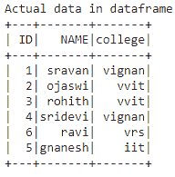
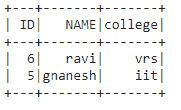
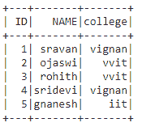
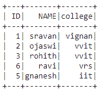
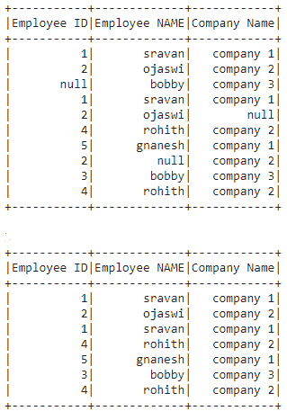
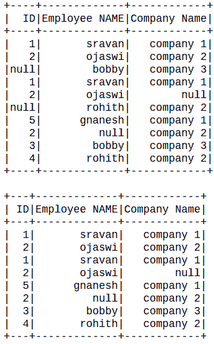
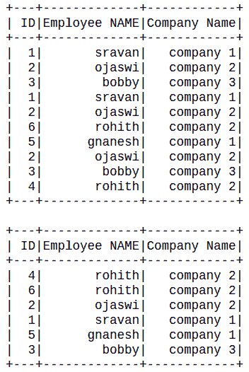
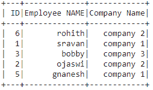
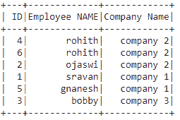

# 用条件

删除 PySpark 数据框中的行

> 原文:[https://www . geesforgeks . org/drop-row-in-pyspark-data frame-with-condition/](https://www.geeksforgeeks.org/drop-rows-in-pyspark-dataframe-with-condition/)

在本文中，我们将删除 PySpark 数据框中的行。我们将考虑最常见的情况，如删除具有空值的行、删除重复的行等。所有这些条件使用不同的函数，我们将详细讨论这些。

**我们将讨论以下主题:**

*   使用 where()和 filter()关键字删除带有条件的行。
*   删除无值或缺少值的行
*   删除具有空值的行
*   删除重复的行。
*   基于列删除重复行

#### **创建用于演示的数据框:**

## 蟒蛇 3

```py
# importing module
import pyspark

# importing sparksession from pyspark.sql module
from pyspark.sql import SparkSession

# creating sparksession and giving an app name
spark = SparkSession.builder.appName('sparkdf').getOrCreate()

# list  of students  data
data = [["1", "sravan", "vignan"],
        ["2", "ojaswi", "vvit"],
        ["3", "rohith", "vvit"],
        ["4", "sridevi", "vignan"],
        ["6", "ravi", "vrs"],
        ["5", "gnanesh", "iit"]]

# specify column names
columns = ['ID', 'NAME', 'college']

# creating a dataframe from the lists of data
dataframe = spark.createDataFrame(data, columns)

print('Actual data in dataframe')
dataframe.show()
```

**输出:**



### **使用 where()和 filter()函数**删除有条件的行

这里我们将使用 where()和 filter()函数删除带有条件的行。

**其中():**该功能用于检查条件并给出结果。这意味着它会根据条件删除行

> **语法:** dataframe.where(条件)

**filter():** 此函数用于检查条件并给出结果，这意味着它根据条件丢弃行。

> **语法:**数据帧过滤器(条件)

**示例 1:使用 Where()**

Python 程序删除 ID 小于 4 的行

## 蟒蛇 3

```py
# drop rows with id less than 4
dataframe.where(dataframe.ID>4).show()
```

**输出:**



**用大学“虚拟现实”删除行:**

## 蟒蛇 3

```py
# drop rows with college vrs
dataframe.where(dataframe.college != 'vrs').show()
```

**输出:**



**例 2:使用 filter()功能**

Python 程序删除 id=4 的行

## 蟒蛇 3

```py
# drop rows with id 4
dataframe.filter(dataframe.ID!='4').show()
```

**输出:**



### **使用 dropna** 删除带 NA 值的行

数值是数据框中缺失的值，我们将删除具有缺失值的行。它们被表示为 null，通过使用 dropna()方法，我们可以过滤这些行。

> **语法:** dataframe.dropna()

## 蟒蛇 3

```py
# importing module
import pyspark

# importing sparksession from pyspark.sql module
from pyspark.sql import SparkSession

# creating sparksession and giving an app name
spark = SparkSession.builder.appName('sparkdf').getOrCreate()

# list  of employee data with 5 row values
data = [["1", "sravan", "company 1"],
        ["2", "ojaswi", "company 2"],
        [None, "bobby", "company 3"],
        ["1", "sravan", "company 1"],
        ["2", "ojaswi", None],
        ["4", "rohith", "company 2"],
        ["5", "gnanesh", "company 1"],
        ["2", None, "company 2"],
        ["3", "bobby", "company 3"],
        ["4", "rohith", "company 2"]]

# specify column names
columns = ['Employee ID', 'Employee NAME', 'Company Name']

# creating a dataframe from the lists of data
dataframe = spark.createDataFrame(data, columns)

# display actual dataframe
dataframe.show()

# drop missing values
dataframe = dataframe.dropna()

# display  dataframe after dropping null values
dataframe.show()
```

**输出:**



### **使用 isNotNull 删除空值的行**

在这里，我们删除具有空值的行，我们使用 isNotNull()函数删除这些行

> **语法:**data frame . where(data frame . column . isnotnull())

Python 程序根据特定的列删除空值

## 蟒蛇 3

```py
# importing module
import pyspark

# importing sparksession from pyspark.sql module
from pyspark.sql import SparkSession

# creating sparksession and giving an app name
spark = SparkSession.builder.appName('sparkdf').getOrCreate()

# list  of employee data with 5 row values
data = [["1", "sravan", "company 1"],
        ["2", "ojaswi", "company 2"],
        [None, "bobby", "company 3"],
        ["1", "sravan", "company 1"],
        ["2", "ojaswi", None],
        [None, "rohith", "company 2"],
        ["5", "gnanesh", "company 1"],
        ["2", None, "company 2"],
        ["3", "bobby", "company 3"],
        ["4", "rohith", "company 2"]]

# specify column names
columns = ['ID', 'Employee NAME', 'Company Name']

# creating a dataframe from the lists of data
dataframe = spark.createDataFrame(data, columns)
dataframe.show()

# removing null values in ID column
dataframe.where(dataframe.ID.isNotNull()).show()
```

**输出:**



### 删除重复的行

重复的行意味着数据框中的行是相同的，我们将使用 dropDuplicates()函数删除这些行。

**示例 1:** 删除重复行的 Python 代码。

> **语法:** dataframe.dropDuplicates()

## 蟒蛇 3

```py
# importing module
import pyspark

# importing sparksession from pyspark.sql module
from pyspark.sql import SparkSession

# creating sparksession and giving an app name
spark = SparkSession.builder.appName('sparkdf').getOrCreate()

# list  of employee data with 5 row values
data = [["1", "sravan", "company 1"],
        ["2", "ojaswi", "company 2"],
        ["3", "bobby", "company 3"],
        ["1", "sravan", "company 1"],
        ["2", "ojaswi", "company 2"],
        ["6", "rohith", "company 2"],
        ["5", "gnanesh", "company 1"],
        ["2", "ojaswi", "company 2"],
        ["3", "bobby", "company 3"],
        ["4", "rohith", "company 2"]]

# specify column names
columns = ['ID', 'Employee NAME', 'Company Name']

# creating a dataframe from the lists of data
dataframe = spark.createDataFrame(data, columns)
dataframe.show()

# remove the duplicates
dataframe.dropDuplicates().show()
```

**输出:**



**示例 2:** 根据列名删除重复项。

> **语法:**data frame . DropDuplicates([' column _ name '])

基于员工姓名删除重复项的 Python 代码

## 蟒蛇 3

```py
# remove the duplicates
dataframe.dropDuplicates(['Employee NAME']).show()
```

**输出:**



### 使用不同的函数删除重复的行

我们可以通过使用不同的函数来删除重复的行。

> **语法:** dataframe.distinct()

## 蟒蛇 3

```py
# importing module
import pyspark

# importing sparksession from pyspark.sql module
from pyspark.sql import SparkSession

# creating sparksession and giving an app name
spark = SparkSession.builder.appName('sparkdf').getOrCreate()

# list  of employee data with 5 row values
data = [["1", "sravan", "company 1"],
        ["2", "ojaswi", "company 2"],
        ["3", "bobby", "company 3"],
        ["1", "sravan", "company 1"],
        ["2", "ojaswi", "company 2"],
        ["6", "rohith", "company 2"],
        ["5", "gnanesh", "company 1"],
        ["2", "ojaswi", "company 2"],
        ["3", "bobby", "company 3"],
        ["4", "rohith", "company 2"]]

# specify column names
columns = ['ID', 'Employee NAME', 'Company Name']

# creating a dataframe from the lists of data
dataframe = spark.createDataFrame(data, columns)

# remove the duplicates by using distinct function
dataframe.distinct().show()
```

**输出:**

