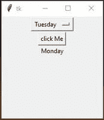

# 下拉菜单–Tinter

> 原文:[https://www.geeksforgeeks.org/dropdown-menus-tkinter/](https://www.geeksforgeeks.org/dropdown-menus-tkinter/)

**先决条件:** [Python 图形用户界面–tkinter](https://www.geeksforgeeks.org/python-gui-tkinter/)

Python 为开发图形用户界面提供了多种选择。在所有的 GUI 方法中，Tkinter 是最常用的方法。它是 Python 附带的 Tk 图形用户界面工具包的标准 Python 接口。Python 搭配 Tkinter 是创建 GUI 应用程序最快最简单的方法。使用 Tkinter 创建图形用户界面是一项简单的任务。

## **选项菜单**

**选项菜单**是  任何图形用户界面的重要组成部分。它创建一个弹出菜单，和一个按钮来显示它。它类似于 Windows 上常用的组合框小部件。

> **语法:**
> 
> OptionMenu(主选项)
> 
> **参数:**
> 
> *   **主:**此参数用于表示父窗口。
> *   **选项:**包含菜单值

### 要创建下拉菜单，请执行以下步骤:

1.  定义菜单文本的数据类型，表示整数、字符串或任何其他数据类型
2.  设置初始菜单文本(初始显示)
3.  将选项中的菜单值作为列表添加
4.  创建下拉菜单

**下面是一个在 Tkinter 中创建下拉菜单的实现:**

## 蟒蛇 3

```py
# Import module
from tkinter import *

# Create object
root = Tk()

# Adjust size
root.geometry( "200x200" )

# Change the label text
def show():
    label.config( text = clicked.get() )

# Dropdown menu options
options = [
    "Monday",
    "Tuesday",
    "Wednesday",
    "Thursday",
    "Friday",
    "Saturday",
    "Sunday"
]

# datatype of menu text
clicked = StringVar()

# initial menu text
clicked.set( "Monday" )

# Create Dropdown menu
drop = OptionMenu( root , clicked , *options )
drop.pack()

# Create button, it will change label text
button = Button( root , text = "click Me" , command = show ).pack()

# Create Label
label = Label( root , text = " " )
label.pack()

# Execute tkinter
root.mainloop()
```

**输出:-**

