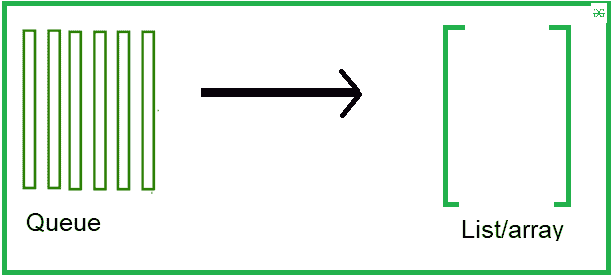

# 将队列转储到 Python 中的列表或数组中

> 原文:[https://www . geesforgeks . org/dumping-queue-in-list-or-array-in-python/](https://www.geeksforgeeks.org/dumping-queue-into-list-or-array-in-python/)

**先决条件:**[Python 中的队列](https://www.geeksforgeeks.org/queue-in-python/)

这里给定一个队列，我们的任务是将队列转储到列表或数组中。我们将看到两种方法来实现我们解决方案的目标。



**例 1:**

在本例中，我们将使用集合包创建一个队列，然后将其转换到列表中

## 蟒蛇 3

```
# Python program to
# demonstrate queue implementation
# using collections.dequeue

from collections import deque

# Initializing a queue
q = deque()

# Adding elements to a queue
q.append('a')
q.append('b')
q.append('c')

# display the queue
print("Initial queue")
print(q,"\n")

# display the type
print(type(q))
```

**输出:**

```
Initial queue
deque(['a', 'b', 'c']) 

<class 'collections.deque'>
```

让我们创建一个列表并加入其中:

## 蟒蛇 3

```
# convert into list
li = list(q)

# display
print("Convert into the list")
print(li)
print(type(li))
```

**输出:**

```
Convert into the list
['a', 'b', 'c']
<class 'list'>
```

**例 2:**

在本例中，我们将使用队列模块创建一个队列，然后将其转换到列表中。

## 蟒蛇 3

```
from queue import Queue

# Initializing a queue
que = Queue()

# Adding elements to a queue
que.put(1)
que.put(2)
que.put(3)
que.put(4)
que.put(5)

# display the queue
print("Initial queue")
print(que.queue)

# casting into the list
li = list(que.queue)
print("\nConverted into the list")
print(li)
```

**输出:**

```
Initial queue
deque([1, 2, 3, 4, 5])

Converted into the list
[1, 2, 3, 4, 5]
```