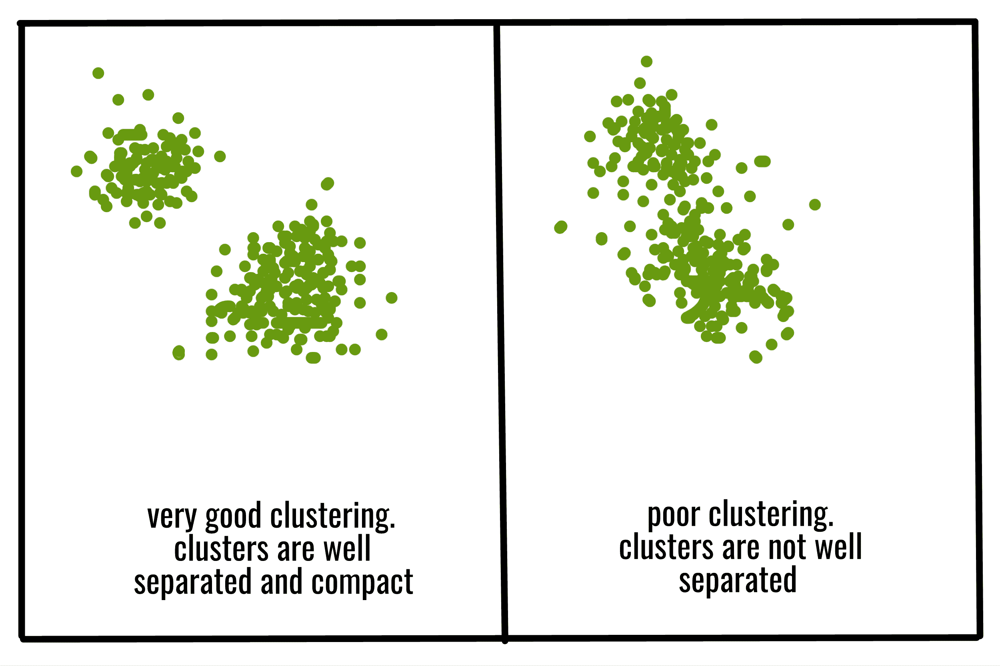
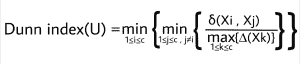
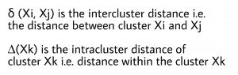
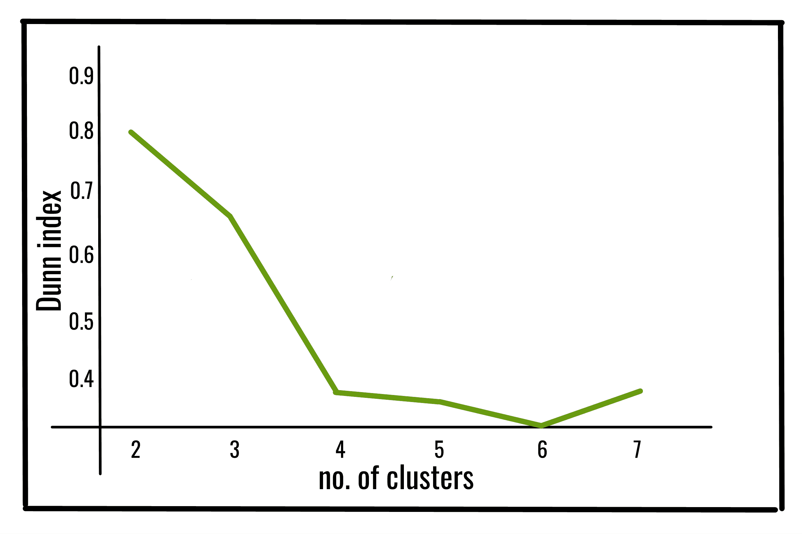
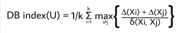
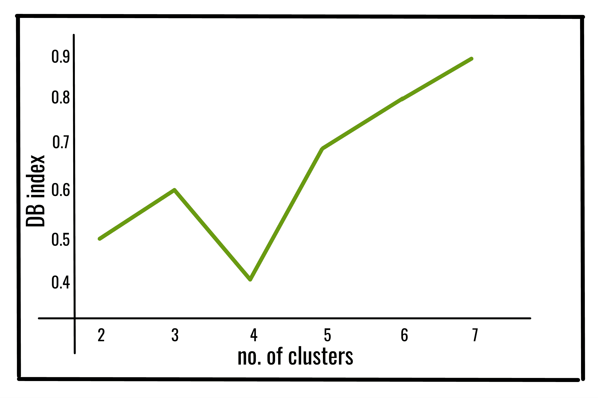

# 邓恩指数和数据库指数–聚类有效性指数|集合 1

> 原文:[https://www . geesforgeks . org/Dunn-index-and-db-index-cluster-validation-indexs-set-1/](https://www.geeksforgeeks.org/dunn-index-and-db-index-cluster-validity-indices-set-1/)

不同的性能指标用于评估不同的机器学习算法。在分类问题的情况下，我们有多种性能度量来评估我们的模型有多好。对于聚类分析，类似的问题是如何评估结果聚类的“好度”？

**为什么我们需要聚类有效性指标？**

*   比较聚类算法。
*   比较两组集群。
*   比较两个聚类，即哪一个在紧密度和连通性方面更好。
*   To determine whether random structure exists in the data due to noise.

    

通常，聚类有效性度量分为三类，它们是–

1.  **内部聚类验证**:聚类结果是基于聚类本身的数据(内部信息)进行评估，不参考外部信息。
2.  **外部聚类验证**:聚类结果是基于一些外部已知的结果进行评估的，比如外部提供的类标签。
3.  **相对聚类验证**:通过改变同一算法的不同参数(如改变聚类数量)来评估聚类结果。

除了术语聚类有效性指数之外，我们还需要了解两个聚类 a、b 之间的聚类间距离 *d(a，b)* 以及聚类 *a* 的聚类内指数 *D(a)* 。

**两个集群 a 和 b 之间的集群间距离 *d(a，b)* 可以是–**

*   **单联动距离:**分别属于 *a* 和 *b* 的两个物体之间的最近距离。
*   **完全联动距离:**分别属于 *a* 和 *b* 的两个最远物体之间的距离。
*   **平均联动距离:**分别属于 *a* 和 *b* 的所有物体之间的平均距离。
*   **质心联动距离**:两个星团 *a* 和 *b* 质心之间的距离。

**聚类 a 的聚类内距离 *D(a)* 可以是–**

*   **完全直径联动距离:**属于簇 a 的两个最远物体之间的距离。
*   **平均直径链接距离:**属于聚类 a 的所有对象之间的平均距离
*   **质心直径联动距离**:所有物体与聚类 a 质心平均距离的两倍

现在，我们来讨论两个内部聚类有效性指数，即**和 ***数据库指数*** 。**

### **邓恩指数:**

**邓恩指数(DI)(由 J. C .邓恩于 1974 年引入)是一种用于评估聚类算法的指标，是一种内部评估方案，其结果基于聚类数据本身。与所有其他此类指数一样，这种邓恩指数的目的是识别紧密的、集群成员之间差异小且分离良好的集群组，其中与集群内差异相比，不同集群的平均值相距足够远。
邓恩指数值越高，聚类越好。将邓恩指数最大化的聚类数作为最佳聚类数 k，也有一些缺点。随着聚类数和数据维数的增加，计算成本也随之增加。**

**聚类数为 c 的邓恩指数定义为:

【其中】

**

**下面是使用 *jqmcvi* 库的上述 Dunn 索引的 Python 实现:**

```
import pandas as pd
from sklearn import datasets
from jqmcvi import base

# loading the dataset
X = datasets.load_iris()
df = pd.DataFrame(X.data)

# K-Means
from sklearn import cluster
k_means = cluster.KMeans(n_clusters=3)
k_means.fit(df) #K-means training
y_pred = k_means.predict(df)

# We store the K-means results in a dataframe
pred = pd.DataFrame(y_pred)
pred.columns = ['Type']

# we merge this dataframe with df
prediction = pd.concat([df, pred], axis = 1)

# We store the clusters
clus0 = prediction.loc[prediction.Species == 0]
clus1 = prediction.loc[prediction.Species == 1]
clus2 = prediction.loc[prediction.Species == 2]
cluster_list = [clus0.values, clus1.values, clus2.values]

print(base.dunn(cluster_list))
```

****输出:****

```
0.67328051 
```

### **数据库索引:**

**戴维斯-波尔丁指数(DBI)(由大卫·l·戴维斯和唐纳德·w·波尔丁于 1979 年引入)是一种用于评估聚类算法的指标，是一种内部评估方案，其中使用数据集固有的数量和特征来验证聚类完成得如何。
DB 指标值越低，聚类越好。它也有一个缺点。通过这种方法报告的良好值并不意味着最好的信息检索。**

**k 个集群的 DB 指数定义为:

【其中】

**

**下面是使用 sklearn 库的上述数据库索引的 Python 实现:**

```
from sklearn import datasets
from sklearn.cluster import KMeans
from sklearn.metrics import davies_bouldin_score
from sklearn.datasets.samples_generator import make_blobs

# loading the dataset
X, y_true = make_blobs(n_samples=300, centers=4, 
                       cluster_std=0.50, random_state=0)

# K-Means
kmeans = KMeans(n_clusters=4, random_state=1).fit(X)

# we store the cluster labels
labels = kmeans.labels_

print(davies_bouldin_score(X, labels))
```

****输出:****

```
0.36628770 
```

****参考资料:**
[http://cs . joensu . fi/sipu/pub/Qin Pei-thesis . pdf](http://cs.joensuu.fi/sipu/pub/qinpei-thesis.pdf)
[https://en . Wikipedia . org/wiki/Davies % E2 % 80% 93 bouldin _ index](https://en.wikipedia.org/wiki/Davies%E2%80%93Bouldin_index)**