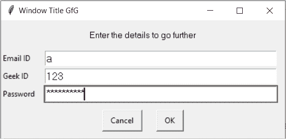

# 易趣–多密码盒

> 原文:[https://www.geeksforgeeks.org/easygui-multi-password-box/](https://www.geeksforgeeks.org/easygui-multi-password-box/)

**多密码框:**用于获取用户多文本单密码形式的输入，即屏蔽输入，输入可以是任意键盘输入，采取字符串形式输入。它显示标题、要显示的消息、输入文本的位置组和一对用于确认输入的“确定”、“取消”按钮。我们还可以在用户输入文本的地方设置一些默认文本。类似于多输入框，但最后一个输入字段被认为是密码，即下面的屏蔽文本就是密码框的样子


> 为了做到这一点，我们将使用`multpasswordbox`方法
> 
> **语法:**多密码框(消息、标题、字段、默认文本)
> 
> **参数:**需要 4 个参数，第一个字符串即要显示的消息/信息，第二个字符串即窗口标题，第三个是字段列表，第四个是字符串列表，默认为文本
> 
> **返回:**返回输入文本列表，如果按取消，则返回无

**示例:**
在这里我们将创建一个带有默认文本的多密码框，并根据输入的文本在屏幕上显示具体的消息，下面是实现

```
# importing easygui module
from easygui import *

# message to be displayed
text = "Enter the details to go further"

# window title
title = "Window Title GfG"

# list of entry fields
fields = ["Email ID", "Geek ID", "Password"]

# default text
default_values = ["email@abc.com", "G-111", "password"]

# creating a multi password box
output = multpasswordbox(text, title, fields, default_values )

# showing details entered by the user
print("Details entered by user")
print("==================================")

# traversing the output
for i in range(len(fields)):

    # showing field and entered value
    print(fields[i] + " : " + str(output[i]))
```

**输出:**

<video class="wp-video-shortcode" id="video-481834-1" width="665" height="277" preload="metadata" controls=""><source type="video/mp4" src="https://media.geeksforgeeks.org/wp-content/uploads/20200905010547/Window-Title-GfG-2020-09-05-01-05-24.mp4?_=1">[https://media.geeksforgeeks.org/wp-content/uploads/20200905010547/Window-Title-GfG-2020-09-05-01-05-24.mp4](https://media.geeksforgeeks.org/wp-content/uploads/20200905010547/Window-Title-GfG-2020-09-05-01-05-24.mp4)</video>

```
Details entered by user
==================================
Email ID : email@asd.ccc
Geek ID : G-11122
Password : password

```

**另一个例子:**
在这里我们会创建一个没有默认文本的多密码框，并且会根据输入的文本在屏幕上显示具体的消息，下面是实现

```
# importing easygui module
from easygui import *

# message to be displayed
text = "Enter the details to go further"

# window title
title = "Window Title GfG"

# list of entry fields
fields = ["Email ID", "Geek ID", "Password"]

# creating a multi password box
output = multpasswordbox(text, title, fields)

# showing details entered by the user
print("Details entered by user")
print("==================================")

# traversing the output
for i in range(len(fields)):

    # showing field and entered value
    print(fields[i] + " : " + str(output[i]))
```

**输出:**

<video class="wp-video-shortcode" id="video-481834-2" width="665" height="277" preload="metadata" controls=""><source type="video/mp4" src="https://media.geeksforgeeks.org/wp-content/uploads/20200905010647/Window-Title-GfG-2020-09-05-01-06-23.mp4?_=2">[https://media.geeksforgeeks.org/wp-content/uploads/20200905010647/Window-Title-GfG-2020-09-05-01-06-23.mp4](https://media.geeksforgeeks.org/wp-content/uploads/20200905010647/Window-Title-GfG-2020-09-05-01-06-23.mp4)</video>

```
Details entered by user
==================================
Email ID : aaa
Geek ID : Geek101
Password : alphabeta

```