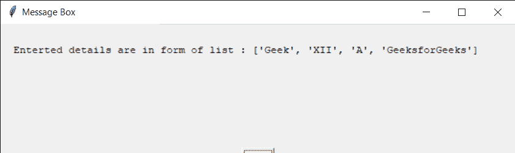
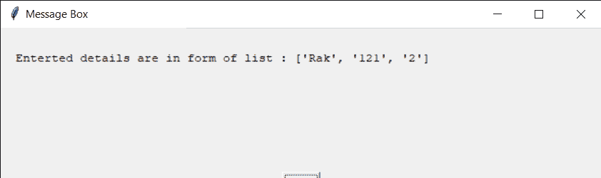

# 简易界面–多输入框

> 原文:[https://www.geeksforgeeks.org/easygui-multiple-enter-box/](https://www.geeksforgeeks.org/easygui-multiple-enter-box/)

**多重输入框:**用于一次性获取用户的多重输入，输入可以是任意键盘输入，它采取字符串形式输入。它显示标题、要显示的消息、一组输入文本的位置和一对用于确认输入的“确定”、“取消”按钮。它类似于普通的输入框，但是在多个输入框中可以同时给出多个输入，下图是输入框的外观
T3

> 为了做到这一点，我们将使用`multenterbox`方法
> 
> **语法:**多输入框(消息、标题、列表项、颜色 _ 默认 _ 文本)
> 
> **参数:**需要 4 个参数，第一个字符串，即要显示的消息/信息，第二个字符串，即窗口标题，第三个是字符串列表，即项目名称，第四个是字符串列表，即默认文本
> 
> **返回:**返回输入文本列表，如果按取消，则返回无

**示例:**
在这里我们将创建一个带有默认文本的多输入框，并根据输入的文本在屏幕上显示具体的消息，下面是实现

```
# importing easygui module
from easygui import *

# message to be displayed
text = "Enter the following details"

# window title
title = "Window Title GfG"

# list of multiple inputs
input_list = ["Name", "Class", "Section", "Address"]

# list of default text
default_list = ["eg GfG", "XII", "A", "GeeksforGeeks"]

# creating a integer box
output = multenterbox(text, title, input_list, default_list)

# title for the message box
title = "Message Box"

# creating a message
message = "Enterted details are in form of list : " + str(output)

# creating a message box
msg = msgbox(message, title)
```

**输出:**

<video class="wp-video-shortcode" id="video-481830-1" width="665" height="318" preload="metadata" controls=""><source type="video/mp4" src="https://media.geeksforgeeks.org/wp-content/uploads/20200905001436/Window-Title-GfG-2020-09-05-00-14-03.mp4?_=1">[https://media.geeksforgeeks.org/wp-content/uploads/20200905001436/Window-Title-GfG-2020-09-05-00-14-03.mp4](https://media.geeksforgeeks.org/wp-content/uploads/20200905001436/Window-Title-GfG-2020-09-05-00-14-03.mp4)</video>


**另一个例子:**
在这里我们将创建一个没有默认文本的多输入框，并根据输入的文本在屏幕上显示具体的消息，下面是实现

```
# importing easygui module
from easygui import *

# message to be displayed
text = "Enter the following details"

# window title
title = "Window Title GfG"

# list of multiple inputs
input_list = ["Geek Name", "Geek ID", "Experiance"]

# creating a integer box
output = multenterbox(text, title, input_list)

# title for the message box
title = "Message Box"

# creating a message
message = "Enterted details are in form of list : " + str(output)

# creating a message box
msg = msgbox(message, title)
```

**输出:**

<video class="wp-video-shortcode" id="video-481830-2" width="665" height="267" preload="metadata" controls=""><source type="video/mp4" src="https://media.geeksforgeeks.org/wp-content/uploads/20200905003313/Window-Title-GfG-2020-09-05-00-31-091.mp4?_=2">[https://media.geeksforgeeks.org/wp-content/uploads/20200905003313/Window-Title-GfG-2020-09-05-00-31-091.mp4](https://media.geeksforgeeks.org/wp-content/uploads/20200905003313/Window-Title-GfG-2020-09-05-00-31-091.mp4)</video>
