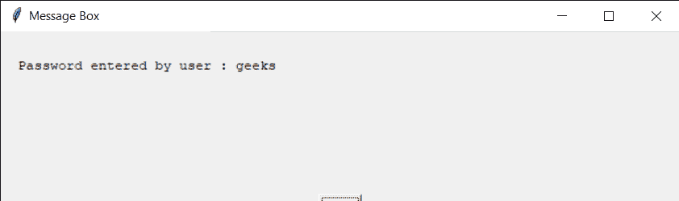
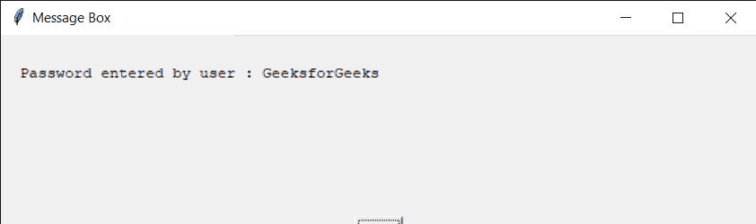

# easy GUI–密码盒

> 原文:[https://www.geeksforgeeks.org/easygui-password-box/](https://www.geeksforgeeks.org/easygui-password-box/)

**密码框:**用于获取用户以密码形式的输入，即屏蔽输入，输入可以是任何键盘输入，它以字符串形式输入。它显示标题、要显示的消息、输入文本的位置以及一对用于确认输入的“确定”、“取消”按钮。我们还可以在用户输入文本的地方设置一些默认文本，下面是密码框的样子


> 为了做到这一点，我们将使用`passwordbox`方法
> 
> **语法:**密码框(消息、标题、默认文本)
> 
> **参数:**需要 3 个参数，第一个字符串即要显示的消息/信息，第二个字符串即窗口标题，第三个字符串即默认文本
> 
> **返回:**如果按下取消，则返回输入的文本和无

**示例:**
在这里我们将创建一个带有默认文本的密码框，并根据输入的文本在屏幕上显示具体的消息，下面是实现

```
# importing easygui module
from easygui import *

# message to be displayed
text = "Enter the password to enter GeeksforGeeks"

# window title
title = "Window Title GfG"

# default password
default_password = "geeksforgeeks"

# creating a integer box
output = passwordbox(text, title, default_password)

# title for the message box
title = "Message Box"

# creating a message
message = "Password entered by user : " + str(output)

# creating a message box
msg = msgbox(message, title)
```

**输出:**

<video class="wp-video-shortcode" id="video-481832-1" width="665" height="217" preload="metadata" controls=""><source type="video/mp4" src="https://media.geeksforgeeks.org/wp-content/uploads/20200905004813/Window-Title-GfG-2020-09-05-00-47-44.mp4?_=1">[https://media.geeksforgeeks.org/wp-content/uploads/20200905004813/Window-Title-GfG-2020-09-05-00-47-44.mp4](https://media.geeksforgeeks.org/wp-content/uploads/20200905004813/Window-Title-GfG-2020-09-05-00-47-44.mp4)</video>


另一个例子
在这里我们将创建一个没有默认文本的密码框，并根据输入的文本在屏幕上显示具体的消息，下面是实现

```
# importing easygui module
from easygui import *

# message to be displayed
text = "Enter the new password for GeeksforGeeks"

# window title
title = "Window Title GfG"

# creating a integer box
output = passwordbox(text, title)

# title for the message box
title = "Message Box"

# creating a message
message = "Password entered by user : " + str(output)

# creating a message box
msg = msgbox(message, title)
```

**输出:**

<video class="wp-video-shortcode" id="video-481832-2" width="665" height="217" preload="metadata" controls=""><source type="video/mp4" src="https://media.geeksforgeeks.org/wp-content/uploads/20200905005010/Window-Title-GfG-2020-09-05-00-49-24.mp4?_=2">[https://media.geeksforgeeks.org/wp-content/uploads/20200905005010/Window-Title-GfG-2020-09-05-00-49-24.mp4](https://media.geeksforgeeks.org/wp-content/uploads/20200905005010/Window-Title-GfG-2020-09-05-00-49-24.mp4)</video>
