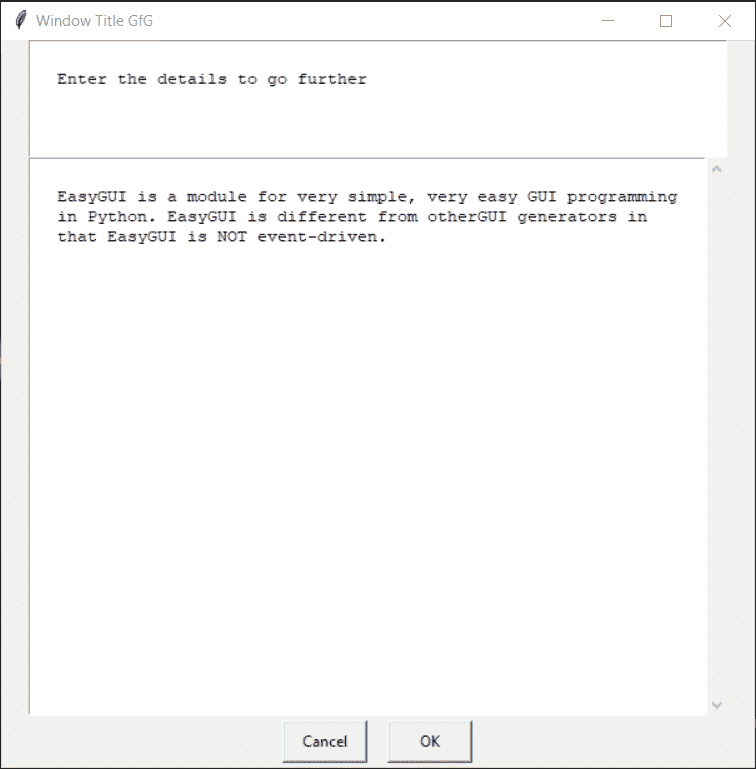

# easy GUI–文字方块

> 哎哎哎:# t0]https://www . geeksforgeeks . org/easy GUI-text-box/

**文本框:**用于向/从用户显示和获取文本，文本可以使用任何键盘输入进行编辑，它以字符串的形式进行输入。它显示标题、要显示的消息、更改给定文本的位置以及一对用于确认文本的“确定”、“取消”按钮。它类似于输入文本，但用于显示大文本，并对给定文本进行自动换行，下面是输入框的外观


> 为了做到这一点，我们将使用`textbox`方法
> 
> **语法:**文本框(消息、标题、文本)
> 
> **参数:**需要 3 个参数，第一个字符串即要显示的消息/信息，第二个字符串即窗口标题，第三个字符串即可编辑文本
> 
> **返回:**如果按下取消，则返回修改后的文本和无

**示例:**
在这里我们将创建一个带有可编辑文本的文本框，并将根据修改后的文本在屏幕上显示具体的文本，下面是实现

```
# importing easygui module
from easygui import *

# message to be displayed
message = "Below is the text to edit"

# window title
title = "Window Title GfG"

# long text
text = ["EasyGUI is a module for very simple, very easy GUI ",
"programming in Python. EasyGUI is different from other",
"GUI generators in that EasyGUI is NOT event-driven."]

# creating a multi password box
output = textbox(message, title, text)

# showing the output
print("Alterted Text ")
print("================")
print(output)
```

**输出:**

<video class="wp-video-shortcode" id="video-481836-1" width="665" height="644" preload="metadata" controls=""><source type="video/mp4" src="https://media.geeksforgeeks.org/wp-content/uploads/20200905012707/Window-Title-GfG-2020-09-05-01-24-30.mp4?_=1">[https://media.geeksforgeeks.org/wp-content/uploads/20200905012707/Window-Title-GfG-2020-09-05-01-24-30.mp4](https://media.geeksforgeeks.org/wp-content/uploads/20200905012707/Window-Title-GfG-2020-09-05-01-24-30.mp4)</video>

```
Alterted Text 
================
EasyGUI is a module for very simple, very easy GUI programming in Python. EasyGUI is different from otherGUI generators in that EasyGUI is NOT event-driven. geeksforgeeks

```

**另一个例子:**
在这里我们将创建一个没有任何可编辑文本的文本框，并将根据修改后的文本在屏幕上显示具体的文本，下面是实现

```
# importing easygui module
from easygui import *

# message to be displayed
message = "Below is the text to edit"

# window title
title = "Window Title GfG"

# creating a multi password box
output = textbox(message, title)

# showing the output
print("Alterted Text ")
print("================")
print(output)
```

**输出:**

<video class="wp-video-shortcode" id="video-481836-2" width="665" height="644" preload="metadata" controls=""><source type="video/mp4" src="https://media.geeksforgeeks.org/wp-content/uploads/20200905012901/Window-Title-GfG-2020-09-05-01-27-50.mp4?_=2">[https://media.geeksforgeeks.org/wp-content/uploads/20200905012901/Window-Title-GfG-2020-09-05-01-27-50.mp4](https://media.geeksforgeeks.org/wp-content/uploads/20200905012901/Window-Title-GfG-2020-09-05-01-27-50.mp4)</video>

```
Alterted Text 
================
Welcome to geeksforgeeks ajkbkjbajxblcblc;c

```