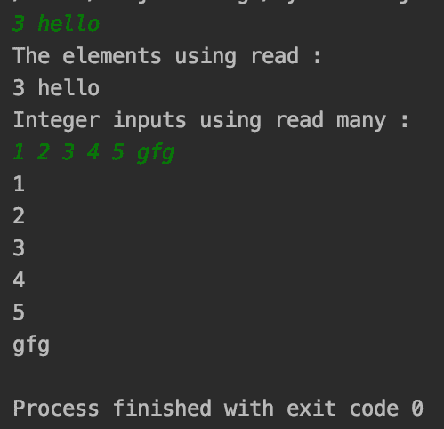
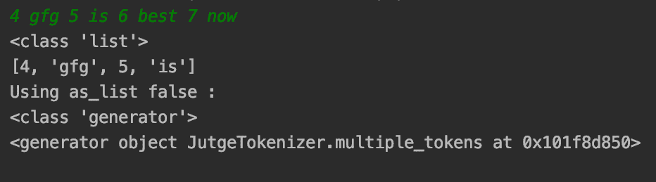
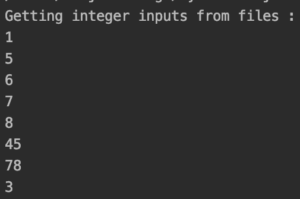
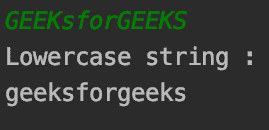
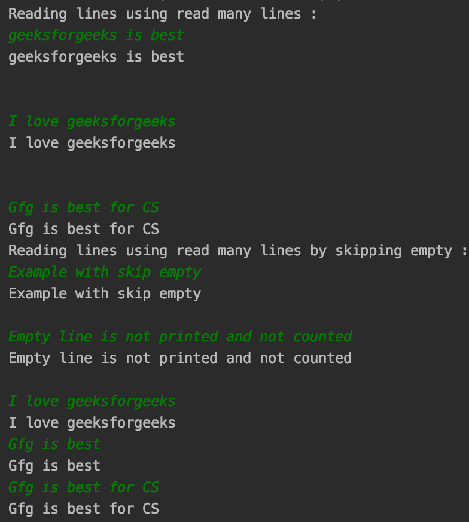

# Python 中的 easyinput 模块

> 原文:[https://www.geeksforgeeks.org/easyinput-module-in-python/](https://www.geeksforgeeks.org/easyinput-module-in-python/)

**Python 中的 easyinput** 模块提供了一个类似于 C++中 cin 流的简单输入界面。它支持包括文件在内的多种数据类型，并提供输入不同数据类型、多行输入等功能。

### 装置

要安装此模块，请在终端中键入以下命令。

```py
pip install easyinput
```

### **使用的功能**

*   **read(*type，amount=1，file，as_list):** 从输入流返回令牌。

> **参数:**
> 
> *   **类型**:数据类型列表，每种类型返回对应的令牌。
> *   **量**:给定类型重复特定次数。
> *   **as_list** :如果为真，令牌流作为列表返回，否则返回生成器。
> *   **文件**:文件实体流。

*   **read _ multi(* type，amount=1，file=_StdIn):** 从输入流中读取令牌，除非输入了其他类型的元素。

**例 1:read()和 read _ multi()的工作方式**

## 蟒蛇 3

```py
from easyinput import read_many, read

a = read(int)
b = read(str)

print("The elements using read : ")
print(a, b)

print("Integer inputs using read many : ")
for num in read_many(int):
    print(num)

# reading the string after integers
print(read())
```

**输出:**



演示 read()和 read _ multi()

**例 2:使用金额()和 as_list()**

通常，在 read()中处理多个参数时，read()会返回一个列表。如果我们需要使用一个生成器，而不是一个列表，as_list()可以设置为 false。它的优点是可以避免重复列表来访问和填充不同的数据类型。

## 蟒蛇 3

```py
from easyinput import read

# input int, str, int chain 3 times
multi_input = read(int, str, amount=2)

# printing type and input
print(type(multi_input))
print(multi_input)

# putting as_list = False
print("Using as_list false : ")
multi_input = read(int, str, amount=2, as_list=False)

print(type(multi_input))
print(multi_input)
```

**输出:**



使用金额()和 as_list()

**示例 3:使用 read _ multi()**输入文件

read()和 read _ multi()函数提供了获取文件作为输入流的功能，以从文件中获取数据并在控制台上渲染，或者使用**文件**参数渲染任何文件。

**代码:**

## 蟒蛇 3

```py
from easyinput import read_many

print("Getting integer inputs from files : ")
with open('gfg_file_input') as inp_file:
    for ele in read_many(int, file=inp_file):
        print(ele)
```

**输出:**



输出数字

**示例 4:使用带有 read()** 的自定义数据类型

除了基元数据类型之外，read()还可以接受接受字符串作为输入的类实例，这些字符串可用于转换为自定义的工作类型。下面的示例获取小写单词。

## 蟒蛇 3

```py
from easyinput import read

class ToLower:
    def __init__(self, ele):
        self.ele = ele.lower()

    def print_ele(self):
        print(self.ele)

# Gets object of ToLower class
ele = read(ToLower)

# printing the word
print("Lowercase string : ")
ele.print_ele()
```

**输出:**



获取转换为小写的输入

### **使用 read _ multi _ line()**

与 read _ multi()类似，不同之处在于它一次读取整行，而不是在空格处移动到换行符。阅读整行。

**语法:**

> **read _ multi _ line(rstrip = True，skip_empty=False)**
> 
> **参数:**
> **rstrip :** 跳过所有输入的尾随换行符。默认情况下，该值为真。
> **skip_empty :** 默认为 false，设置为 True 时，跳过只是空字符的行。

**代码:**

## 蟒蛇 3

```py
from easyinput import read_many_lines

print("Reading lines using read many lines : ")
count = 1
for line in read_many_lines():
    print(line)
    count = count + 1
    if count > 5:
        break

print("Reading lines using read many lines by skipping empty : ")
count = 1
for sline in read_many_lines(skip_empty=True):
    print(sline)
    count = count + 1
    if count > 5:
        break
```

**输出:**



读取多行示例