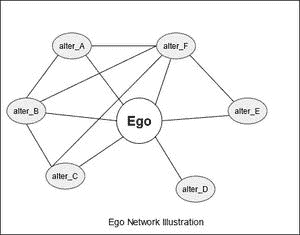
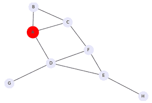
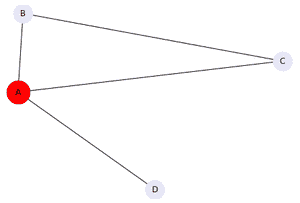

# Python 中使用 Networkx 的自我图

> 原文:[https://www . geesforgeks . org/ego-graph-use-networkx-in-python/](https://www.geeksforgeeks.org/ego-graph-using-networkx-in-python/)

**先决条件–**[**图表**](https://www.geeksforgeeks.org/graph-and-its-representations/)**[**网络基础知识**](https://www.geeksforgeeks.org/python-visualize-graphs-generated-in-networkx-using-matplotlib/)**

**Ego 网络是一种特殊类型的网络，由一个中心节点和与其直接相连的所有其他节点组成。中心节点被称为**自我**，而其他直接连接到它的周围节点被称为**变身**。自我网络主要用于分析社会关系、联系和关系。下图所示的网络是自我网络的示例。中心节点(ego)显示为被相邻节点(changes)包围的圆形。**

**自我网络广泛应用于社会网络分析。关于自我网络的基本假设是强联系是同质的。同质性是指以某种方式在社会上有联系的个体之间表现出某些特征或相似性的倾向。简而言之，志同道合的人在某种程度上紧密相连。自我网络帮助我们识别这些隐藏的联系。**

****自我网络提供以下功能:****

*   **高效传播信息。**
*   **从链接中感知，例如——社交链接，关系。**
*   **访问资源，高效的连接路径生成。**
*   **社区检测，识别形成的群体。**
*   **社会支持的个体关系分析。**

****

**在任何图形数据库上实现 ego 网络最简单的方法是使用 network 库。它为网络的分析和可视化提供了许多预定义的功能。**

****Networkx:** Networkx 是一个 Python 包，用于创建、分析和研究复杂网络的本质。它是最流行的用于网络分析的 python 库之一。**

****包装安装:****

```py
pip install networkx
```

**Networkx 库提供了方法 **ego_graph()** 从任何图形生成一个 ego 网络。该方法采用两个强制参数和四个附加可选参数。**

> ****语法:** ego_graph(G，n，半径=1，中心=真，无向=假，距离=无)**
> 
> ****参数:****
> 
>  ***   **G(图)–**网络 x 图(其自我网络将被创建的父网络)
> *   **N(节点)–**单个节点(自我网络的自我/中心节点)
> *   **半径(数字，可选)–**包括距离的所有邻居< =从 n 开始的半径
> *   **中心(布尔，可选)–**如果为假，则不要在图形中包括中心节点(ego)
> *   **无向(布尔，可选)–**如果为真，则使用有向图的内邻居和外邻居。
> *   **距离(键，可选)–**使用指定的边缘数据键作为距离。例如，设置距离= '权重'将使用边缘权重来测量距节点 n 的距离。**

### ****创建样本网络****

**我们取了一个样本网络，其中几个节点相互连接。在这个例子中，节点是–( A，B，C，D，E，F，G，H)，在这些节点中，一个节点被视为中心节点(自我)，在我们的例子中，我们已经将 A 视为自我。下面的代码创建并显示了我们的示例网络。**

****示例:****

## **蟒蛇 3**

```py
# import networkx for graph generation
import networkx as nx

# import matplotlib library
import matplotlib.pyplot as plt

# generation of a sample graph
G = nx.Graph()
G.add_edges_from([('A', 'B'), ('A', 'C'), 
                  ('B', 'C'), ('E', 'F'),
                  ('D', 'E'), ('A', 'D'), 
                  ('D', 'G'), ('C', 'F'),
                  ('D', 'F'), ('E', 'H')])

# Defining ego as large and red
# while alters are in lavender
# Let 'A' be the ego
ego = 'A'
pos = nx.spring_layout(G)
nx.draw(G, pos, node_color = "lavender", 
        node_size = 800, with_labels = True)

options = {"node_size": 1200, "node_color": "r"}
nx.draw_networkx_nodes(G, pos, nodelist=[ego], **options)
plt.show()
```

****输出:****

**

样本网络(自我-A)** 

**节点 A 被定义为自我，因此以红色显示。**

### ****创造自我网络****

**下面的代码创建并显示了将节点 A 视为自我的自我网络。**

## **蟒蛇 3**

```py
# create ego network
hub_ego = nx.ego_graph(G, ego)

# showing the ego network
nx.draw(hub_ego, pos, node_color="lavender", 
        node_size = 800, with_labels = True)

nx.draw_networkx_nodes(
  hub_ego, pos, nodelist = [ego], **options)

plt.show()
```

****输出:****

**

自我网络(自我-A，改变–[ B，C，D])**