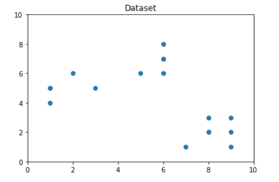
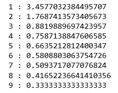
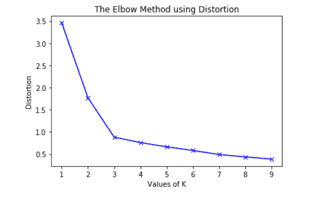
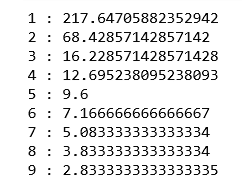
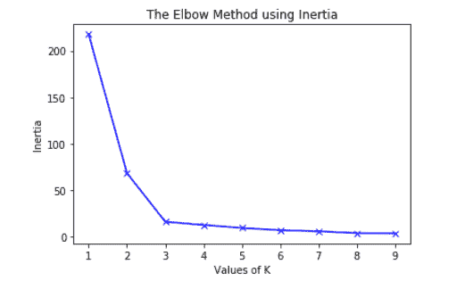
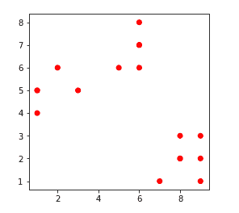
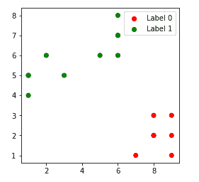
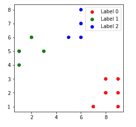
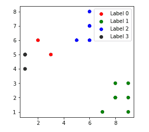

# k 线最佳值的肘形法

> 原文:[https://www . geeksforgeeks . org/肘形法获得最佳 k 值公里数/](https://www.geeksforgeeks.org/elbow-method-for-optimal-value-of-k-in-kmeans/)

**先决条件:** [K-Means 聚类](https://www.geeksforgeeks.org/k-means-clustering-introduction/)
任何无监督算法的一个基本步骤是确定数据可能被聚类到的最佳聚类数。**肘形方法**是确定 K 的最佳值的最流行的方法之一。
我们现在使用 python 的 **Sklearn** 库演示使用 K-Means 聚类技术的给定方法。
**步骤 1:导入所需的库**

## 蟒蛇 3

```py
from sklearn.cluster import KMeans
from sklearn import metrics
from scipy.spatial.distance import cdist
import numpy as np
import matplotlib.pyplot as plt
```

**步骤 2:创建和可视化数据**

## 蟒蛇 3

```py
# Creating the data
x1 = np.array([3, 1, 1, 2, 1, 6, 6, 6, 5, 6, 7, 8, 9, 8, 9, 9, 8])
x2 = np.array([5, 4, 5, 6, 5, 8, 6, 7, 6, 7, 1, 2, 1, 2, 3, 2, 3])
X = np.array(list(zip(x1, x2))).reshape(len(x1), 2)

# Visualizing the data
plt.plot()
plt.xlim([0, 10])
plt.ylim([0, 10])
plt.title('Dataset')
plt.scatter(x1, x2)
plt.show()
```



从上面的可视化中，我们可以看到最佳的集群数量应该在 3 个左右。但是仅仅将数据可视化并不总能给出正确的答案。因此，我们演示以下步骤。
我们现在定义如下

1.  **失真:**它被计算为各个簇的簇中心的平方距离的平均值。通常，使用欧几里得距离度量。
2.  **惯性:**是样本到最近聚类中心的平方距离之和。

我们从 1 到 9 迭代 k 的值，计算每个 k 值的失真值，并计算给定范围内每个 k 值的失真和惯性。
**第三步:建立聚类模型，计算扭曲和惯性值:**

## 蟒蛇 3

```py
distortions = []
inertias = []
mapping1 = {}
mapping2 = {}
K = range(1, 10)

for k in K:
    # Building and fitting the model
    kmeanModel = KMeans(n_clusters=k).fit(X)
    kmeanModel.fit(X)

    distortions.append(sum(np.min(cdist(X, kmeanModel.cluster_centers_,
                                        'euclidean'), axis=1)) / X.shape[0])
    inertias.append(kmeanModel.inertia_)

    mapping1[k] = sum(np.min(cdist(X, kmeanModel.cluster_centers_,
                                   'euclidean'), axis=1)) / X.shape[0]
    mapping2[k] = kmeanModel.inertia_
```

**第 4 步:使用不同的失真值将结果制成表格并可视化**
a)【T3:

## 蟒蛇 3

```py
for key, val in mapping1.items():
    print(f'{key} : {val}')
```



## 蟒蛇 3

```py
plt.plot(K, distortions, 'bx-')
plt.xlabel('Values of K')
plt.ylabel('Distortion')
plt.title('The Elbow Method using Distortion')
plt.show()
```



b) **使用不同的惯性值:**

## 蟒蛇 3

```py
for key, val in mapping2.items():
    print(f'{key} : {val}')
```



## 蟒蛇 3

```py
plt.plot(K, inertias, 'bx-')
plt.xlabel('Values of K')
plt.ylabel('Inertia')
plt.title('The Elbow Method using Inertia')
plt.show()
```



为了确定最佳的群集数量，我们必须选择“弯头”处的 k 值，即扭曲/惯性开始以线性方式减小的点。因此，对于给定的数据，我们得出数据的最佳聚类数是 **3** 。
不同 k 值的聚类数据点:-
1。 **k = 1**



2. **k = 2**



3. **k = 3**



4. **k = 4**

