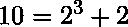

# Python 中的 Elias Gamma 编码

> 原文:[https://www . geesforgeks . org/Elias-gamma-encoding-in-python/](https://www.geeksforgeeks.org/elias-gamma-encoding-in-python/)

Elias gamma 码是一种通用码，用于对正整数序列进行编码。它是由彼得·埃利亚斯开发的。当不能事先确定整数的上限时，这是最有用的。

#### 编码步骤:

要对数字 X 进行编码，

*   找到最大的 N，用
    (2 的更大幂)。

*   使用一元编码对 N 进行编码(即 N 个 0 后跟一个 1)。*   Append the integer  using N digits in Binary.

    **示例:**我们来考虑一个要对 10 进行编码的示例，
    我们可以将 10 表示为:
    。
    **Step1** :这里，最大 N = 3
    **Step2** :一元中的 N(=3)后跟一个 1 = 0001
    **step 3**:现在用 N(=3)位数表示二进制中的 2 = 010
    所以， **10 的 Elias gamma 编码= 0001010**

    下面是上述方法的实现。

    ```py
    # Python3 implementation
    from math import log

    log2 = lambda x: log(x, 2)

    def Unary(x):
        return (x-1)*'0'+'1'

    def Binary(x, l = 1):
        s = '{0:0%db}' % l
        return s.format(x)

    def Elias_Gamma(x):
        if(x == 0): 
            return '0'

        n = 1 + int(log2(x))
        b = x - 2**(int(log2(x)))

        l = int(log2(x))

        return Unary(n) + Binary(b, l)

    print(Elias_Gamma(10))
    ```

    **输出:**

    ```py
    0001010
    ```