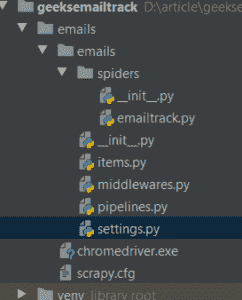
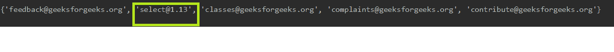
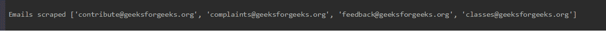

# 来自 Scrapy Python 网站的电子邮件 Id 提取器项目

> 原文:[https://www . geesforgeks . org/email-id-extractor-project-from-sites-in-scrapy-python/](https://www.geeksforgeeks.org/email-id-extractor-project-from-sites-in-scrapy-python/)

Scrapy 是用 Python 编写的开源网页抓取框架，用于网页抓取，也可以用于提取数据进行通用。首先，所有的子页面链接都取自主页，然后使用正则表达式从这些子页面中抓取电子邮件 id。

本文展示了 geeksforgeeks 网站的电子邮件 id 提取作为参考。

**要从 geeksforgeeks 网站抓取的电子邮件 id–**[‘反馈@ geeksforgeeks . org’，‘类@ geeksforgeeks . org’，‘投诉@ geeksforgeeks . org’，‘投稿@ geeksforgeeks . org’]

### 如何使用 Scrapy 创建电子邮件 ID 提取器项目？

1.**包装安装**–从终端运行以下命令

```
pip install scrapy 
pip install scrapy-selenium
```

2.**创建项目–**

```
scrapy startproject projectname (Here projectname is geeksemailtrack) 
cd projectname 
scrapy genspider spidername (Here spidername is emails)
```

3)在 settings.py 文件中添加代码以使用 scrapy-selenium

```
from shutil import which 
SELENIUM_DRIVER_NAME = 'chrome' 
SELENIUM_DRIVER_EXECUTABLE_PATH = which('chromedriver') 
SELENIUM_DRIVER_ARGUMENTS=[]
DOWNLOADER_MIDDLEWARES = { 
'scrapy_selenium.SeleniumMiddleware': 800 
}
```

4)现在为你的 chrome 下载 chrome 驱动程序，并把它放在 chrome scrapy.cfg 文件附近。下载 chrome 驱动请参考本网站–[下载 chrome 驱动](https://chromedriver.chromium.org/downloads)。

**目录结构–**



**分步代码–**

1.导入所有必需的库–

## 蟒蛇 3

```
# web scraping framework
import scrapy

# for regular expression
import re

# for selenium request
from scrapy_selenium import SeleniumRequest

# for link extraction
from scrapy.linkextractors.lxmlhtml import LxmlLinkExtractor
```

2.创建 **start_requests** 功能从 selenium 打到站点。您可以添加自己的网址。

## 蟒蛇 3

```
def start_requests(self):
    yield SeleniumRequest(
        url="https://www.geeksforgeeks.org/",
        wait_time=3,
        screenshot=True,
        callback=self.parse,
        dont_filter=True
    )
```

3.创建**解析**函数:

## 蟒蛇 3

```
def parse(self, response):
        # this helps to get all links from source code
        links = LxmlLinkExtractor(allow=()).extract_links(response)

        # Finallinks contains links urk
        Finallinks = [str(link.url) for link in links]

        # links list for url that may have email ids
        links = []

        # filtering and storing only needed url in links list
        # pages that are about us and contact us are the ones that have email ids
        for link in Finallinks:
            if ('Contact' in link or 'contact' in link or 'About' in link or 'about' in link or 'CONTACT' in link or 'ABOUT' in link):
                links.append(link)

        # current page url also added because few sites have email ids on there main page
        links.append(str(response.url))

        # parse_link function is called for extracting email ids
        l = links[0]
        links.pop(0)

        # meta helps to transfer links list from parse to parse_link
        yield SeleniumRequest(
            url=l,
            wait_time=3,
            screenshot=True,
            callback=self.parse_link,
            dont_filter=True,
            meta={'links': links}
        )
```

**解析函数解释–**

*   以下几行中的所有链接都是从 https://www.geeksforgeeks.org/的回复中提取的。

```
links = LxmlLinkExtractor(allow=()).extract_links(response) 
Finallinks = [str(link.url) for link in links] 
```

*   Finallinks 是包含所有链接的列表。
*   为了避免不必要的链接，我们把过滤器，如果链接属于联系和关于页面，那么只有我们刮从那个页面的细节。

```
for link in Finallinks: 
if ('Contact' in link or 'contact' in link or 'About' in link or 'about' in link or 
or 'CONTACT' in link or 'ABOUT' in 
link): 
links.append(link) 
```

*   这上面的过滤器是不必要的，但网站确实有很多标签(链接)，因此，如果网站有 50 个子页面，那么它将从这 50 个子网址提取电子邮件。假设电子邮件主要在主页、联系人页面和关于页面上，因此该过滤器有助于减少抓取那些可能没有电子邮件 id 的 URL 的时间浪费。
*   可能具有电子邮件 id 的页面的链接被逐个请求，并且电子邮件 id 被使用正则表达式刮除。

4.创建 **parse_link** 功能代码:

## 蟒蛇 3

```
def parse_link(self, response):
    # response.meta['links'] this helps to get links list
    links = response.meta['links']
    flag = 0

    # links that contains following bad words are discarded
    bad_words = ['facebook', 'instagram', 'youtube', 'twitter', 'wiki', 'linkedin']

    for word in bad_words:
        # if any bad word is found in the current page url
        # flag is assigned to 1
        if word in str(response.url):
            flag = 1
            break

    # if flag is 1 then no need to get email from
    # that url/page
    if (flag != 1):
        html_text = str(response.text)
        # regular expression used for email id
        email_list = re.findall('\w+@\w+\.{1}\w+', html_text)
        # set of email_list to get unique
        email_list = set(email_list)
        if (len(email_list) != 0):
            for i in email_list:
                # adding email ids to final uniqueemail
                self.uniqueemail.add(i)

    # parse_link function is called till
    # if condition satisfy
    # else move to parsed function
    if (len(links) > 0):
        l = links[0]
        links.pop(0)
        yield SeleniumRequest(
            url=l,
            callback=self.parse_link,
            dont_filter=True,
            meta={'links': links}
        )
    else:
        yield SeleniumRequest(
            url=response.url,
            callback=self.parsed,
            dont_filter=True
        )
```

**parse _ link 函数说明:**

通过 *response.text* 我们获得了请求的网址的所有源代码。正则表达式' \w+@\w+\。这里使用的{1}\w+可以翻译为类似这样的内容:查找每一段以一个或多个字母开头，后跟一个 at 符号(“@”)的字符串，后跟一个或多个以点结尾的字母。
在那之后它应该又有一个或多个字母了。这是一个用于获取电子邮件 id 的正则表达式。

5.创建**解析的**函数–

## 蟒蛇 3

```
def parsed(self, response):
    # emails list of uniqueemail set
    emails = list(self.uniqueemail)
    finalemail = []

    for email in emails:
        # avoid garbage value by using '.in' and '.com'
        # and append email ids to finalemail
        if ('.in' in email or '.com' in email or 'info' in email or 'org' in email):

            finalemail.append(email)

    # final unique email ids from geeksforgeeks site
    print('\n'*2)
    print("Emails scraped", finalemail)
    print('\n'*2)
```

**解析函数的解释:**
上面的正则表达式也导致了像 select@1.13 这样的垃圾值在这个来自 geeksforgeeks 的刮擦邮件 id 中，我们知道 select@1.13 不是邮件 id。已解析的函数筛选器应用仅接受包含“”的电子邮件的筛选器。com '和”。在”。

使用以下命令运行蜘蛛–

```
scrape crawl spidername (spidername is name of spider)
```

**垃圾邮件中的垃圾值:**



**最终的垃圾邮件:**



## 计算机编程语言

```
# web scraping framework
import scrapy

# for regular expression
import re

# for selenium request
from scrapy_selenium import SeleniumRequest

# for link extraction
from scrapy.linkextractors.lxmlhtml import LxmlLinkExtractor

class EmailtrackSpider(scrapy.Spider):
    # name of spider
    name = 'emailtrack'

    # to have unique email ids
    uniqueemail = set()

    # start_requests sends request to given https://www.geeksforgeeks.org/
    # and parse function is called
    def start_requests(self):
        yield SeleniumRequest(
            url="https://www.geeksforgeeks.org/",
            wait_time=3,
            screenshot=True,
            callback=self.parse,
            dont_filter=True
        )

    def parse(self, response):
            # this helps to get all links from source code
            links = LxmlLinkExtractor(allow=()).extract_links(response)

            # Finallinks contains links urk
            Finallinks = [str(link.url) for link in links]

            # links list for url that may have email ids
            links = []

            # filtering and storing only needed url in links list
            # pages that are about us and contact us are the ones that have email ids
            for link in Finallinks:
                if ('Contact' in link or 'contact' in link or 'About' in link or 'about' in link or 'CONTACT' in link or 'ABOUT' in link):
                    links.append(link)

            # current page url also added because few sites have email ids on there main page
            links.append(str(response.url))

            # parse_link function is called for extracting email ids
            l = links[0]
            links.pop(0)

            # meta helps to transfer links list from parse to parse_link
            yield SeleniumRequest(
                url=l,
                wait_time=3,
                screenshot=True,
                callback=self.parse_link,
                dont_filter=True,
                meta={'links': links}
            )

    def parse_link(self, response):

        # response.meta['links'] this helps to get links list
        links = response.meta['links']
        flag = 0

        # links that contains following bad words are discarded
        bad_words = ['facebook', 'instagram', 'youtube', 'twitter', 'wiki', 'linkedin']

        for word in bad_words:
            # if any bad word is found in the current page url
            # flag is assigned to 1
            if word in str(response.url):
                flag = 1
                break

        # if flag is 1 then no need to get email from
        # that url/page
        if (flag != 1):
            html_text = str(response.text)
            # regular expression used for email id
            email_list = re.findall('\w+@\w+\.{1}\w+', html_text)
            # set of email_list to get unique
            email_list = set(email_list)
            if (len(email_list) != 0):
                for i in email_list:
                    # adding email ids to final uniqueemail
                    self.uniqueemail.add(i)

        # parse_link function is called till
        # if condition satisfy
        # else move to parsed function
        if (len(links) > 0):
            l = links[0]
            links.pop(0)
            yield SeleniumRequest(
                url=l,
                callback=self.parse_link,
                dont_filter=True,
                meta={'links': links}
            )
        else:
            yield SeleniumRequest(
                url=response.url,
                callback=self.parsed,
                dont_filter=True
            )

    def parsed(self, response):
        # emails list of uniqueemail set
        emails = list(self.uniqueemail)
        finalemail = []

        for email in emails:
            # avoid garbage value by using '.in' and '.com'
            # and append email ids to finalemail
            if ('.in' in email or '.com' in email or 'info' in email or 'org' in email):

                finalemail.append(email)

        # final unique email ids from geeksforgeeks site
        print('\n'*2)
        print("Emails scraped", finalemail)
        print('\n'*2)
```

**上述代码的工作视频–**

<video class="wp-video-shortcode" id="video-535048-1" width="640" height="360" preload="metadata" controls=""><source type="video/webm" src="https://media.geeksforgeeks.org/wp-content/uploads/20200726161046/emailtrack.webm?_=1">[https://media.geeksforgeeks.org/wp-content/uploads/20200726161046/emailtrack.webm](https://media.geeksforgeeks.org/wp-content/uploads/20200726161046/emailtrack.webm)</video>

**参考–**[链接提取器](https://docs.scrapy.org/en/latest/_modules/scrapy/linkextractors/lxmlhtml.html)