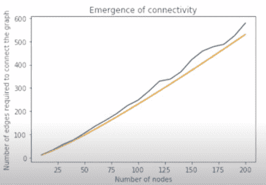

# 社交网络中连通性的出现

> 原文:[https://www . geeksforgeeks . org/社交网络中连接的出现/](https://www.geeksforgeeks.org/emergence-of-connectedness-in-social-networks/)

**先决条件:** [网络基础知识](https://www.geeksforgeeks.org/introduction-to-social-networks-using-networkx-in-python/)

连通性的出现是为了检查图是否连通。它说，在一个有 N 个节点的图中，我们只需要 N 条边就可以使图连通。

**进场:**

应遵循以下算法:

1.  取任意有 N 个节点的随机图。
2.  现在选择任意节点作为起始节点。
3.  现在给图添加随机边，每次检查图是否连通。
4.  如果图形没有连接，则重复步骤 2 和 3。
5.  如果图是连通的，那么检查添加的边的数量，这将等于 NLogN。
6.  现在检查两个情节将几乎相似。

**检查连通性的代码:**

## 蟒蛇 3

```
import networkx as nx
import matplotlib.pyplot as plt
import random

# Add N number of nodes in graph g 
# and return the graph
def add_nodes(N):
    g = nx.Graph()
    g.add_nodes_from(range(N))
    return g

# Add 1 random edge
def add_random_edge(g):
    z1 = random.choice(g.nodes())
    z2 = random.choice(g.nodes())
    if z1 != z2:
        g.add_edge(z1, z2)
    return g

# Continue adding edges in graph g till 
# it becomes connected
def continue_add_connectivity(g):
    while(nx.is_connected(g) == False):
        g = add_random_edge(g)
    return g

# Creates an object of entire process.
# Input- number of nodes and Output- 
# number of edges required for graph
# connectivity.
def create_instance(N):
    g = add_nodes(N)
    g = continue_add_connectivity(g)
    return g.number_of_edges()

# Average it over 100 times
def create_average_instance(N):
    l = []
    for i in range(0, 100):
        l.append(create_instance(N))
    return numpy.average(l)

# Plot the graph for different number 
# of edges
def plot_connectivity():
    a = []
    b = []

    # j is the number of nodes
    j = 10

    while (j <= 1000):
        a.append(j)
        b.append(create_average_instance(j))
        i += 10

    plt.xlabel('Number of nodes')
    plt.ylabel('Number of edges required')
    plt.title('Emergence of connectivity')
    plt.plot(a, b)
    plt.show()

    a1 = []
    b1 = []
    j = 10
    while (j <= 400):
        a1.append(j)
        b1.append(j*float(numpy.log(j)/2))
        j += 10
    plt.plot(a1, b1)
    plt.show()

# main
plot_connectivity()
```

**输出:**

```
10
20
30
40
50
60
70
80
90
100
110
120
130
140
150
160
170
180
190
200

```



连通性出现图