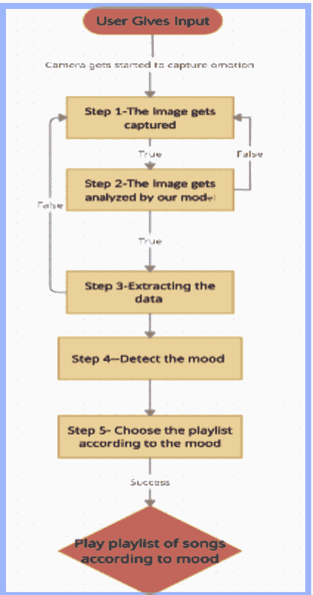

# 基于情感的音乐播放器——Python 项目

> 原文:[https://www . geesforgeks . org/基于情感-音乐-播放器-python-project/](https://www.geeksforgeeks.org/emotion-based-music-player-python-project/)

在本文中，我们将使用 Python、OpenCV、Android Studios 和 FisherFace 算法构建一个基于情感的音乐播放器。正如雷·查尔斯所说，音乐有治愈一个人的力量。音乐在识别一个人的情绪和精神状态方面起着非常重要的作用；这是人们表达自己的一个很好的方式，也是音乐爱好者和听众的一个重要的娱乐媒介。听音乐有助于我们放松和冷静。音乐也被认为是最有效的媒介，因为它可以通过某种信息引发深刻的情感。随着技术的进步，艺术家、他们的音乐和音乐听众的数量都在增加，这就出现了根据他们的心情或选择手动浏览和选择音乐的问题。这就是我们的项目发挥作用的地方，因为我们都知道要面对人体的一个器官，它在提取人类行为和精神状态方面起着至关重要的作用。我们的项目**检测用户的情绪**，并根据他的情绪播放歌曲或播放列表。该项目使用网络摄像头捕捉用户的图像，然后**将面部表情分类为**开心、悲伤、中性**、**或愤怒**，然后根据输入的图像播放歌曲。这个项目的主要优点是用户不需要手动实现和选择歌曲。**

### **工具和技术**

我们需要在系统中安装安卓工作室。我们还遇到了 OpenCV、木星笔记本和卷积神经网络来检测用户情绪。我们使用了 FisherFace 算法以及主成分分析和线性判别分析。

### 所需技能集

Python 基础知识和 OpenCV、安卓 studio、FisherFace 算法的中高级知识。

### **实施:**

检测情绪的过程很有挑战性。我们已经在两个数据集上训练了我们的模型，即: **JAFEE** 和****Conh-Kanade 数据库。**这两个数据集在网上很容易获得，并被我们用于评估我们的模型。 **FisherFace 算法**捕获分类图像，对数据进行降维，然后分类计算统计值。它还为输入图像计算相同的值，并将该值与训练数据集进行比较，并给出所需的输出。**

**[**【LDA】**](https://www.geeksforgeeks.org/ml-linear-discriminant-analysis/)属于监督学习的范畴，在监督学习中，机器必须利用先验数据进行学习。LDA 应用了**降维**技术，减少了执行和分类数据的时间。 **PCA** 以数学值的形式转换不相关和相关的变量。它使用降维技术，通过将大数据集转换成更小的部分来减少它们。主成分分析**观察数据**并计算**概率生成模型。****

**我们使用 Cohn-Kanade 数据集进行了训练，并对我们的模型进行了分类**训练和测试**。由于输入与用户相关，它将提供良好的准确率，具有数据集数量少和内存存储少的优势。快速响应时间也能获得更快的输出。**

**处理数据和检测情绪所涉及的**步骤**讨论如下:**

*   ****第一步:**用户给出输入，输入的形式是用户的网络摄像头拍摄的图像。**
*   ****步骤 2:** 图像被我们的模型分析，并被分类为快乐、悲伤、中性或愤怒的情绪。**
*   ****步骤 3:** 利用训练数据集提取和检测数据，训练数据集是 JAFEE 和 Cohn-Kanade 数据集。**
*   ****步骤 4:** 根据用户面部情绪识别选择播放列表或歌曲。**
*   ****步骤 5:** 在成功检测到情绪后，播放音乐来提升用户的情绪。**

**表示相同的**流程图**如下所示:**

****

### ****狙击编码:****

**要显示源输入，请使用以下代码。使用命令提示符 **:** 安装必要的库，包括 **Tkinter****

```
pip -V
pip install tkinter
```

## **蟒蛇 3**

```
import tkinter as tk
import cv2
from PIL import Image, ImageTk

width, height = 800, 600
cap = cv2.VideoCapture(0)
cap.set(cv2.CAP_PROP_FRAME_WIDTH, width)
cap.set(cv2.CAP_PROP_FRAME_HEIGHT, height)

root = Music_player.Tk()
root.bind('<Escape>', lambda e: root.quit())
lmain = Music_player.Label(root)
lmain.pack()

def show_frame():
    _, frame = cap.read()
    frame = cv2.flip(frame, 1)
    cv2image = cv2.cvtColor(frame, cv2.COLOR_BGR2RGBA)
    img = Image.fromarray(cv2image)
    imgtk = ImageTk.PhotoImage(image=img)
    lmain.imgtk = imgtk
    lmain.configure(image=imgtk)
    lmain.after(10, show_frame)

show_frame()
root.mainloop()
```