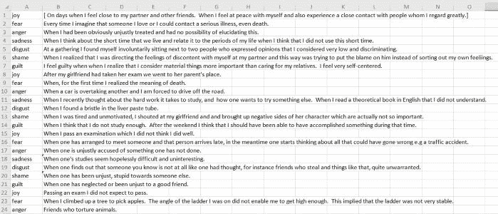
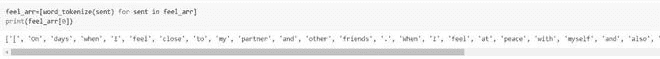
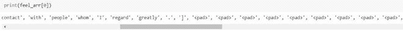
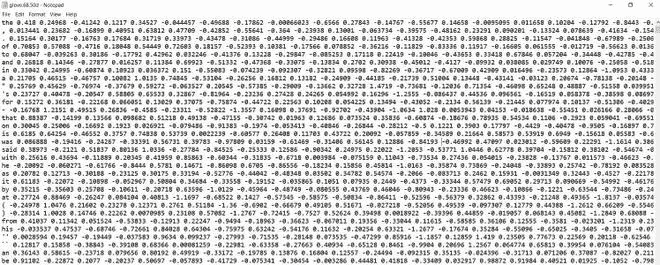
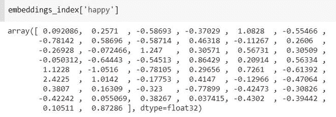
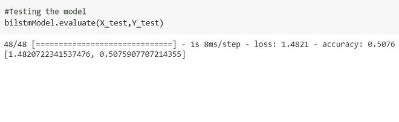

# 使用双向 LSTM 的情绪检测

> 原文:[https://www . geesforgeks . org/情感-检测-使用-双向-lstm/](https://www.geeksforgeeks.org/emotion-detection-using-bidirectional-lstm/)

情感检测是当今研究的热点之一。情绪感应技术可以促进机器和人之间的交流。这也将有助于改进决策过程。已经提出了许多机器学习模型来从文本中识别情感。但是，在本文中，我们的重点是双向 LSTM 模型。双向最小二乘法是常规最小二乘法的补充，用于提高模型在序列分类问题上的性能。BiLSTMs 使用两个 LSTMs 在顺序输入上进行训练。第一个 LSTM 按原样用于输入序列。第二 LSTM 用于输入序列的反向表示。它有助于补充额外的上下文，并使我们的模型更快。

我们使用的数据集是 ISEAR(国际情绪前因和反应调查)。这是数据集的一瞥。



ISEAR 数据集

ISEAR 数据集包含 7652 个句子。它总共有七种情绪——喜悦、恐惧、愤怒、悲伤、内疚、羞愧和厌恶。

让我们一步一步地制作预测情绪的模型。

**步骤 1:导入所需的库**

## 蟒蛇 3

```
# Importing the required libraries
import keras
import numpy as np
from keras.models import Sequential,Model
from keras.layers import Dense,Bidirectional
from nltk.tokenize import word_tokenize,sent_tokenize
from keras.layers import *
from sklearn.model_selection import cross_val_score
import nltk
import pandas as pd
nltk.download('punkt')
```

**第二步:**下一步是从我们的机器上加载数据集并对其进行预处理。在数据集中，有些行包含-“无响应”。这句话对我们来说完全没用。所以，我们将删除这样的行。

**读取数据集并预处理**

## 蟒蛇 3

```
df=pd.read_csv('isear.csv',header=None)
# The isear.csv contains rows with value 'No response'
# We need to remove such rows
df.drop(df[df[1] == '[ No response.]'].index, inplace = True)
```

**步骤 3:** 应用单词标记器将每个句子转换为单词列表。例:如果有一句话——‘我很幸福’。之后，对它进行标记化将被转换成一个列表[“我”、“我”、“快乐”]。

**单词标记化**

## 蟒蛇 3

```
# The feel_arr will store all the sentences
# i.e feel_arr is the list of all sentences
feel_arr = df[1]

# Each  sentence in feel_arr is tokenized by the help of work tokenizer.
# If I have a sentence - 'I am happy'.
# After word tokenizing it will convert into- ['I','am','happy']
feel_arr = [word_tokenize(sent) for sent in feel_arr]
print(feel_arr[0])
```

上述代码片段的输出如下:



单词标记化的输出

**第四步:**每个句子的长度不同。为了通过模型，每个句子的长度应该相等。通过可视化数据集，我们可以看到数据集中句子的长度不超过 100 个单词。所以，现在我们将每个句子转换成 100 个单词。为此，我们将借助填充。

**涂抹衬垫**

## 蟒蛇 3

```
# Defined a function padd in which each sentence length is fixed to 100.
# If length is less than 100 , then the word- '<padd>' is append
def padd(arr):
    for i in range(100-len(arr)):
        arr.append('<pad>')
    return arr[:100]

# call the padd function for each sentence in feel_arr
for i in range(len(feel_arr)):
  feel_arr[i]=padd(feel_arr[i])
```

上述代码片段的输出如下:



填充后输出

5.现在，每个单词都需要嵌入一些数字表示，因为模型只理解数字。为此，我们从互联网上下载了一个预定义的 50 维手套向量。该向量用于嵌入单词。每个单词被表示成一个 50 维的向量。

手套向量包含了英语词典中几乎所有的单词。

这里有一些关于手套矢量的见解。



手套向量

每行的第一个单词是要嵌入的字符。从第一列到最后一列，是 50d 向量形式的字符的数字表示。

**使用手套嵌入单词**

## 蟒蛇 3

```
# Glove vector contains a 50 dimensional vector corresponding to each word in dictionary.
vocab_f = 'glove.6B.50d.txt'

# embeddings_index is a dictionary which contains the mapping of
# word with its corresponding 50d vector.
embeddings_index = {}
with open(vocab_f, encoding='utf8') as f:
    for line in f:
        # splitting each line of the glove.6B.50d in a list of items- in which
        # the first element is the word to be embedded, and from second
        # to the end of line contains the 50d vector.
        values = line.rstrip().rsplit(' ')
        word = values[0]
        coefs = np.asarray(values[1:], dtype='float32')
        embeddings_index[word] = coefs

# Now, each word of the dataset should be embedded in 50d vector with
# the help of the dictionary form above.

# Embedding each word of the feel_arr
embedded_feel_arr = []
for each_sentence in feel_arr:
    embedded_feel_arr.append([])
    for word in each_sentence:
        if word.lower() in embeddings_index:
            embedded_feel_arr[-1].append(embeddings_index[word.lower()])
        else:
                # if the word to be embedded is '<padd>' append 0 fifty times
            embedded_feel_arr[-1].append([0]*50)
```

这里，在上面的例子中，形成的字典即*embeddeds _ index*包含单词及其对应的 50d 向量，为了可视化它，让我们打印单词的 50 个维度——‘happy’。



**步骤 6:** 现在，我们已经完成了所有的预处理部分，现在我们需要执行以下操作:

*   对每种情绪进行一次热编码。
*   将数据集分成训练集和测试集。
*   在我们的数据集上训练模型。
*   在测试集上测试模型。

**训练模型**

## 蟒蛇 3

```
#Converting x into numpy-array
X=np.array(embedded_feel_arr)
print(np.shape(X))

# Perform one-hot encoding on df[0] i.e emotion
from sklearn.preprocessing import OneHotEncoder
enc = OneHotEncoder(handle_unknown='ignore')
Y = enc.fit_transform(np.array(df[0]).reshape(-1,1)).toarray()

# Split into train and test
from keras.layers import Embedding
from sklearn.model_selection import train_test_split
X_train, X_test, Y_train, Y_test = train_test_split(X, Y, test_size=0.2, random_state=42)

#Defining the BiLSTM Model
def model(X,Y,input_size1,input_size2,output_size):
  m=Sequential()

  # Here 100 denotes the dimensionality of output spaces.

  m.add(Bidirectional(LSTM(100,input_shape=(input_size1,input_size2))))
  m.add(Dropout(0.5))
  m.add(Dense(output_size,activation='softmax'))
  m.compile('Adam','categorical_crossentropy',['accuracy'])
  m.fit(X,Y,epochs=32, batch_size=128)
  return m
```

**训练模型**

## 蟒蛇 3

```
# Training the model
bilstmModel=model(X_train,Y_train,100,50,7)
```

这是建议模型的示意图:

这里，输入的维度是 100×50，其中 100 是数据集的每个输入句子中的单词数，50 表示每个单词在 50d 向量中的映射。

双向(LSTM)的输出是 200，因为上面我们已经将输出空间的维数定义为 100。因为它是一个 BiLSTM 模型，所以维度将是 100*2 =200，因为 BiLSTM 包含两个 LSTMs 层——一个向前，另一个向后。

添加脱落层以防止过度拟合后。最后应用密集层将 200 个输出序列转换为 7，因为我们只有 7 种情绪，所以输出应该只有 7 个维度。


提议的 BiLSTM 模型

**测试模型**

## 蟒蛇 3

```
#Testing the model
bilstmModel.evaluate(X_test,Y_test)
```

这就是我们测试模型时的准确性。



测试精度

要获取数据集和代码，点击这里的[](https://drive.google.com/drive/folders/1KCwEOqHnPWse4rDp7QkI6hCN4Jay91zM?usp=sharing)<u><u>。</u></u>