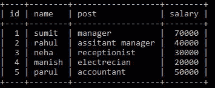

# 使用 Python 的员工管理系统

> 原文:[https://www . geesforgeks . org/employee-management-system-use-python/](https://www.geeksforgeeks.org/employee-management-system-using-python/)

任务是用 Python 创建一个数据库驱动的员工管理系统，将信息存储在 MySQL 数据库中。该脚本将包含以下操作:

*   添加员工
*   删除员工
*   提升员工
*   显示员工

我们的想法是通过使用不同的函数在我们的员工记录中执行不同的更改，例如，Add_Employee 将在我们的员工中插入一个新行，我们还将创建一个 Remove Employee 函数，该函数将删除我们的员工表中任何特定现有员工的记录。该系统的工作原理是从数据库中获取信息，对提取的数据进行必要的更改，并将更改应用到我们将在“提升员工系统”中看到的记录中。我们还可以使用“显示员工”功能获得所有现有员工的信息。将我们的程序连接到数据库的主要优点是，即使在多次关闭我们的程序后，信息也变得无损。

## 入门指南

为了用 Python 创建使用 MySQL 数据库的员工管理系统，我们需要将 Python 与 MySQL 连接起来。

为了建立连接，我们需要安装[**【MySQL connector】**](https://www.geeksforgeeks.org/mysql-connector-python-module-in-python/)，这可以通过在 Windows 上的命令提示符下编写以下命令来完成。

```py
pip install mysqlconnector
```

现在，在成功安装 mysqlconnector 之后，我们可以使用 Python 连接 MySQL，这可以通过编写以下代码来完成

## 蟒蛇 3

```py
import mysql.connector

con = mysql.connector.connect(
    host="localhost", user="root", password="password", database="emp")
```

现在我们已经完成了连接，所以我们可以专注于我们的员工管理系统

**在用表:**



员工记录

我们的想法是将所有关于员工的信息保存在上表中，并在需要时操作该表。所以现在我们来详细看看每个操作的工作原理。

### **检查员工功能**

check employee 函数将雇员 id 作为参数，并检查在雇员详细信息记录中是否存在任何具有给定 id 的雇员。为了检查这一点，它使用 **cursor.rowcount()** 函数来计算与给定细节匹配的行数。这是一个实用函数，我们将在后面的操作中看到它的使用，比如添加雇员函数等。

**程序:**

## 蟒蛇 3

```py
# Function To Check if Employee with
# given Id Exist or Not

def check_employee(employee_id):

    # Query to select all Rows f
    # rom employee Table
    sql = 'select * from empd where id=%s'

    # making cursor buffered to make
    # rowcount method work properly
    c = con.cursor(buffered=True)
    data = (employee_id,)

    # Executing the SQL Query
    c.execute(sql, data)

    # rowcount method to find
    # number of rows with given values
    r = c.rowcount

    if r == 1:
        return True
    else:
        return False
```

### **添加员工功能**

“添加员工”功能将要求输入员工 Id，并使用“检查员工”功能检查要添加的员工是否已经存在于我们的记录中。如果员工详细信息还不存在，它将要求输入要添加的员工的详细信息，如员工姓名、员工职务和员工的工资。现在，从该系统的用户那里获得所有这些详细信息后，它只需将信息插入到我们的员工详细信息表中。

**程序:**

## 蟒蛇 3

```py
# Function to mAdd_Employee

def Add_Employ():

    Id = input("Enter Employee Id : ")

    # Checking if Employee with given Id
    # Already Exist or Not
    if(check_employee(Id) == True):
        print("Employee aready exists\nTry Again\n")
        menu()

    else:
        Name = input("Enter Employee Name : ")
        Post = input("Enter Employee Post : ")
        Salary = input("Enter Employee Salary : ")
        data = (Id, Name, Post, Salary)

        # Inserting Employee details in the Employee
        # Table
        sql = 'insert into empd values(%s,%s,%s,%s)'
        c = con.cursor()

        # Executing the SQL Query
        c.execute(sql, data)

        # commit() method to make changes in the table
        con.commit()
        print("Employee Added Successfully ")
        menu()
```

### **删除员工功能**

“删除员工”功能将简单地要求删除员工的 id，因为在我们的员工详细信息记录中，Id 是[主键](https://www.geeksforgeeks.org/primary-key-constraint-in-sql/)，因为可以有两个同名的员工，但他们必须有一个唯一的 Id。“删除员工”功能使用“检查员工”功能来检查我们的记录中是否存在要删除的员工。如果存在员工详细信息，则在获得有效的员工 id 后，它会删除与该员工 id 对应的记录。

**程序**

## 蟒蛇 3

```py
# Function to Remove Employee with given Id
def Remove_Employ():
    Id = input("Enter Employee Id : ")

    # Checking if Employee with given Id
    # Exist or Not
    if(check_employee(Id) == False):
        print("Employee does not  exists\nTry Again\n")
        menu()

    else:

        # Query to Delete Employee from Table
        sql = 'delete from empd where id=%s'
        data = (Id,)
        c = con.cursor()

        # Executing the SQL Query
        c.execute(sql, data)

        # commit() method to make changes in
        # the table
        con.commit()
        print("Employee Removed")
        menu()
```

### **提升员工职能**

“提升员工”功能将要求输入员工 Id，并使用“检查员工”功能检查我们的记录中是否存在要提升的员工。如果存在员工详细信息，它将要求增加其工资的金额。获得有效的详细信息后，它会将具有给定 id 的员工的工资增加给定的金额。

**程序**

## 蟒蛇 3

```py
# Function to Promote Employee
def Promote_Employee():
    Id = int(input("Enter Employ's Id"))

    # Checking if Employee with given Id
    # Exist or Not
    if(check_employee(Id) == False):
        print("Employee does not  exists\nTry Again\n")
        menu()
    else:
        Amount = int(input("Enter increase in Salary"))

        # Query to Fetch Salary of Employee with
        # given Id
        sql = 'select salary from empd where id=%s'
        data = (Id,)
        c = con.cursor()

        # Executing the SQL Query
        c.execute(sql, data)

        # Fetching Salary of Employee with given Id
        r = c.fetchone()
        t = r[0]+Amount

        # Query to Update Salary of Employee with
        # given Id
        sql = 'update empd set salary=%s where id=%s'
        d = (t, Id)

        # Executing the SQL Query
        c.execute(sql, d)

        # commit() method to make changes in the table
        con.commit()
        print("Employee Promoted")
        menu()
```