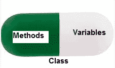

# Python 中的封装

> 原文:[https://www.geeksforgeeks.org/encapsulation-in-python/](https://www.geeksforgeeks.org/encapsulation-in-python/)

封装是面向对象编程的基本概念之一。它描述了包装数据的思想以及在一个单元中处理数据的方法。这就对直接访问变量和方法设置了限制，可以防止数据的意外修改。为了防止意外更改，只能通过对象的方法来更改对象的变量。这些类型的变量被称为**私有变量**。
类是封装的一个例子，因为它封装了成员函数、变量等所有数据。



考虑一个真实的封装例子，在一个公司中，有不同的部分，如帐户部分、财务部分、销售部分等。财务科处理所有财务交易，并记录所有与财务有关的数据。同样，销售部门处理所有与销售相关的活动，并保存所有销售记录。现在可能会出现这样一种情况:出于某种原因，财务部的一名官员需要某个特定月份的所有销售数据。在这种情况下，不允许他直接访问销售部门的数据。他首先必须联系销售部门的其他官员，然后要求他提供具体数据。这就是封装。这里，销售部门的数据和能够操纵这些数据的员工被包装在一个名称“销售部门”下。使用封装也隐藏了数据。在本例中，销售、财务或帐户等部门的数据对任何其他部门都是隐藏的。

## 受保护成员

受保护成员(在 C++和 JAVA 中)是那些不能在类外部访问，但可以从类及其子类内部访问的类成员。要在 Python 中实现这一点，只需遵循惯例**，在成员名称前加上一个**单下划线“_”**。
**注意:**_ _ init _ _ 方法是一个构造函数，只要类的一个对象被实例化就运行。** 

## **蟒蛇 3**

```
# Python program to
# demonstrate protected members

# Creating a base class
class Base:
    def __init__(self):

        # Protected member
        self._a = 2

# Creating a derived class   
class Derived(Base):
    def __init__(self):

        # Calling constructor of
        # Base class
        Base.__init__(self)
        print("Calling protected member of base class: ")
        print(self._a)

obj1 = Derived()

obj2 = Base()

# Calling protected member
# Outside class will  result in
# AttributeError
print(obj2.a)
```

****输出:****

```
Calling protected member of base class: 
2 
```

```
Traceback (most recent call last):
  File "/home/6fb1b95dfba0e198298f9dd02469eb4a.py", line 25, in 
    print(obj1.a)
AttributeError: 'Base' object has no attribute 'a' 
```

## **私人成员**

**私有成员类似于受保护的成员，区别在于声明为私有的类成员既不应该被类外访问，也不应该被任何基类访问。在 Python 中，不存在**私有**实例变量，除非在类内部，否则无法访问。但是，要定义私有成员，请在成员名称前加双下划线“_”。** 

****注意:** Python 的私有和受保护成员可以通过 [python 名称 mangling](https://www.geeksforgeeks.org/private-variables-python/) 在类外访问。** 

## **蟒蛇 3**

```
# Python program to
# demonstrate private members

# Creating a Base class
class Base:
    def __init__(self):
        self.a = "GeeksforGeeks"
        self.__c = "GeeksforGeeks"

# Creating a derived class
class Derived(Base):
    def __init__(self):

        # Calling constructor of
        # Base class
        Base.__init__(self)
        print("Calling private member of base class: ")
        print(self.__c)
# Driver code
obj1 = Base()
print(obj1.a)

# Uncommenting print(obj1.c) will
# raise an AttributeError

# Uncommenting obj2 = Derived() will
# also raise an AtrributeError as
# private member of base class
# is called inside derived class
```

****输出:****

```
GeeksforGeeks 
```

```
Traceback (most recent call last):
  File "/home/f4905b43bfcf29567e360c709d3c52bd.py", line 25, in <module>
    print(obj1.c)
AttributeError: 'Base' object has no attribute 'c'

Traceback (most recent call last):
  File "/home/4d97a4efe3ea68e55f48f1e7c7ed39cf.py", line 27, in <module>
    obj2 = Derived()
  File "/home/4d97a4efe3ea68e55f48f1e7c7ed39cf.py", line 20, in __init__
    print(self.__c)
AttributeError: 'Derived' object has no attribute '_Derived__c' 
```