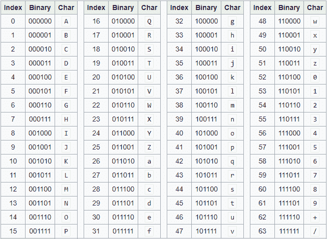

# Python 中 Base64 字符串的编码和解码

> 原文:[https://www . geesforgeks . org/编解码-base64-strings in-python/](https://www.geeksforgeeks.org/encoding-and-decoding-base64-strings-in-python/)

Base64 编码用于将包含二进制或文本数据的字节转换为 ASCII 字符。编码可以防止数据在通过纯文本系统传输或处理时被破坏。在本文中，我们将讨论 Base64 编码和解码及其在二进制和文本数据编码和解码中的应用。

**Base64 编码:**
是字节到 ASCII 字符的一种转换。下面列出了可用的 Base64 字符:

*   26 个大写字母
*   26 个小写字母
*   10 个数字
*   +和/用于新线路

每个 Base64 字符代表 6 位数据。同样重要的是要注意，由于显而易见的原因，它并不意味着加密。
要将字符串转换为 Base64 字符，应遵循以下步骤:

*   获取字符串中每个字符的 ASCII 值。
*   计算 ASCII 值的 8 位二进制等价物
*   通过对数字进行重新分组，将 8 位字符块转换为 6 位字符块
*   将 6 位二进制组转换为各自的十进制值。
*   使用 Base64 编码表来对齐每个十进制值的 Base64 值。

下图为我们提供了一个 Base64 编码表。



来源影像:维基百科

**Using python to encode strings:**In Python the base64 module is used to encode and decode data. First, the strings are converted into byte-like objects and then encoded using the base64 module. The below example shows the implementation of encoding strings isn’t base64 characters.

**示例:**

```py
import base64

sample_string = "GeeksForGeeks is the best"
sample_string_bytes = sample_string.encode("ascii")

base64_bytes = base64.b64encode(sample_string_bytes)
base64_string = base64_bytes.decode("ascii")

print(f"Encoded string: {base64_string}")
```

**输出:**

```py
Encoded string: R2Vla3NGb3JHZWVrcyBpcyB0aGUgYmVzdA==
```

**使用 Python 解码字符串:**
解码 Base64 字符串与编码完全相反。首先，我们将 Base64 字符串转换为未编码的数据字节，然后将类似字节的对象转换为字符串。下面的示例描述了对上述示例编码字符串输出的解码。

**示例:**

```py
import base64

base64_string =" R2Vla3NGb3JHZWVrcyBpcyB0aGUgYmVzdA =="
base64_bytes = base64_string.encode("ascii")

sample_string_bytes = base64.b64decode(base64_bytes)
sample_string = sample_string_bytes.decode("ascii")

print(f"Decoded string: {sample_string}")
```

**输出:**

```py
Decoded string: GeeksForGeeks is the best
```