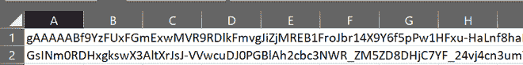

# 使用 Python 加密和解密文件

> 原文:[https://www . geesforgeks . org/加密和解密文件-使用-python/](https://www.geeksforgeeks.org/encrypt-and-decrypt-files-using-python/)

加密是对消息进行解码的行为，以便目标用户只能看到它。我们加密数据是因为我们不想让任何人看到或访问它。

我们将使用*密码术* [](https://cryptography.io/en/latest)库来加密文件。*密码术*库使用对称算法来加密文件。在对称算法中，我们使用相同的密钥来加密和解密文件。加密包的 *fernet* 模块内置了生成密钥、将明文加密为密文、以及分别使用 *encrypt()* 和 *decrypt()* 方法将密文解密为明文的功能。 *fernet* 模块保证使用它加密的数据在没有密钥的情况下不能被进一步操作或读取。

我们将使用 [nba.csv](https://media.geeksforgeeks.org/wp-content/uploads/nba.csv) 文件来执行所有操作。

### **安装:**

可以使用以下命令安装*加密库*:

```
pip install cryptography
```

### **生成密钥加密文件**

在*密码学*库中，有一种叫做 *fernet* 的密码学算法。我们将使用 *fernet* 模块来加密文件。

## 蟒蛇 3

```
# import required module
from cryptography.fernet import Fernet
```

生成密钥并保存它:

## 蟒蛇 3

```
# key generation
key = Fernet.generate_key()

# string the key in a file
with open('filekey.key', 'wb') as filekey:
   filekey.write(key)
```

上面的代码会生成一个名为 *filekey.key* 的文件。该文件将包含一行，这是一个充当密钥的字符串，即*j64zhfpcwfls9zt 7 y5zxuq1gb 09y 7 cucne _ EhuWyDM =*

### **使用生成的密钥加密文件**

现在我们有一个加密的密钥和要加密的文件。现在编写代码来加密这个文件:

1.  打开包含密钥的文件。
2.  初始化 *Fernet* 对象，并将其存储在 *fernet* 变量中。
3.  阅读原始文件。
4.  加密文件并将其存储到对象中。
5.  然后将加密后的数据写入同一个文件 *nba.csv* 。

## 蟒蛇 3

```
# opening the key
with open('filekey.key', 'rb') as filekey:
    key = filekey.read()

# using the generated key
fernet = Fernet(key)

# opening the original file to encrypt
with open('nba.csv', 'rb') as file:
    original = file.read()

# encrypting the file
encrypted = fernet.encrypt(original)

# opening the file in write mode and 
# writing the encrypted data
with open('nba.csv', 'wb') as encrypted_file:
    encrypted_file.write(encrypted)
```

执行上述程序前的 *nba.csv* 文件:


执行上述程序后的 *nba.csv* 文件:



### **解密加密文件**

我们必须使用相同的密钥来解密文件:

1.  初始化 *Fernet* 对象，并将其存储在 *fernet* 变量中。
2.  读取加密文件。
3.  解密文件并将其存储到对象中。
4.  然后将解密后的数据写入同一个文件 nba.csv。

## 蟒蛇 3

```
# using the key
fernet = Fernet(key)

# opening the encrypted file
with open('nba.csv', 'rb') as enc_file:
    encrypted = enc_file.read()

# decrypting the file
decrypted = fernet.decrypt(encrypted)

# opening the file in write mode and
# writing the decrypted data
with open('nba.csv', 'wb') as dec_file:
    dec_file.write(decrypted)
```

执行上述程序前的 *nba.csv* 文件:


执行上述程序后的 *nba.csv* 文件:

