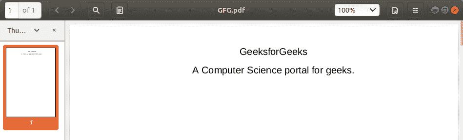
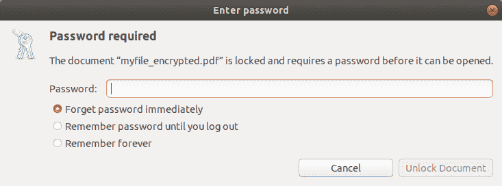

# 使用 py PDF F2

加密和解密 PDF

> 原文:[https://www . geesforgeks . org/encrypt-and-decrypt-pdf-using-py pdf 2/](https://www.geeksforgeeks.org/encrypt-and-decrypt-pdf-using-pypdf2/)

**PDF** ( **便携文档格式**)是存储和发送文档最常用的文件格式之一。它们通常用于许多目的，如电子书、简历、扫描文档等。但是，当我们与许多人共享 pdf 时，其数据有可能被泄露或窃取。因此，有必要对我们的 PDF 文件进行密码保护，以便只有授权的人才能访问它。

在本文中，我们将了解如何设置密码来保护 PDF 文件。我们将使用 [**PyPDF2**](https://www.geeksforgeeks.org/working-with-pdf-files-in-python/) 模块来加密和解密我们的 PDF 文件。 **PyPDF2** 是一个作为 PDF 工具包构建的 Python 库。它能够:

*   提取文档信息(标题、作者、…)
*   拆分和合并文档
*   裁剪页面
*   加密和解密 PDF 文件

### **安装**

PyPDF2 不是一个内置的库，所以我们必须安装它。

```
pip3 install PyPDF2

```

现在，我们准备编写脚本来加密 PDF 文件。

## **加密 PDF 文件**

首先，我们将用阅读器对象打开我们的 PDF 文件。然后，我们将创建原始文件的副本，这样如果出现问题，就不会影响我们的原始文件。要创建副本，我们必须遍历文件的每一页，并将其添加到新的 PDF 文件中。然后，我们可以简单地加密我们的新 PDF 文件。

**使用的 PDF 文件:**



## 蟒蛇 3

```
# import PdfFileWriter and PdfFileReader 
# class from PyPDF2 library
from PyPDF2 import PdfFileWriter, PdfFileReader

# create a PdfFileWriter object
out = PdfFileWriter()

# Open our PDF file with the PdfFileReader
file = PdfFileReader("myfile.pdf")

# Get number of pages in original file
num = file.numPages

# Iterate through every page of the original 
# file and add it to our new file.
for idx in range(num):

    # Get the page at index idx
    page = file.getPage(idx)

    # Add it to the output file
    out.addPage(page)

# Create a variable password and store 
# our password in it.
password = "pass"

# Encrypt the new file with the entered password
out.encrypt(password)

# Open a new file "myfile_encrypted.pdf"
with open("myfile_encrypted.pdf", "wb") as f:

    # Write our encrypted PDF to this file
    out.write(f)
```

**输出:**



这将创建原始文件的副本，并使用输入的密码对其进行加密。PDF 一旦加密，不输入正确的密码就无法打开。

## 解密文件

但是如果我们想解密加密的 PDF 文件呢？我们也可以用这个库做到这一点。过程几乎是一样的。我们将使用正确的密码打开加密文件，并通过遍历它的每一页并将其添加到我们的新 PDF 文件中来创建它的副本。

下面是代码:

## 蟒蛇 3

```
# import PdfFileWriter and PdfFileReader 
# class from PyPDF2 library
from PyPDF2 import PdfFileWriter, PdfFileReader

# Create a PdfFileWriter object
out = PdfFileWriter()

# Open encrypted PDF file with the PdfFileReader
file = PdfFileReader("myfile_encrypted.pdf")

# Store correct password in a variable password.
password = "pass"

# Check if the opened file is actually Encrypted
if file.isEncrypted:

    # If encrypted, decrypt it with the password
    file.decrypt(password)

    # Now, the file has been unlocked.
    # Iterate through every page of the file
    # and add it to our new file.
    for idx in range(file.numPages):

        # Get the page at index idx
        page = file.getPage(idx)

        # Add it to the output file
        out.addPage(page)

    # Open a new file "myfile_decrypted.pdf"
    with open("myfile_decrypted.pdf", "wb") as f:

        # Write our decrypted PDF to this file
        out.write(f)

    # Print success message when Done
    print("File decrypted Successfully.")
else:

    # If file is not encrypted, print the 
    # message
    print("File already decrypted.")
```

这将创建一个不需要密码就能打开的加密文件副本。

所以，这是一个加密和解密 PDF 文件的基本脚本。但是有太多的想法来扩展这一点。您可以创建一个*图形用户界面工具*来实现它，或者开发一个*网络应用程序*来加密 PDF 文件。您也可以使用 **PyPDF2** 库创建一个完整的 *PDF 管理器*。