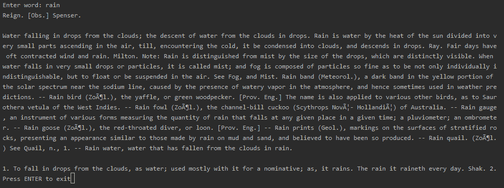
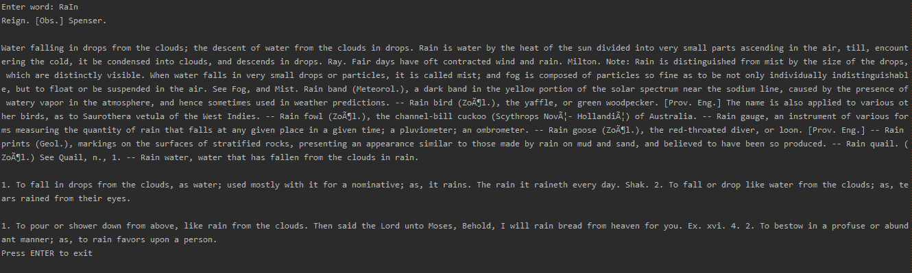
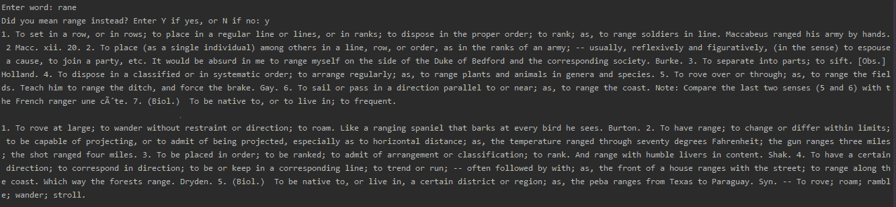

# 使用 Python 的英语词典应用

> 原文:[https://www . geesforgeks . org/English-dictionary-application-use-python/](https://www.geeksforgeeks.org/english-dictionary-application-using-python/)

**Python 中的字典** **是一个无序的数据值集合，用于像地图一样存储数据值，与其他只保存单个值作为元素的数据类型不同，字典保存`key:value` 对。字典中提供了键值，以使其更加优化。字典中的每个键值对由冒号分隔，而每个键由“逗号”分隔。**

**Python 中的字典的工作方式类似于现实世界中的字典。字典的键必须是唯一的并且是不可变的数据类型，例如字符串、整数和元组，但是键值可以重复并且是任何类型。**

****注意**–要了解更多关于词典[的信息，请点击此处](https://www.geeksforgeeks.org/python-dictionary/)。**

#### **所需模块:**

*   ****json:** 内置 python，无需外接安装。要了解更多关于 JSON [的信息，请点击此处](https://www.geeksforgeeks.org/javascript-json/)。**
*   ****difflib:** 这个模块提供了比较序列的类和函数。它还内置了 python，所以不需要从外部安装。**

****步骤:****

1.  **下载一个包含 python 字典数据类型格式的英语字典单词的`JSON` 文件，或者以这种方式排列文件内容。**
2.  **创建一个文件夹并添加下载的。该文件夹中有 json 文件和 python 脚本。**
3.  **在 python 编辑器中，导入所需的模块。**

**下面是实现。**

```py
# Import the modules required
import json
from difflib import get_close_matches

# Loading data from json file
# in python dictionary
data = json.load(open("dictionary.json"))

def translate(w):
    # converts to lower case
    w = w.lower()

    if w in data:
        return data[w]
    # for getting close matches of word
    elif len(get_close_matches(w, data.keys())) > 0:             
        yn = input("Did you mean % s instead? Enter Y if yes, or N if no: " % get_close_matches(w, data.keys())[0])
        yn = yn.lower()
        if yn == "y":
            return data[get_close_matches(w, data.keys())[0]]
        elif yn == "n":
            return "The word doesn't exist. Please double check it."
        else:
            return "We didn't understand your entry."
    else:
        return "The word doesn't exist. Please double check it."

# Driver code
word = input("Enter word: ")
output = translate(word)

if type(output) == list:
    for item in output:
        print(item)
else:
    print(output)
input('Press ENTER to exit') 
```

**重要的是，输出不应因不同的大小写而不同，例如，相同文本的大写和小写输入应相同，即 rain 或 RaIn 或 Rain 应产生相同的输出。此外，如果用户在拼写单词时出错，它应该返回与单词输入相关的关闭单词，或者打印一条用户友好的消息，表明该单词不存在。**

****输入:****

```py
rain
```

****输出:**
**

**对于混合情况–
**输入:****

```py
RaIn
```

****输出:**
**

**如果拼写错误，它会给出与用户键入的单词含义最接近的单词，如图所示。假设输入是“rane”，用户想搜索“range”，那么输出如下。
**输入:****

```py
rane
```

****输出:**
**