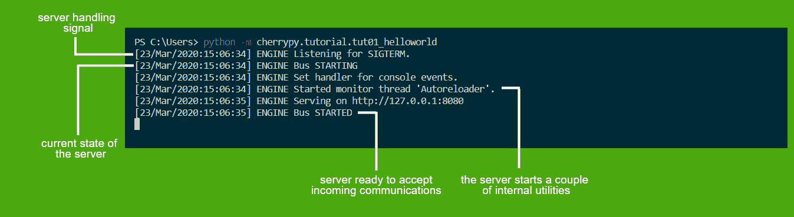
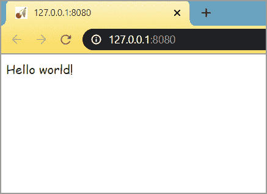

# 奇瑞的环境设置

> 原文:[https://www . geesforgeks . org/environment-setup-for-cherrypy/](https://www.geeksforgeeks.org/environment-setup-for-cherrypy/)

**CherryPy** 是一个流行的 Python 框架。使用 CherryPy，可以以更快、更可靠的方式构建网络应用程序。它也被称为 web 应用程序库。它以其简单性而闻名，因为它基于面向对象的 Python 编程，从而在更短的时间内产生更小的源代码。

**注:**详见[奇瑞派介绍](https://www.geeksforgeeks.org/introduction-to-cherrypy/)。

#### 要求

奇瑞没有任何环境要求。常见的 Python 包管理器(如安装工具或 pip)会自动安装所有基于 Python 的分发需求。

但基本要求是:

*   Python 3.5 到 3.8。
*   奇瑞 3.0 版

#### 如何安装

安装奇瑞比非常容易。就像其他库一样，CherryPy 可以通过 pip 轻松安装。

1.使用简易安装:

```
$ easy_install cherrypy
```

2.使用 pip:

```
$ pip install cherrypy
```

3.使用 Github:

```
$ git clone https://github.com/cherrypy/cherrypy
$ cd cherrypy
$ python setup.py install
```

除了下载之外，这些方法还会在您的 python 环境中全局构建和安装 CherryPy。

#### 测试您的安装

一旦您部署了 CherryPy 包，您可以通过执行 CherryPy 提供的简单教程来测试您的安装。一个这样的教程是简单的 Hello World。执行以下代码:

```
python -m cherrypy.tutorial.tut01_helloworld
```

执行后，您将在浏览器上看到类似这样的内容:



现在，将浏览器指向 [http://127.0.0.1:8080](http://127.0.0.1:8080) 。在执行基本教程时，您将看到以下输出。

