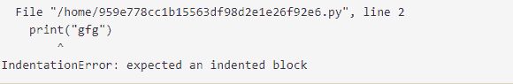

# Python 中的错误和异常

> 原文:[https://www . geesforgeks . org/python 中的错误和异常/](https://www.geeksforgeeks.org/errors-and-exceptions-in-python/)

错误是程序中的问题，由于这些问题，程序将停止执行。另一方面，当一些改变程序正常流程的内部事件发生时，就会引发异常。
python 中出现两种类型的错误。

1.  句法误差
2.  逻辑错误(异常)

## 句法误差

当没有遵循语言的正确语法时，就会引发语法错误。
**例**

## 蟒蛇 3

```
# initialize the amount variable
amount = 10000

# check that You are eligible to
#  purchase Dsa Self Paced or not
if(amount>2999)
    print("You are eligible to purchase Dsa Self Paced")

```

**输出:**


它返回一条语法错误消息，因为在 if 语句之后缺少冒号。我们可以通过编写正确的语法来解决这个问题。

## 逻辑错误(异常)

在运行时，通过语法测试后出现的错误称为异常或逻辑类型。例如，当我们用零除任何数字时，就会引发零除错误异常，或者当我们导入一个不存在的模块时，就会引发导入错误。
**例 1:**

## 蟒蛇 3

```
# initialize the amount variable
marks = 10000

# perform division with 0
a = marks / 0
print(a)
```

**输出:**


在上面的例子中，我们试图用 0 除一个数时出现了零除错误。
**例 2:** 压痕不正确时。

## 蟒蛇 3

```
if(a<3):
print("gfg")
```

**输出:**



一些常见的内置异常不同于上述异常的是:

<figure class="table">

| 例外 | 描述 |
| --- | --- |
| 索引错误 | 当检索到列表的错误索引时。 |
| 资产错误 | 当 assert 语句失败时，就会发生这种情况 |
| 属性错误 | 当属性分配失败时会出现这种情况。 |
| 导入错误 | 当找不到导入的模块时，就会出现这种情况。 |
| 键错误 | 当找不到字典的关键字时，就会发生这种情况。 |
| 名称错误 | 当变量未定义时会出现这种情况。 |
| 存储器错误 | 当程序内存不足时，就会出现这种情况。 |
| 类型埃罗尔 | 当以不正确的类型应用函数和操作时，就会出现这种情况。 |

</figure>

**注意:**更多信息请参考[Python 内置异常](https://www.geeksforgeeks.org/built-exceptions-python/)T4】

## 错误处理

当出现错误和异常时，我们会在 Handling 方法的帮助下处理它。

*   **用 Try/Except/Finally**
    处理异常我们可以用 Try/Except/Finally 方法处理错误。我们在 try 中编写不安全的代码，在 except 中返回代码，在 finally 块中返回最终代码。
    **例**

## 蟒蛇 3

```
# put unsafe operation in try block
try:
     print("code start")

     # unsafe operation perform
     print(1 / 0)

# if error occur the it goes in except block
except:
     print("an error occurs")

# final code in finally block
finally:
     print("GeeksForGeeks")
```

*   **输出:**

```
code start
an error occurs
GeeksForGeeks
```

*   **为预定义条件**
    引发异常当我们想要为某些条件的限制进行编码时，我们可以引发异常。
    **例**

## 蟒蛇 3

```
# try for unsafe code
try:
    amount = 1999
    if amount < 2999:

        # raise the ValueError
        raise ValueError("please add money in your account")
    else:
        print("You are eligible to purchase DSA Self Paced course")

# if false then raise the value error
except ValueError as e:
        print(e)
```

*   **输出:**

```
please add money in your account
```