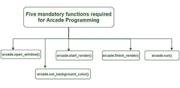
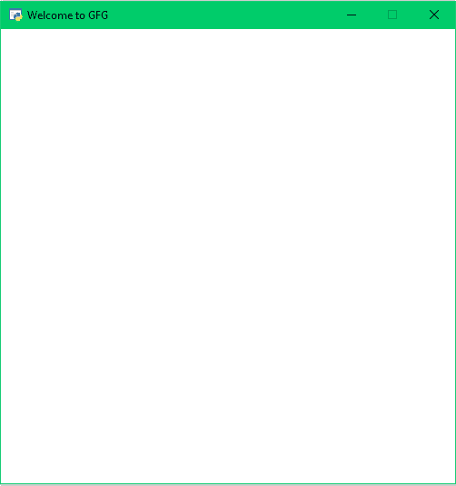

# 用 Python 建立街机窗口

> 原文:[https://www . geesforgeks . org/建立一个 python 中的街机窗口/](https://www.geeksforgeeks.org/establishing-an-arcade-window-in-python/)

[街机库](https://www.geeksforgeeks.org/arcade-library-in-python/)是一个高科技 Python 包，拥有一套先进的工具，可以制作具有扣人心弦的图形和声音的 2D 游戏。它是面向对象的，是专门为 Python 3.6 及以上版本构建的。

做街机编程需要五个必备功能。



**1。arcade.open_window():** 在 arcade 中，一切都会在窗口本身完成，借助 open_window()。目前，街机只支持单个显示窗口，但您可以根据自己的要求调整其大小。

该命令打开一个给定大小的窗口，即宽度和高度以及屏幕标题。它需要三个参数，每个参数的位置都是固定的。这是街机的内置功能。语法如下:

> **语法:**arcade . open _ window(Screen _ width，Screen_Height，“Screen_title”，可调整大小，抗锯齿)
> 
> **参数:**
> 
> *   **屏幕宽度:**–窗口宽度。
> *   **屏幕高度** :-窗口高度。
> *   **Screen _ Title:**–窗口标题。
> *   **可调整大小:**–窗口是否可由用户调整大小。
> *   **抗锯齿** :-告知图形是否平滑。

**实现上述语法:**

## 蟒蛇 3

```
# importing the module
import arcade

arcade.open_window(500, 500, "Welcome to GFG " , False,  False)
```

**输出:**



***2。*****Arcade . set _ background _ color():**Arcade 让背景色的设置变得非常容易，下面我们就来开始如何设置背景色。在街机模块中，我们有一个内置的函数 arcade.set_background_color()函数，用来设置背景颜色。它的语法如下:

> **语法:**街机. set_background_color(颜色)
> 
> **参数:**
> 
> *   **颜色:**指定背景的颜色

**实现上述语法:**

要生成蓝色背景，我们将运行以下命令:

```
arcade.set_background_color(arcade.color.BLUE)
```

**3。arcade . start _ render(<u>):</u>**它是 Python 的街机模块中的一个内置函数，实际上是通知街机模块开始运行。要告诉 Arcade 您开始发送绘图命令，您需要使用 arcade.start.render()。不需要争论。语法如下

> **语法:** arcade.start_render()
> 
> **参数:**无

**4。arcade.finish_render():** 这是 Python 的 arcade 模块中的一个内置函数，它实际上显示了我们绘制的内容。不需要争论。语法如下

> **语法:** arcade.finish_render()
> 
> **参数:**无

**5。arcade.run():** 它基本上运行主程序。它通常是程序的最后一个命令。它还有助于将输出保持在屏幕上，直到用户不存在。语法如下:

> **语法:** arcade.run()
> 
> **参数:**无

从现在起，我们已经了解了它们的功能和用途。让我们举一个例子，一起实现上面提到的所有功能。

## 蟒蛇 3

```
# import arcade module
import arcade

# open the window
arcade.open_window(500, 500, "Welcome to GFG", False, False)

# set background colour
arcade.set_background_color(arcade.color.PINK)

# start drawing
arcade.start_render()

# finish drawing
arcade.finish_render()

# to keep output
# window open
arcade.run()
```

**输出:**

