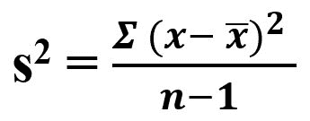
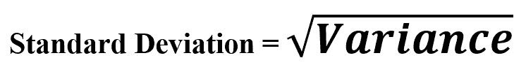
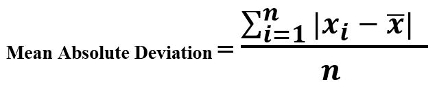

# 变量|集合 1 的估计

> 原文:[https://www.geeksforgeeks.org/estimation-of-variable-set-1/](https://www.geeksforgeeks.org/estimation-of-variable-set-1/)

**可变性:**是衡量数据变化的导入维度，即数据是分散还是紧密聚集。也称为离散在机器学习或数据科学中处理数据集时，它涉及许多步骤——方差测量、约简、区分随机可变性和真实可变性。识别真实可变性的来源，根据它做出关于预处理选择或模型选择的决策。

**与可变性指标相关的术语:**

```
-> Deviation 
-> Variance
-> Standard Deviation
-> Mean Absolute Deviation
-> Meadian Absolute Deviation
-> Order Statistics
-> Range
-> Percentile 
-> Inter-quartile Range
```

*   **偏差:**我们可以称之为——误差或残差。它是衡量值与中心值/观察值之间差异/分散程度的标准。
    T3】例:

```
Sequence : [2, 3, 5, 6, 7, 9] 
Suppose, Central/Observed Value = 7

Deviation = [-5, -4, -2, -1, 0, 2]
```

*   **方差(s <sup>2</sup> ):** 这是估计变异性的最佳已知度量，因为它是方差。我们可以称之为**均方误差**，因为它是标准偏差的平均值。



**示例:**

```
Sequence : [2, 3, 5, 6, 7, 9] 
Mean              = 5.33
Total Terms, n    = 6
Squared Deviation = (2 - 5.33)2 + (3 - 5.33)2 + (5 - 5.33)2
                    (6 - 5.33)2 + (7 - 5.33)2 + (9 - 5.33)2
Variance          = Squared Deviation / n
```

**代码–**

## 蟒蛇 3

```
# Variance

import numpy as np

Sequence = [2, 3, 5, 6, 7, 9]

var = np.var(Sequence)

print("Variance : ", var)
```

**输出:**

```
Variance :  5.5555555555555545
```

*   **标准差:**是方差的平方根。也被称为**欧几里德范数**。



**示例:**

```
Sequence : [2, 3, 5, 6, 7, 9] 
Mean              = 5.33
Total Terms, n    = 6
Squared Deviation = (2 - 5.33)2 + (3 - 5.33)2 + (5 - 5.33)2
                    (6 - 5.33)2 + (7 - 5.33)2 + (9 - 5.33)2

Variance             = Squared Deviation / n
Standard Deviation   = (Variance)1/2
```

**代码–**

## 蟒蛇 3

```
# Standard Deviation

import numpy as np

Sequence = [2, 3, 5, 6, 7, 9]

std = np.std(Sequence)

print("Standard Deviation : ", std)
```

**输出:**

```
Standard Deviation :  2.357022603955158
```

*   **平均绝对偏差:**可以估计这些偏差的典型估计值。如果我们取平均值，负偏差会抵消正偏差。此外，偏离平均值的和总是零。所以，这是一个简单的方法，采取平均偏差本身。



**示例:**

```
Sequence : [2, 4, 6, 8] 
Mean     = 5
Deviation around mean = [-3, -1, 1, 3]

Mean Absolute Deviation = (3 + 1 + 1 + 3)/ 4
```

## 蟒蛇 3

```
# Mean Absolute Deviation

import numpy as np

def mad(data):
    return np.mean(np.absolute(
            data - np.mean(data)))

Sequence = [2, 4, 6, 8]

print ("Mean Absolute Deviation : ", mad(Sequence))
```

**输出:**

```
Mean Absolute Deviation :  2.0
```