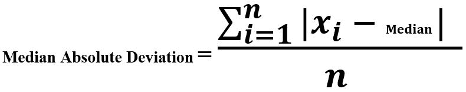

# 变量|集合 2 的估计

> 原文:[https://www.geeksforgeeks.org/estimation-of-variable-set-2/](https://www.geeksforgeeks.org/estimation-of-variable-set-2/)

先决条件:[变量的估计|集合 1](https://www.geeksforgeeks.org/estimation-of-variable-set-1/)
**与可变性度量相关的术语:**

```py
-> Deviation 
-> Variance
-> Standard Deviation
-> Mean Absolute Deviation
-> Meadian Absolute Deviation
-> Order Statistics
-> Range
-> Percentile 
-> Inter-quartile Range
```

*   **中值绝对偏差:**平均绝对偏差、方差和标准差(上一节讨论过)对极值和异常值不稳健。我们平均偏离中位数的总和。



*   **示例:**

```py
Sequence : [2, 4, 6, 8] 
Mean     = 5
Deviation around mean = [-3, -1, 1, 3]

Mean Absolute Deviation = (3 + 1 + 1 + 3)/ 4
```

## 蟒蛇 3

```py
# Median Absolute Deviation

import numpy as np

def mad(data):
    return np.median(np.absolute(
            data - np.median(data)))

Sequence = [2, 4, 10, 6, 8, 11]

print ("Median Absolute Deviation : ", mad(Sequence))

```

**输出:**

```py
Median Absolute Deviation :  3.0
```

*   **顺序统计:**这种可变性测量方法基于分级(排序)数据的分布。
*   **范围:**属于订单统计最基本的计量。它是数据集的最大值和最小值之间的差值。知道数据的传播是好事，但它对异常值非常敏感。我们可以通过降低极端值来使它变得更好。
    T3】例:

```py
Sequence : [2, 30, 50, 46, 37, 91]
Here, 2 and 91 are outliers

Range = 91 - 2 = 89
Range without outliers = 50 - 30 = 20
```

*   **百分位:**这是一个很好的度量数据可变性的方法，避免了异常值。P <sup>数据中的第</sup>百分位是这样一个值，即至少 P%或更小的值小于它，并且至少(100–P)%的值大于 P。
    中值是数据的第 50 个百分位。
    **例:**

```py
Sequence : [2, 30, 50, 46, 37, 91] 
Sorted   : [2, 30, 37, 46, 50, 91]

50th percentile = (37 + 46) / 2 = 41.5 
```

*   **代码–**

## 蟒蛇 3

```py
# Percentile

import numpy as np

Sequence = [2, 30, 50, 46, 37, 91]

print ("50th Percentile : ", np.percentile(Sequence, 50))

print ("60th Percentile : ", np.percentile(Sequence, 60))
```

**输出:**

```py
50th Percentile :  41.5
60th Percentile :  46.0
```

*   **四分位数区间(IQR) :** 适用于排序后的数据。它有三个四分位数来划分数据——Q1(第 25 <sup>第</sup>百分位)、Q2(第 50 <sup>第</sup>百分位)和 Q3(第 75 <sup>第</sup>百分位)。四分位数范围是第三季度和 Q1 之间的差异。
    **示例:**

```py
Sequence : [2, 30, 50, 46, 37, 91] 
Q1 (25th percentile) : 31.75
Q2 (50th percentile) : 41.5
Q3 (75th percentile) : 49

IQR = Q3 - Q1 = 17.25
```

*   **代码–1**

## 蟒蛇 3

```py
# Inter-Quartile Range

import numpy as np
from scipy.stats import iqr

Sequence = [2, 30, 50, 46, 37, 91]

print ("IQR : ", iqr(Sequence))
```

**输出:**

```py
IQR :  17.25
```

*   **代码–2**

## 蟒蛇 3

```py
import numpy as np

# Inter-Quartile Range
iqr = np.subtract(*np.percentile(Sequence, [75, 25]))

print ("\nIQR : ", iqr)
```

**输出:**

```py
IQR :  17.25
```