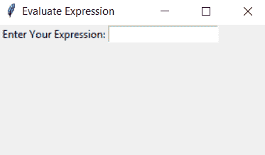
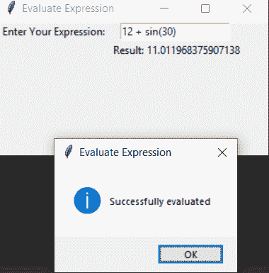

# 使用 Python 中的 Tkinter 评估数学表达式

> 原文:[https://www . geesforgeks . org/evaluate-the-数学表达式-使用-tkinter-in-python/](https://www.geeksforgeeks.org/evaluate-the-mathematical-expressions-using-tkinter-in-python/)

本文着重于使用 Python 中的 **Tkinter** 和**数学**包来评估数学表达式。

[**Tkinter:**](https://www.geeksforgeeks.org/python-gui-tkinter/)Python Tkinter 是一个 GUI 编程包或内置包。Tkinter 为 Tk GUI 工具包提供了一个强大的面向对象的界面。Python 和 tkinter 是创建图形用户界面应用程序最快最简单的方法。使用 tkinter 创建图形用户界面是一项简单的任务。

[**数学模块:**](https://www.geeksforgeeks.org/mathematical-functions-python-set-1-numeric-functions/) 在 python 中，通过导入一个名为“Math”的 [python 模块](https://www.geeksforgeeks.org/python-modules/)，可以轻松进行各种数学运算，指定各种函数，让我们的任务变得更简单。

> #### **温度转换涉及的步骤:**
> 
> *   Import tkinter & math package.
> *   Create the main window.
> *   Add the number of parts in the main window: items and labels.
> *   Evaluation expression.
> *   Show messages.
> *   Apply event triggers to widgets.

## 大蟒

```
# Importing tkinter module as tk
import tkinter as tk

# Importing all functions/methods
# from math module
from math import *

# Import messagebox class from tkinter
from tkinter import messagebox

# function for evaluating the expression
def eval_expression(event):
    result.configure(text = " Result: " +
                     str(eval(entry.get())))

    messagebox.showinfo("Evaluate Expression",
                        "Successfully evaluated" )

# creating Tk window
root = tk.Tk()

# set geometry of root window
root.geometry('300x150+600+200')

# set the title of root window
root.title('Evaluate Expression')

# label and entry field
input_label = tk.Label(root,
                      text = " Enter Your Expression:",).grid(row = 1)
entry = tk.Entry(root)

# bind 'enter' event to the
# eval_expression() through
# entry widget
entry.bind("
```

**输出:**



计算表达式 gui



评估表达式工作

#### 下面是一段演示代码在 PyCharm 中执行的视频:

<video class="wp-video-shortcode" id="video-435365-1" width="640" height="360" preload="metadata" controls=""><source type="video/mp4" src="https://media.geeksforgeeks.org/wp-content/uploads/20200618210036/mini-evaluate12.mp4?_=1">[https://media.geeksforgeeks.org/wp-content/uploads/20200618210036/mini-evaluate12.mp4](https://media.geeksforgeeks.org/wp-content/uploads/20200618210036/mini-evaluate12.mp4)</video>