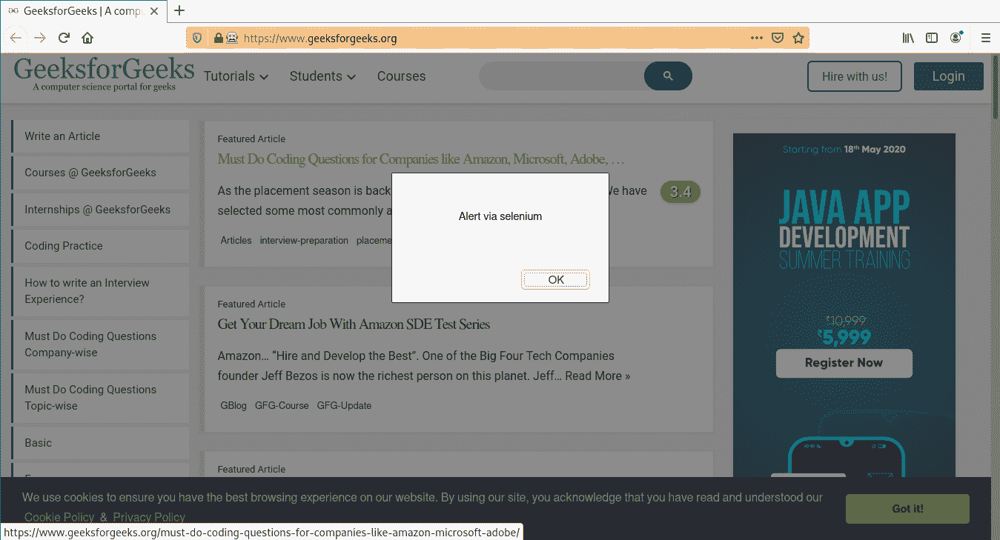

# 执行 _ async _ 脚本驱动方法–硒 Python

> 原文:[https://www . geesforgeks . org/execute _ async _ script-driver-method-selenium-python/](https://www.geeksforgeeks.org/execute_async_script-driver-method-selenium-python/)

Selenium 的 Python 模块是为使用 Python 执行自动化测试而构建的。硒 Python 绑定提供了一个简单的应用编程接口，可以使用硒网络驱动程序编写功能/验收测试。要使用硒 Python 打开网页，请使用 get 方法-硒 Python 签出–[导航链接。仅仅能够去一些地方并没有多大用处。我们真正想做的是与页面交互，或者更具体地说，与页面中的 HTML 元素交互。使用硒元素有多种策略，结账–](https://www.geeksforgeeks.org/navigating-links-using-get-method-selenium-python/)[定位策略](https://www.geeksforgeeks.org/locator-strategies-selenium-python/)。Selenium WebDriver 提供了各种有用的方法来控制会话，或者换句话说，浏览器。例如，添加 cookie、按后退按钮、在选项卡间导航等。

本文围绕《硒》中的`execute_async_script`驱动方法展开。`execute_async_script`方法在当前窗口/框架中异步执行 JavaScript。这是 selenium 的一大特色，因为 javascript 可以在网站上做任何事情，从打 API 到玩实时代码。

**语法–**

```py
execute_async_script(script, *args)
```

args–

*   `script`:要执行的 JavaScript。
*   `*args`:你的 JavaScript 的任何适用的参数。

**示例–**
现在可以使用 execute_async_script 方法作为驱动程序方法，如下所示–

```py
diver.get("https://www.geeksforgeeks.org/")
driver.execute_async_script("alert("alert via selenium")")

```

## 如何在 Selenium Python 中使用 execute_async_script 驱动方法？

演示一下，硒 Python 中网络驱动的`execute_async_script`方法。让我们访问 https://www.geeksforgeeks.org/，对驱动程序对象进行操作。

**程序–**

```py
# import webdriver
from selenium import webdriver

# create webdriver object
driver = webdriver.Firefox()

# get geeksforgeeks.org
driver.get("https://www.geeksforgeeks.org/")

# write script
script = "alert('Alert via selenium')"

# generate a alert via javascript
driver.execute_async_script(script)
```

**输出–**
浏览器生成警报，如下所示–
