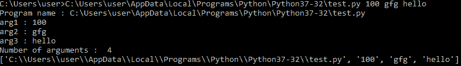
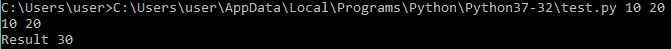
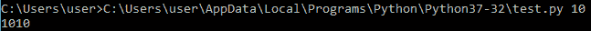
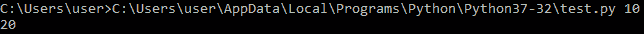
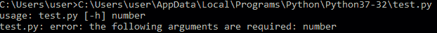
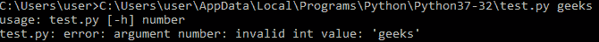

# 在 Python 中一个终端执行多个参数的函数

> 原文:[https://www . geeksforgeeks . org/在 python 终端执行多参数函数/](https://www.geeksforgeeks.org/executing-functions-with-multiple-arguments-at-a-terminal-in-python/)

命令行参数是用户在运行时提供的参数，由程序中的函数或方法执行。Python 提供了多种方法来处理这些类型的参数。最常见的三种是:

*   使用 sys.argv
*   使用 getopt 模块/li >
*   使用 argparse 模块

Python sys 模块允许在 sys 模块的帮助下访问命令行参数。python sys 模块提供了可用于访问 python 运行时环境不同部分的函数和变量。它允许访问系统特定的参数和功能。要使用 sys 模块，我们需要在运行任何功能之前在程序中导入 sys 模块。
sys 模块中主要有两个函数:
**sys.argv** :给出命令行参数列表。例如，sys.argv[0]是程序名。
**len(sys.argv)** :给出命令行参数的个数。

**示例 1 :** 这个程序演示了使用 sys.argv 获取命令行参数，len(sys.argv)给出了传递的命令行参数总数，包括 python 脚本的名称。

```
# importing the module
import sys

# storing the arguments
program = sys.argv[0]
arg1 = sys.argv[1]
arg2 = sys.argv[2]
arg3 = sys.argv[3]

# displaying the program name
print("Program name : " + program)

# displaying the arguments
print("arg1 : " + arg1)
print("arg2 : " + arg2)
print("arg3 : " + arg3)
print("Number of arguments : ", len(sys.argv))
print(sys.argv)
```

**输出:**


**示例 2 :** 这个程序演示了如何使用 sys.argv[index]将命令行参数传递给函数。索引 1、2 和 3 处的命令行参数存储在变量 arg1、arg2 和 arg3 中。变量 arg1、arg2 和 arg3 被传递给定义的函数。但是，命令行参数可以直接传递，而无需将其值存储在局部变量中。

```
# importing the module
import sys

# function definition
def concat(s1, s2, s3):
    print(s1 + " " + s2 + " " + s3)

# fetching the arguments
arg1 = sys.argv[1]
arg2 = sys.argv[2]
arg3 = sys.argv[3]

# calling the function
concat(arg1, arg2, arg3)
```

**输出:**


**示例 3 :** 这个程序演示了如何使用 sys.argv[index]将命令行参数传递给函数。索引 1 和 2 处的命令行参数存储在变量 arg1 和 arg2 中。变量 a 和 b 被传递给定义的函数。命令行参数被接受为字符串，因此为了执行数字操作，应该首先将其转换为所需的数字类型。例如，在这个程序中，命令行参数首先转换成整数，然后存储到变量中。但是，命令行参数可以直接传递，而无需将其值存储在局部变量中。

```
# importing the module
import sys

# function definition
def add(a, b):
    print("Result", a + b)

# fetching the arguments
arg1 = int(sys.argv[1])
arg2 = int(sys.argv[2])

# displaying the arguments
print(arg1, arg2)

# calling the function
add(arg1, arg2)
```

**输出:**


**使用 argparse 模块**
sys . argv 方法存在一定的问题，因为如果没有传递参数或者传递了无效类型的参数，它不会抛出任何特定的错误。argparse 模块优雅地处理参数的存在和不存在。以下示例显示了 argparse 模块的实用程序:

```
# importing the module
import argparse

# creating an ArgumentParsert object
parser = argparse.ArgumentParser()

# fetching the arguments
parser.add_argument('number',
                    help = "Enter number to triple it.")
args = parser.parse_args()

# performing some operation
print(args.number * 2)
```

**输出:**


Python 默认接受所有命令行参数作为字符串类型，因此结果是 55 ie。该字符串被重复两次。但是，我们可以在程序本身中指定我们期望的数据类型，以便每当传递命令行参数时，只要它是类型兼容的，它就会自动转换为期望的数据类型。

```
# importing the module
import argparse

# creating an ArgumentParsert object
parser = argparse.ArgumentParser()

# fetching the arguments
parser.add_argument('number',
                    help = "Enter number to double.",
                    type = int)
args = parser.parse_args()
print(args.number * 2)
```

**输出:**


我们可以看看生成的错误:



与 sys 模块不同，这个 argparse 会抛出特定的错误。根据方便和要求，可以使用任何模块。

Python 提供了一个 [getopt](https://www.geeksforgeeks.org/getopt-module-in-python/) 模块，可以解析命令行参数。

**示例:**

```
import sys 
import getopt 

def full_name(): 
    first_name = None
    last_name = None

    argv = sys.argv[1:] 

    try: 
        opts, args = getopt.getopt(argv, "f:l:") 

    except: 
        print("Error") 

    for opt, arg in opts: 
        if opt in ['-f']: 
            first_name = arg 
        elif opt in ['-l']: 
            last_name = arg 

    print( first_name +" " + last_name) 

full_name()
```

**输出:**
