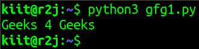
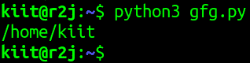
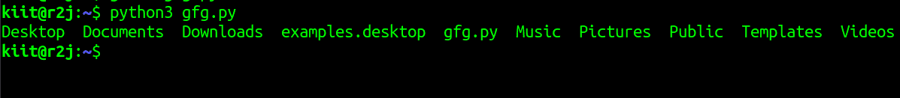
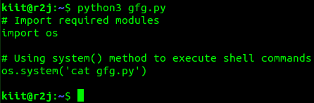

# 用 Python 执行 Shell 命令

> 原文:[https://www . geesforgeks . org/executing-shell-commands-with-python/](https://www.geeksforgeeks.org/executing-shell-commands-with-python/)

**先决条件:** [一些基本的 shell 命令](https://www.geeksforgeeks.org/basic-shell-commands-in-linux/)

在编程中，外壳是用于访问操作系统功能的软件接口。操作系统中的外壳根据设备的功能和基本操作使用命令行界面或图形用户界面。

Python 中的操作系统模块包括与操作系统通信的功能。操作系统模块是 Python 的标准实用程序模块之一。这个 Python 模块提供了一种使用操作系统相关特性的便捷方式，shell 命令可以使用 os 模块中的 [system()](https://www.geeksforgeeks.org/python-os-system-method/) 方法来执行。

**下面是一些使用 Python 执行 shell 命令的例子:**

**例 1:**

## 蟒蛇 3

```
# Importing required module
import os

# Using system() method to 
# execute shell commands
os.system('echo "Geeks 4 Geeks"')
```

**输出:**



**例 2:**

## 蟒蛇 3

```
# Importing required module
import os

# Using system() method to execute
# shell commands
os.system('pwd')
```

**输出:**



**例 3:**

## 蟒蛇 3

```
# Importing required module
import os

# Using system() method to execute
# shell commands
os.system('ls')
```

**输出:**



**例 4:**

## 蟒蛇 3

```
# Importing required module
import os

# Using system() method to execute
# shell commands
os.system('cat')
```

**输出:**



**例 5:**

## 蟒蛇 3

```
# Importing required module
import os

# Using system() method to execute
# shell commands
os.system('telnet towel.blinkenlights.nl')
```

**输出:**

