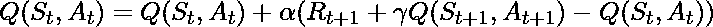
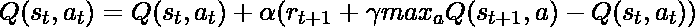
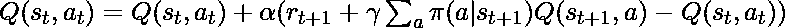
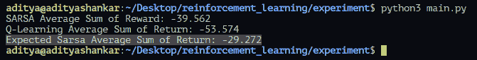

# 强化学习中的预期 SARSA

> 原文:[https://www . geeksforgeeks . org/expected-sarsa-in-reduction-learning/](https://www.geeksforgeeks.org/expected-sarsa-in-reinforcement-learning/)

**先决条件:** [SARSA](https://www.geeksforgeeks.org/sarsa-reinforcement-learning/)
SARSA 和强化学习中的 Q-Learning 技术是使用时间差异(TD)更新来改善代理行为的算法。预期的 SARSA 技术是改进代理策略的替代方案。它与 SARSA 和 Q-Learning 非常相似，不同之处在于它遵循的动作值函数。
我们知道 SARSA 是一种策略上的技术，Q 学习是一种策略外的技术，但是 Expected SARSA 既可以作为策略上的技术，也可以作为策略外的技术。与这两种算法相比，这是 Expected SARSA 更加灵活的地方。
我们来对比一下三种算法的作用值函数，看看在 Expected SARSA 中有什么不同。

*   **讽刺:** 
*   **Q-Learning:**
    
*   **预计 SARSA:**
    

我们看到，预期 SARSA 根据采取行动的概率，对所有可能的后续行动进行加权求和。如果期望收益相对于期望收益是贪婪的，那么这个方程被转化为 Q 学习。否则，预期的 SARSA 将按策略运行，并计算所有操作的预期回报，而不是像 SARSA 那样随机选择一个操作。
牢记理论和公式，让我们用一个实验来比较这三种算法。我们将实现一个 Cliff Walker 作为我们的环境，该环境由[健身房](https://gym.openai.com/)图书馆
**提供代码:Python 代码来创建类 Agent，该类 Agent 将被其他代理继承以避免重复代码。**

## 蟒蛇 3

```py
# Agent.py

import numpy as np

class Agent:
    """
    The Base class that is implemented by
    other classes to avoid the duplicate 'choose_action'
    method
    """
    def choose_action(self, state):
        action = 0
        if np.random.uniform(0, 1) < self.epsilon:
            action = self.action_space.sample()
        else:
            action = np.argmax(self.Q[state, :])
        return action
```

**代码:创建 SARSA 代理的 Python 代码。**

## 蟒蛇 3

```py
# SarsaAgent.py

import numpy as np
from Agent import Agent

class SarsaAgent(Agent):
    """
    The Agent that uses SARSA update to improve it's behaviour
    """
    def __init__(self, epsilon, alpha, gamma, num_state, num_actions, action_space):
        """
        Constructor
        Args:
            epsilon: The degree of exploration
            gamma: The discount factor
            num_state: The number of states
            num_actions: The number of actions
            action_space: To call the random action
        """
        self.epsilon = epsilon
        self.alpha = alpha
        self.gamma = gamma
        self.num_state = num_state
        self.num_actions = num_actions

        self.Q = np.zeros((self.num_state, self.num_actions))
        self.action_space = action_space

    def update(self, prev_state, next_state, reward, prev_action, next_action):
        """
        Update the action value function using the SARSA update.
        Q(S, A) = Q(S, A) + alpha(reward + (gamma * Q(S_, A_) - Q(S, A))
        Args:
            prev_state: The previous state
            next_state: The next state
            reward: The reward for taking the respective action
            prev_action: The previous action
            next_action: The next action
        Returns:
            None
        """
        predict = self.Q[prev_state, prev_action]
        target = reward + self.gamma * self.Q[next_state, next_action]
        self.Q[prev_state, prev_action] += self.alpha * (target - predict)
```

**代码:创建 Q-Learning Agent 的 Python 代码。**

## 蟒蛇 3

```py
# QLearningAgent.py

import numpy as np
from Agent import Agent

class QLearningAgent(Agent):
    def __init__(self, epsilon, alpha, gamma, num_state, num_actions, action_space):
        """
        Constructor
        Args:
            epsilon: The degree of exploration
            gamma: The discount factor
            num_state: The number of states
            num_actions: The number of actions
            action_space: To call the random action
        """
        self.epsilon = epsilon
        self.alpha = alpha
        self.gamma = gamma
        self.num_state = num_state
        self.num_actions = num_actions

        self.Q = np.zeros((self.num_state, self.num_actions))
        self.action_space = action_space
    def update(self, state, state2, reward, action, action2):
        """
        Update the action value function using the Q-Learning update.
        Q(S, A) = Q(S, A) + alpha(reward + (gamma * Q(S_, A_) - Q(S, A))
        Args:
            prev_state: The previous state
            next_state: The next state
            reward: The reward for taking the respective action
            prev_action: The previous action
            next_action: The next action
        Returns:
            None
        """
        predict = self.Q[state, action]
        target = reward + self.gamma * np.max(self.Q[state2, :])
        self.Q[state, action] += self.alpha * (target - predict)
```

**代码:创建预期 SARSA 代理的 Python 代码。在这个实验中，我们使用下面的公式来计算策略。**


## 蟒蛇 3

```py
# ExpectedSarsaAgent.py

import numpy as np
from Agent import Agent

class ExpectedSarsaAgent(Agent):
    def __init__(self, epsilon, alpha, gamma, num_state, num_actions, action_space):
        """
        Constructor
        Args:
            epsilon: The degree of exploration
            gamma: The discount factor
            num_state: The number of states
            num_actions: The number of actions
            action_space: To call the random action
        """
        self.epsilon = epsilon
        self.alpha = alpha
        self.gamma = gamma
        self.num_state = num_state
        self.num_actions = num_actions

        self.Q = np.zeros((self.num_state, self.num_actions))
        self.action_space = action_space
    def update(self, prev_state, next_state, reward, prev_action, next_action):
        """
        Update the action value function using the Expected SARSA update.
        Q(S, A) = Q(S, A) + alpha(reward + (pi * Q(S_, A_) - Q(S, A))
        Args:
            prev_state: The previous state
            next_state: The next state
            reward: The reward for taking the respective action
            prev_action: The previous action
            next_action: The next action
        Returns:
            None
        """
        predict = self.Q[prev_state, prev_action]

        expected_q = 0
        q_max = np.max(self.Q[next_state, :])
        greedy_actions = 0
        for i in range(self.num_actions):
            if self.Q[next_state][i] == q_max:
                greedy_actions += 1

        non_greedy_action_probability = self.epsilon / self.num_actions
        greedy_action_probability = ((1 - self.epsilon) / greedy_actions) + non_greedy_action_probability

        for i in range(self.num_actions):
            if self.Q[next_state][i] == q_max:
                expected_q += self.Q[next_state][i] * greedy_action_probability
            else:
                expected_q += self.Q[next_state][i] * non_greedy_action_probability

        target = reward + self.gamma * expected_q
        self.Q[prev_state, prev_action] += self.alpha * (target - predict)
```

**Python 代码创建环境并测试所有三种算法。**

## 蟒蛇 3

```py
# main.py

import gym
import numpy as np

from ExpectedSarsaAgent import ExpectedSarsaAgent
from QLearningAgent import QLearningAgent
from SarsaAgent import SarsaAgent
from matplotlib import pyplot as plt

# Using the gym library to create the environment
env = gym.make('CliffWalking-v0')

# Defining all the required parameters
epsilon = 0.1
total_episodes = 500
max_steps = 100
alpha = 0.5
gamma = 1
"""
    The two parameters below is used to calculate
    the reward by each algorithm
"""
episodeReward = 0
totalReward = {
    'SarsaAgent': [],
    'QLearningAgent': [],
    'ExpectedSarsaAgent': []
}

# Defining all the three agents
expectedSarsaAgent = ExpectedSarsaAgent(
    epsilon, alpha, gamma, env.observation_space.n,
    env.action_space.n, env.action_space)
qLearningAgent = QLearningAgent(
    epsilon, alpha, gamma, env.observation_space.n,
    env.action_space.n, env.action_space)
sarsaAgent = SarsaAgent(
    epsilon, alpha, gamma, env.observation_space.n,
    env.action_space.n, env.action_space)

# Now we run all the episodes and calculate the reward obtained by
# each agent at the end of the episode

agents = [expectedSarsaAgent, qLearningAgent, sarsaAgent]

for agent in agents:
    for _ in range(total_episodes):
        # Initialize the necessary parameters before
        # the start of the episode
        t = 0
        state1 = env.reset()
        action1 = agent.choose_action(state1)
        episodeReward = 0
        while t < max_steps:

            # Getting the next state, reward, and other parameters
            state2, reward, done, info = env.step(action1)

            # Choosing the next action
            action2 = agent.choose_action(state2)

            # Learning the Q-value
            agent.update(state1, state2, reward, action1, action2)

            state1 = state2
            action1 = action2

            # Updating the respective vaLues
            t += 1
            episodeReward += reward

            # If at the end of learning process
            if done:
                break
        # Append the sum of reward at the end of the episode
        totalReward[type(agent).__name__].append(episodeReward)
env.close()

# Calculate the mean of sum of returns for each episode
meanReturn = {
    'SARSA-Agent': np.mean(totalReward['SarsaAgent']),
    'Q-Learning-Agent': np.mean(totalReward['QLearningAgent']),
    'Expected-SARSA-Agent': np.mean(totalReward['ExpectedSarsaAgent'])
}

# Print the results
print(f"SARSA Average Sum of Reward: {meanReturn['SARSA-Agent']}")
print(f"Q-Learning Average Sum of Return: {meanReturn['Q-Learning-Agent']}")
print(f"Expected Sarsa Average Sum of Return: {meanReturn['Expected-SARSA-Agent']}")
```

**输出:**



**结论:**
我们已经看到，Expected SARSA 在某些问题上的表现相当不错。它在选择特定的行动之前考虑所有可能的结果。事实上，预期的 SARSA 既可以用作关闭策略，也可以用作打开策略，这是该算法如此动态的原因。