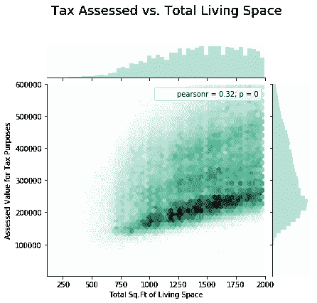
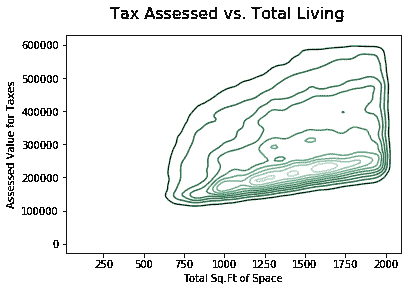

# 利用六边形宁滨和等高线图进行勘探

> 原文:[https://www . geeksforgeeks . org/带有六边形宁滨和等高线图的勘探/](https://www.geeksforgeeks.org/exploration-with-hexagonal-binning-and-contour-plots/)

**六边形宁滨**是两个数值变量的图，记录被分成六边形。下面的代码是一个六边形宁滨图，显示了完工面积与房屋的纳税评估值之间的关系。记录不是标绘点，而是分组到六边形箱中，并用颜色表示该箱中记录的数量。

要获取使用的 csv 文件，请单击此处的。

**加载库**

```
import numpy as np
import pandas as pd
import seaborn as sns
import matplotlib.pyplot as plt
```

**加载数据**

```
data = pd.read_csv("kc_tax.csv")

print (data.head())
```

**输出:**

```
   TaxAssessedValue  SqFtTotLiving  ZipCode
0               NaN           1730  98117.0
1          206000.0           1870  98002.0
2          303000.0           1530  98166.0
3          361000.0           2000  98108.0
4          459000.0           3150  98108.0

```

**数据信息**

```
print (data.shape)
print ("\n", data.info())
```

**输出:**

```
(498249, 3)

RangeIndex: 498249 entries, 0 to 498248
Data columns (total 3 columns):
TaxAssessedValue    497511 non-null float64
SqFtTotLiving       498249 non-null int64
ZipCode             467900 non-null float64
dtypes: float64(2), int64(1)
memory usage: 11.4 MB

```

**选择数据**

```
# Take a subset of the King County, Washington
# Tax data, for Assessed Value for Tax purposes
# < $600, 000 and Total Living Sq. Feet > 100 &
# < 2000

data = data.loc[(data['TaxAssessedValue'] < 600000) & 
                (data['SqFtTotLiving'] > 100) & 
                (data['SqFtTotLiving'] < 2000)]
```

**检查空值**

```
# As you can see in the info
# that records are not complete
data['TaxAssessedValue'].isnull().values.any()
```

**输出:**

```
False
```

**代号#1:** 六角滨宁

```
x = data['SqFtTotLiving']
y = data['TaxAssessedValue']

fig = sns.jointplot(x, y, kind ="hex", 
                    color ="# 4CB391")

fig.fig.subplots_adjust(top = 0.85)

fig.set_axis_labels('Total Sq.Ft of Living Space', 
                    'Assessed Value for Tax Purposes')

fig.fig.suptitle('Tax Assessed vs. Total Living Space', 
                 size = 18);
```

**输出:**


**等高线图:**
等高线图是一条曲线，两个变量的函数沿着它有一个恒定值。它是平行于 x，y 平面的函数 f(x，y)的三维图形的平面部分。等高线连接给定标高上方的等高程点。等高线图是下面代码中说明的地图。等高线图的等高线间隔是连续等高线之间的高程差。

**代码#2:** 等高线图

```
fig2 = sns.kdeplot(x, y, legend = True)

plt.xlabel('Total Sq.Ft of Space')

plt.ylabel('Assessed Value for Taxes')

fig2.figure.suptitle('Tax Assessed vs. Total Living', size = 16);
```

**输出:**
