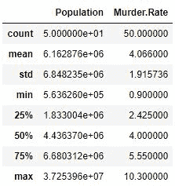

# Python 中的探索性数据分析|第 1 集

> 原文:[https://www . geesforgeks . org/explorive-data-analysis-in-python-set-1/](https://www.geeksforgeeks.org/exploratory-data-analysis-in-python-set-1/)

**探索性数据分析**是用可视化技术和所有统计结果分析数据的技术。在应用任何机器学习模型之前，我们将学习如何应用这些技术。

要获取所使用的`csv` 文件的链接，请单击此处的。

**加载库:**

```
import numpy as np
import pandas as pd
import seaborn as sns
import matplotlib.pyplot as plt

from scipy.stats import trim_mean
```

**加载数据:**

```
data = pd.read_csv("state.csv")

# Check the type of data
print ("Type : ", type(data), "\n\n")

# Printing Top 10 Records
print ("Head -- \n", data.head(10))

# Printing last 10 Records 
print ("\n\n Tail -- \n", data.tail(10))
```

**输出:**

```
Type : class 'pandas.core.frame.DataFrame'

Head -- 
          State  Population  Murder.Rate Abbreviation
0      Alabama     4779736          5.7           AL
1       Alaska      710231          5.6           AK
2      Arizona     6392017          4.7           AZ
3     Arkansas     2915918          5.6           AR
4   California    37253956          4.4           CA
5     Colorado     5029196          2.8           CO
6  Connecticut     3574097          2.4           CT
7     Delaware      897934          5.8           DE
8      Florida    18801310          5.8           FL
9      Georgia     9687653          5.7           GA

 Tail -- 
             State  Population  Murder.Rate Abbreviation
40   South Dakota      814180          2.3           SD
41      Tennessee     6346105          5.7           TN
42          Texas    25145561          4.4           TX
43           Utah     2763885          2.3           UT
44        Vermont      625741          1.6           VT
45       Virginia     8001024          4.1           VA
46     Washington     6724540          2.5           WA
47  West Virginia     1852994          4.0           WV
48      Wisconsin     5686986          2.9           WI
49        Wyoming      563626          2.7           WY

```

**代码#1 :** 向数据框添加列

```
# Adding a new column with derived data 

data['PopulationInMillions'] = data['Population']/1000000

# Changed data
print (data.head(5))
```

**输出:**

```
        State  Population  Murder.Rate Abbreviation  PopulationInMillions
0     Alabama     4779736          5.7           AL              4.779736
1      Alaska      710231          5.6           AK              0.710231
2     Arizona     6392017          4.7           AZ              6.392017
3    Arkansas     2915918          5.6           AR              2.915918
4  California    37253956          4.4           CA             37.253956

```

**代码#2 :** 数据描述

```
data.describe()
```

**输出:**


**代码#3 :** 数据信息

```
data.info()
```

**输出:**

```

RangeIndex: 50 entries, 0 to 49
Data columns (total 4 columns):
State           50 non-null object
Population      50 non-null int64
Murder.Rate     50 non-null float64
Abbreviation    50 non-null object
dtypes: float64(1), int64(1), object(2)
memory usage: 1.6+ KB

```

**代码#4 :** 重命名列标题

```
# Rename column heading as it 
# has '.' in it which will create
# problems when dealing functions 

data.rename(columns ={'Murder.Rate': 'MurderRate'}, inplace = True)

# Lets check the column headings
list(data)
```

**输出:**

```
['State', 'Population', 'MurderRate', 'Abbreviation']

```

**代码#5 :** 计算平均值

```
Population_mean = data.Population.mean()
print ("Population Mean : ", Population_mean)

MurderRate_mean = data.MurderRate.mean()
print ("\nMurderRate Mean : ", MurderRate_mean)
```

**输出:**

```
Population Mean :  6162876.3

MurderRate Mean :  4.066

```

**代码#6 :** 修剪平均值

```
# Mean after discarding top and 
# bottom 10 % values eliminating outliers

population_TM = trim_mean(data.Population, 0.1)
print ("Population trimmed mean: ", population_TM)

murder_TM = trim_mean(data.MurderRate, 0.1)
print ("\nMurderRate trimmed mean: ", murder_TM)
```

**输出:**

```
Population trimmed mean:  4783697.125

MurderRate trimmed mean:  3.9450000000000003

```

**代码#7 :** 加权平均值

```
# here murder rate is weighed as per 
# the state population

murderRate_WM = np.average(data.MurderRate, weights = data.Population)
print ("Weighted MurderRate Mean: ", murderRate_WM)
```

**输出:**

```
Weighted MurderRate Mean:  4.445833981123393

```

**代码#8 :** 中间值

```
Population_median = data.Population.median()
print ("Population median : ", Population_median)

MurderRate_median = data.MurderRate.median()
print ("\nMurderRate median : ", MurderRate_median)
```

**输出:**

```
Population median :  4436369.5

MurderRate median :  4.0

```