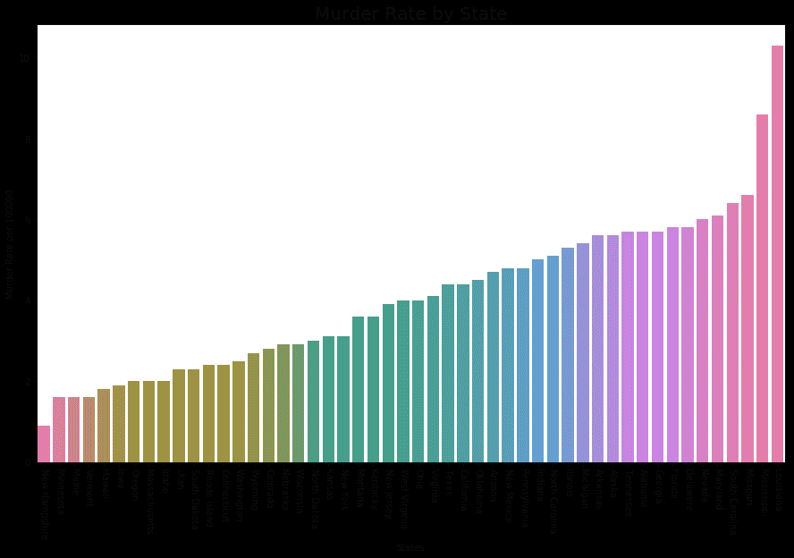

# Python 中的探索性数据分析|第 2 集

> 原文:[https://www . geesforgeks . org/explorive-data-analysis-in-python-set-2/](https://www.geeksforgeeks.org/exploratory-data-analysis-in-python-set-2/)

在[之前的文章](https://www.geeksforgeeks.org/exploratory-data-analysis-in-python-set-1/)中，我们已经讨论了一些分析数据的基本技术，现在让我们来看看可视化技术。

让我们来看看基本技术–

```py
# Loading Libraries

import numpy as np
import pandas as pd
import seaborn as sns
import matplotlib.pyplot as plt
from scipy.stats import trim_mean

# Loading Data
data = pd.read_csv("state.csv")

# Check the type of data
print ("Type : ", type(data), "\n\n")

# Printing Top 10 Records
print ("Head -- \n", data.head(10))

# Printing last 10 Records 
print ("\n\n Tail -- \n", data.tail(10))

# Adding a new column with derived data  
data['PopulationInMillions'] = data['Population']/1000000

# Changed data
print (data.head(5))

# Rename column heading as it 
# has '.' in it which will create
# problems when dealing functions 

data.rename(columns ={'Murder.Rate': 'MurderRate'},
                                    inplace = True)

# Lets check the column headings
list(data)
```

**输出:**

```py
Type : class 'pandas.core.frame.DataFrame'

Head -- 
          State  Population  Murder.Rate Abbreviation
0      Alabama     4779736          5.7           AL
1       Alaska      710231          5.6           AK
2      Arizona     6392017          4.7           AZ
3     Arkansas     2915918          5.6           AR
4   California    37253956          4.4           CA
5     Colorado     5029196          2.8           CO
6  Connecticut     3574097          2.4           CT
7     Delaware      897934          5.8           DE
8      Florida    18801310          5.8           FL
9      Georgia     9687653          5.7           GA

 Tail -- 
             State  Population  Murder.Rate Abbreviation
40   South Dakota      814180          2.3           SD
41      Tennessee     6346105          5.7           TN
42          Texas    25145561          4.4           TX
43           Utah     2763885          2.3           UT
44        Vermont      625741          1.6           VT
45       Virginia     8001024          4.1           VA
46     Washington     6724540          2.5           WA
47  West Virginia     1852994          4.0           WV
48      Wisconsin     5686986          2.9           WI
49        Wyoming      563626          2.7           WY

        State  Population  Murder.Rate Abbreviation  PopulationInMillions
0     Alabama     4779736          5.7           AL              4.779736
1      Alaska      710231          5.6           AK              0.710231
2     Arizona     6392017          4.7           AZ              6.392017
3    Arkansas     2915918          5.6           AR              2.915918
4  California    37253956          4.4           CA             37.253956

['State', 'Population', 'MurderRate', 'Abbreviation']

```

**每百万人口可视化**

```py
# Plot Population In Millions
fig, ax1 = plt.subplots()
fig.set_size_inches(15,  9)

ax1 = sns.barplot(x ="State", y ="Population", 
                  data = data.sort_values('MurderRate'), 
                                        palette ="Set2")

ax1.set(xlabel ='States', ylabel ='Population In Millions')
ax1.set_title('Population in Millions by State', size = 20)

plt.xticks(rotation =-90)
```

**输出:**

```py
(array([ 0,  1,  2,  3,  4,  5,  6,  7,  8,  9, 10, 11, 12, 13, 14, 15, 16,
        17, 18, 19, 20, 21, 22, 23, 24, 25, 26, 27, 28, 29, 30, 31, 32, 33,
        34, 35, 36, 37, 38, 39, 40, 41, 42, 43, 44, 45, 46, 47, 48, 49]),
 a list of 50 Text xticklabel objects)

```


**可视化每 10 万人的谋杀率**

```py
# Plot Murder Rate per 1, 00, 000

fig, ax2 = plt.subplots()
fig.set_size_inches(15,  9)

ax2 = sns.barplot(
    x ="State", y ="MurderRate", 
    data = data.sort_values('MurderRate', ascending = 1), 
                                         palette ="husl")

ax2.set(xlabel ='States', ylabel ='Murder Rate per 100000')
ax2.set_title('Murder Rate by State', size = 20)

plt.xticks(rotation =-90)
```

**输出:**

```py
(array([ 0,  1,  2,  3,  4,  5,  6,  7,  8,  9, 10, 11, 12, 13, 14, 15, 16,
        17, 18, 19, 20, 21, 22, 23, 24, 25, 26, 27, 28, 29, 30, 31, 32, 33,
        34, 35, 36, 37, 38, 39, 40, 41, 42, 43, 44, 45, 46, 47, 48, 49]),
 a list of 50 Text xticklabel objects)

```


虽然路易斯安那州的人口排名为 17 位(约 453 万人)，但它的谋杀率最高，为每 100 万人 10.3 起。

**代码#1 :** 标准偏差

```py
Population_std = data.Population.std()
print ("Population std : ", Population_std)

MurderRate_std = data.MurderRate.std()
print ("\nMurderRate std : ", MurderRate_std)
```

**输出:**

```py
Population std :  6848235.347401142

MurderRate std :  1.915736124302923
```

**代码#2 :** 方差

```py
Population_var = data.Population.var()
print ("Population var : ", Population_var)

MurderRate_var = data.MurderRate.var()
print ("\nMurderRate var : ", MurderRate_var)
```

**输出:**

```py
Population var :  46898327373394.445

MurderRate var :  3.670044897959184

```

**代码#3 :** 四分位数区间

```py
# Inter Quartile Range of Population
population_IQR = data.Population.describe()['75 %'] - 
                 data.Population.describe()['25 %']

print ("Population IQR : ", population_IRQ)

# Inter Quartile Range of Murder Rate
MurderRate_IQR = data.MurderRate.describe()['75 %'] - 
                 data.MurderRate.describe()['25 %']

print ("\nMurderRate IQR : ", MurderRate_IQR)
```

**输出:**

```py
Population IQR :  4847308.0

MurderRate IQR :  3.124999999999999

```

**代码#4 :** 中值绝对偏差(MAD)

```py
Population_mad = data.Population.mad()
print ("Population mad : ", Population_mad)

MurderRate_mad = data.MurderRate.mad()
print ("\nMurderRate mad : ", MurderRate_mad)
```

**输出:**

```py
Population mad :  4450933.356000001

MurderRate mad :  1.5526400000000005

```