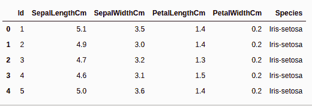
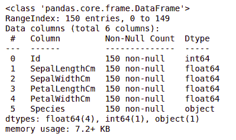
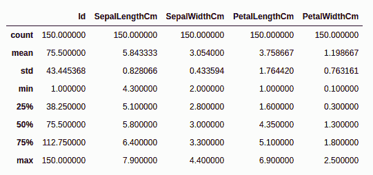

# 虹膜数据集上的探索性数据分析

> 原文:[https://www . geesforgeks . org/explorive-data-analysis-on-iris-dataset/](https://www.geeksforgeeks.org/exploratory-data-analysis-on-iris-dataset/)

在本文中，我们将讨论如何在 Iris 数据集上执行探索性数据分析。在继续这篇文章之前，我们使用了两个术语，即电子设计自动化和虹膜数据集。让我们看一下这些数据集的简介。

## 什么是探索性数据分析？

**探索性数据分析(EDA)** 是一种使用一些可视化技术分析数据的技术。使用这种技术，我们可以获得关于数据统计摘要的详细信息。我们还将能够处理重复值、异常值，并看到数据集中存在的一些趋势或模式。

现在让我们看一下关于 Iris 数据集的简介。

## 虹膜数据集

如果你来自数据科学背景，你们都必须熟悉虹膜数据集。如果你不是，那么不要担心，我们会在这里讨论这个问题。

Iris 数据集被认为是数据科学的 Hello World。它包含五列，即花瓣长度、花瓣宽度、萼片长度、萼片宽度和种类类型。鸢尾是一种开花植物，研究人员测量了不同鸢尾花的各种特征，并以数字方式记录下来。

**注意:**这个数据集可以从[这里](https://datahub.io/machine-learning/iris)下载。

你可以从上面的链接下载 Iris.csv 文件。现在我们将使用熊猫库加载这个 CSV 文件，并将它转换为[数据帧](https://www.geeksforgeeks.org/python-pandas-dataframe/)。 [read_csv()](https://www.geeksforgeeks.org/python-read-csv-using-pandas-read_csv/) 方法用于读取 csv 文件。

**示例:**

## 蟒蛇 3

```
import pandas as pd

# Reading the CSV file
df = pd.read_csv("Iris.csv")

# Printing top 5 rows
df.head()
```

**输出:**



## 获取关于数据集的信息

我们将使用形状参数来获得数据集的形状。

**示例:**

## 蟒蛇 3

```
df.shape
```

**输出:**

```
(150, 6)
```

我们可以看到数据框包含 6 列 150 行。

现在，让我们也看看列及其数据类型。为此，我们将使用 [info()](https://www.geeksforgeeks.org/python-pandas-dataframe-info/) 方法。

**示例:**

## 蟒蛇 3

```
df.info()
```

**输出:**



我们可以看到，只有一列有分类数据，而所有其他列都是数值类型的，具有非空条目。

让我们使用[**【description()**](https://www.geeksforgeeks.org/python-pandas-dataframe-describe-method/)方法快速统计一下数据集。deviation()函数对数据集应用基本的统计计算，如极值、数据点计数标准偏差等。任何缺失的值或 NaN 值都会被自动跳过。distribution()函数很好地描述了数据的分布。

**示例:**

## 蟒蛇 3

```
df.describe()
```

**输出:**



我们可以看到每一列的计数以及它们的平均值、标准偏差、最小值和最大值。

## 检查缺失值

我们将检查我们的数据是否包含任何缺失值。当没有为一个或多个项目或整个单位提供信息时，可能会出现值缺失。我们将使用 [isnull()](https://www.geeksforgeeks.org/python-pandas-isnull-and-notnull/) 方法。

**示例:**

## 蟒蛇 3

```
df.isnull().sum()
```