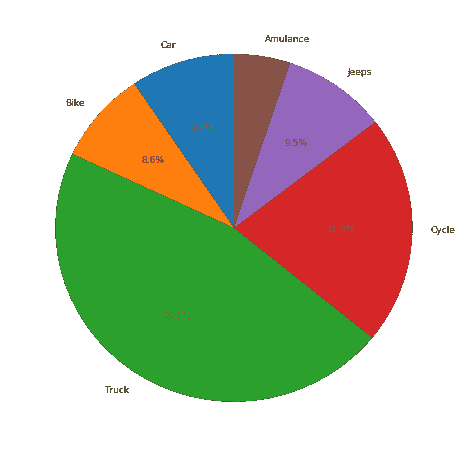

# 探索分类数据

> 原文:[https://www.geeksforgeeks.org/exploring-categorical-data/](https://www.geeksforgeeks.org/exploring-categorical-data/)

**分类变量/数据(或名义变量):**

这样的变量具有固定且有限数量的可能值。例如——等级、性别、血型等。此外，在分类变量的情况下，逻辑顺序与分类数据不同，例如“一”、“二”、“三”。但是这些变量的排序使用逻辑顺序。例如，性别是一个分类变量，有类别——男性和女性，并且没有类别的内在顺序。一个纯粹的分类变量是一个简单地允许你分配类别，但你不能清楚地排序的变量。

**与可变性指标相关的术语:**

*   **模式:**给定数据中最常出现的值
    **示例-**

    ```
    Data = ["Car", "Bat", "Bat", "Car", "Bat", "Bat", "Bat", "Bike"]
    Mode = "Bat"
    ```

*   **Expected Value :** When working in machine learning, categories have to be associated with a numeric value, so as to give understanding to the machine. This gives an average value based on a category’s probability of occurrence i.e. Expected Value.
    It is calculated by –

    ```
    -> Multiply each outcome by its probability of occurring.
    -> Sum these values
    ```

    因此，它是值的总和乘以它们出现的概率，通常用于总结因子变量水平。

    

*   **Bar Charts :** Frequency of each category plotted as bars.

    加载库–

    ```
    import matplotlib.pyplot as plt
    import numpy as np
    ```

    数据–

    ```
    label = ['Car', 'Bike', 'Truck', 'Cycle', 'Jeeps', 'Amulance']
    no_vehicle = [941, 854, 4595, 2125, 942, 509]
    ```

    索引数据–

    ```
    index = np.arange(len(label))

    print ("Total Labels : ", len(label))
    print ("Indexing : ", index)
    ```

    **输出:**

    ```
    Total Labels :  6
    Indexing :  [0 1 2 3 4 5]
    ```

    条形图–

    ```
    plt.bar(index, no_vehicle)
    plt.xlabel('Type', fontsize = 15)
    plt.ylabel('No of Vehicles', fontsize = 15)
    plt.xticks(index, label, fontsize = 10, rotation = 30)
    plt.title('Market Share for Each Genre 1995-2017')

    plt.show()
    ```

    **输出:**
    

*   **Pie Charts :** Frequency of each category plotted as pie or wedges. It is a circular graph, where the arc length of each slice is proportional to the quantity it represents.

    ```
    plt.figure(figsize =(8, 8))
    plt.pie(no_vehicle, labels = label, 
            startangle = 90, autopct ='%.1f %%')
    plt.show()
    ```

    **输出:**
    