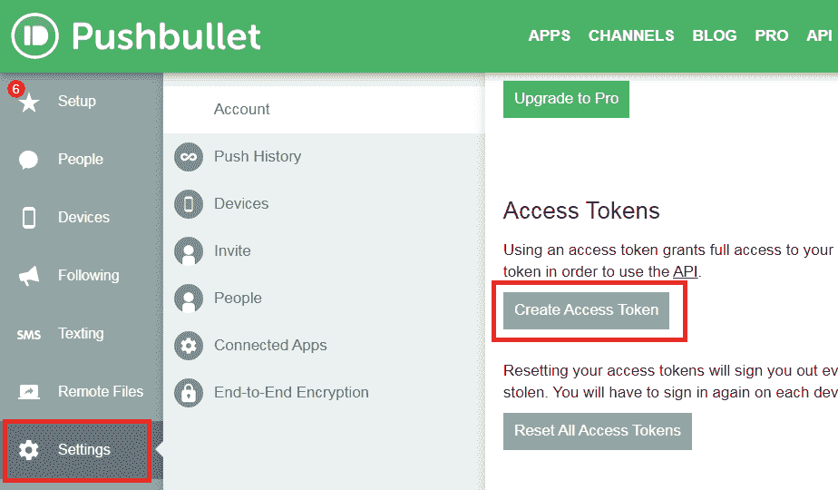
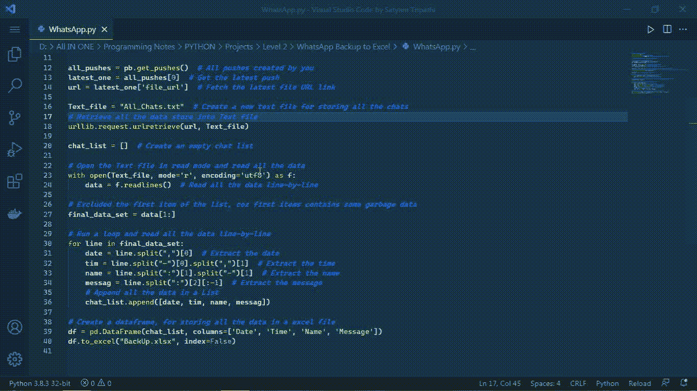

# 使用 Python 将 WhatsApp 聊天历史导出到 Excel】

> 原文:[https://www . geesforgeks . org/export-whatsapp-chat-history-to-excel-using-python/](https://www.geeksforgeeks.org/export-whatsapp-chat-history-to-excel-using-python/)

在本文中，我们将讨论如何将特定用户的聊天导出到 **Excel 工作表**中。为了导出聊天，我们将使用几个 Python 模块和库。

在 Excel 文件中，我们将创建四列:日期、时间、名称和消息。我们将通过 Pandas 创建这些列，将所有聊天详细信息导出到它们各自的列中，并使用 Pushbullets 使用 API 键检索数据。

### 所需模块:

*   [**熊猫**](https://www.geeksforgeeks.org/python-pandas-dataframe/) **:** 熊猫是建立在 NumPy 库之上的开源库。它是一个 Python 包，提供了各种数据结构和操作来操作数字数据和时间序列。

```py
pip install pandas
```

*   **推送工具:**可以给[安卓](https://play.google.com/store/apps/details?id=com.pushbullet.android)和 [iOS](https://itunes.apple.com/us/app/pushbullet/id810352052) 设备发送推送通知。

```py
pip install pushbullet.py == 0.9.1
```

*   [**openpyxl**](https://www.geeksforgeeks.org/python-reading-excel-file-using-openpyxl-module/) **:这是一个 Python 库，可以对 excel 文件进行读、写、算术运算、绘图等多种操作。让我们看看如何使用 openpyxl 执行不同的算术运算。**

```py
pip install openpyxl
```

### **分步**实施:

**第一步:**在你的电脑和手机上设置一个 [**推表**](https://www.pushbullet.com/) 账户


**第二步:**在手机上安装**推球 app** 。使用与登录电脑时相同的电子邮件地址登录。


**第三步:**在电脑和手机上创建账户后。

导航至电脑左上角的**设备**选项。然后选择**添加设备**，添加手机。当您添加手机时，手机的名称会显示在那里。


**第 4 步:**现在导出特定用户的对话。

**按照以下步骤操作:**

1.  去你手机的 **WhatsApp** 应用。
2.  通过单击用户的姓名，选择要导出其对话的用户。
3.  现在，在右上角，点击三个点。
4.  从点击**更多**时出现的菜单中选择**导出聊天**。
5.  点击导出聊天后，会出现一个应用列表，您必须选择**推送**。
6.  您现在可能会在电脑上看到 Pushbullet.com 的一个包含聊天记录的文本文件。

 

**第五步:**现在，从[**Pushbullet.com**](https://www.pushbullet.com/#settings)获取 API 密钥

在电脑上打开 Pushbullet.com，进入**设置**，然后向下滚动并点击**访问令牌。**点击**创建访问令牌**并复制令牌



**第六步:将导出聊天的代码写入 excel。**

*   使用**推送工具**，现在验证密钥。如果您的钥匙是**无效的**，则会抛出**无效钥匙错误**(推球应用编程接口**返回 401** )。

> **语法:**pubullet(Your _ Access _ token)

*   通过使用**get _ pusses**，您可以获得您过去生成的所有推送，这意味着您提交给推库的所有文件。然而，我们想要最近的推送，它将出现在所有推送的列表中的**索引****0**。现在我们已经收到了最近的推送，我们需要从推表中检索导出对话的网址，所以只需给出 **file_url** 。

> **语法:**
> 
> 获取推送()#获取所有推送
> 
> all _ push[0]#获取最新推送

*   创建一个**文本**文件保存所有聊天记录，然后使用 **urlretrieve** 方法从 **URL** 中检索所有数据。 **urlretrieve** 接受两个参数:保存所有数据的 URL 和文本文件。

> **语法:**URL lib . request . URL retrieve(Chats _ URL，Text_file_name)

*   打开文本文件，逐行读取所有数据，使用 **utf8** 编码到**编码**数据。从文本文件中读取后，会将文本文件的内容保存为**列表**格式。因为**索引** ' **0** '包含一些**垃圾文本**，我们必须使用**列表切片**将其删除。
*   运行一个循环，使用列表切片从文件数据中提取**日期**、**时间**、**名称**和**消息**。提取后，只需将其添加到列表中。
*   最后，使用**熊猫**库构建一个**数据框**，该数据框将用于在 **Excel 表格**上存储所有数据。 **pd。数据框**接受两个参数:文本的**列表**和要在 excel 表上创建的**列**。之后，只需使用 **to_excel** 方法将其保存到 excel 文件中即可。

**以下是完整实现:**

## 蟒蛇 3

```py
# Import following modules
import urllib.request
import pandas as pd 
from pushbullet import PushBullet 

# Get Access Token from pushbullet.com
Access_token = "Your Access Token"

# Authentication
pb = PushBullet(Access_token) 

# All pushes created by you
all_pushes = pb.get_pushes() 

# Get the latest push
latest_one = all_pushes[0] 

# Fetch the latest file URL link
url = latest_one['file_url'] 

# Create a new text file for storing
# all the chats
Text_file = "All_Chats.txt" 

# Retrieve all the data store into
# Text file
urllib.request.urlretrieve(url, Text_file)

# Create an empty chat list
chat_list = [] 

# Open the Text file in read mode and
# read all the data
with open(Text_file, mode='r', encoding='utf8') as f:

     # Read all the data line-by-line
    data = f.readlines() 

# Excluded the first item of the list
# first items contains some garbage
# data
final_data_set = data[1:]

# Run a loop and read all the data
# line-by-line
for line in final_data_set:
      # Extract the date, time, name,
    # message
    date = line.split(",")[0] 
    tim = line.split("-")[0].split(",")[1] 
    name = line.split(":")[1].split("-")[1] 
    message = line.split(":")[2][:-1] 

    # Append all the data in a List
    chat_list.append([date, tim, name, message])

# Create a dataframe, for storing
# all the data in a excel file
df = pd.DataFrame(chat_list,
                  columns = ['Date', 'Time',
                             'Name', 'Message'])
df.to_excel("BackUp.xlsx", index = False)
```

**输出:**

