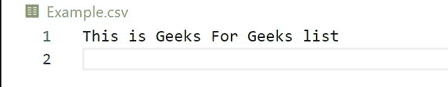
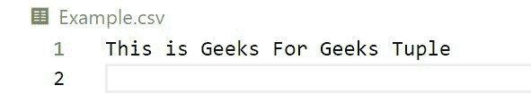
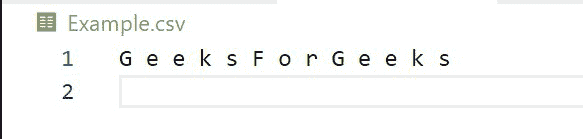
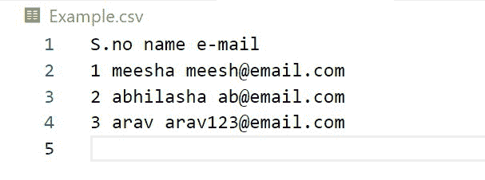

# 将变量导出到 Python 中的 CSV 文件

> 原文:[https://www . geesforgeks . org/export-variable-to-CSV-file-in-python/](https://www.geeksforgeeks.org/exporting-variable-to-csv-file-in-python/)

CSV 文件或逗号分隔值文件用于跨平台存储和共享数据。列由逗号或其他相关分隔符分隔，使数据具有表格结构。

有时我们会遇到现成的 CSV 文件，而有时我们需要根据项目中的要求创建一个。Python 可以使用许多模块编写 CSV 文件。Python 标准库中的 [csv](https://www.geeksforgeeks.org/reading-and-writing-csv-files-in-python/) 模块提供了类和方法来[读取&并将数据写入 csv 文件](https://www.geeksforgeeks.org/working-csv-files-python/)。

为了写入 csv 文件，我们使用 CSV 模块的以下对象和方法:

### writer()方法

此函数返回一个 writer 对象，该对象将数据转换为分隔字符串并将其存储在文件对象中。该函数需要一个文件对象作为参数。为了防止行与行之间出现额外的空格，换行符参数被设置为 **''** 。

**writer 类有以下方法:**

*   **CSV . writerow()**–该函数将项目写入一个可列表(列表、元组或字符串)中，用分隔符将它们分开
*   **CSV . writelrows()**–该函数将 iterables 列表作为参数，并将它们写入新行。

要写入 CSV 文件，让我们从创建一个变量(列表、元组、字符串)开始。然后，我们将在上面两个 csv 模块方法的帮助下，将这个变量导出到我们的文件中。

**示例 1:** 将列表变量导出到 csv 文件。

## 蟒蛇 3

```
import csv

# exporting a list variable into the csv file
input_variable = ['This', 'is', 'Geeks', 
                  'For', 'Geeks','list']

# Example.csv gets created in the current working directory 
with open('Example.csv', 'w', newline = '') as csvfile:
    my_writer = csv.writer(csvfile, delimiter = ' ')
    my_writer.writerow(input_variable)
```

**输出:**



**示例 2:** 将元组变量导出到 csv 文件中

## 蟒蛇 3

```
import csv

# exporting a tuple variable into the csv file
input_variable = ('This', 'is', 'Geeks', 
                  'For', 'Geeks', 'Tuple')

# Example.csv gets created in the current working directory
with open('Example.csv', 'w', newline = '') as csvfile:
    my_writer = csv.writer(csvfile, delimiter = ' ')
    my_writer.writerow(input_variable)
```

**输出:**



**示例 3:** 将字符串变量导出到 CSV 文件

## 蟒蛇 3

```
import csv

# exporting a string variable into the csv file
input_variable = "GeeksForGeeks"

# Example.csv gets created in the current working directory 
with open('Example.csv', 'w', newline = '') as csvfile:
    my_writer = csv.writer(csvfile, delimiter = ' ')
    my_writer.writerow(input_variable)
```

**输出:**



同样，我们可以在二维列表的帮助下将多行写入 CSV。这种数据结构非常类似于带有行和列的表格 Excel 表。

**例如:**

下面的代码创建了一个包含嵌套列表和元组的输入变量。

## 蟒蛇 3

```
import csv

# 2D list of variables (tabular data with rows and columns)
input_variable = [
    ['S.no','name','e-mail'],
    [1,'meesha','meesh@email.com'],
    (2,'abhilasha','ab@email.com'),
    (3,'arav','arav123@email.com')
]

# Example.csv gets created in the current working directory
with open ('Example.csv','w',newline = '') as csvfile:
    my_writer = csv.writer(csvfile, delimiter = ' ')
    my_writer.writerows(input_variable)
```

**输出:**



注意:成功执行上述代码后，CSV 文件中的更改将可见。您需要在每次运行后查看您的 CSV 文件。