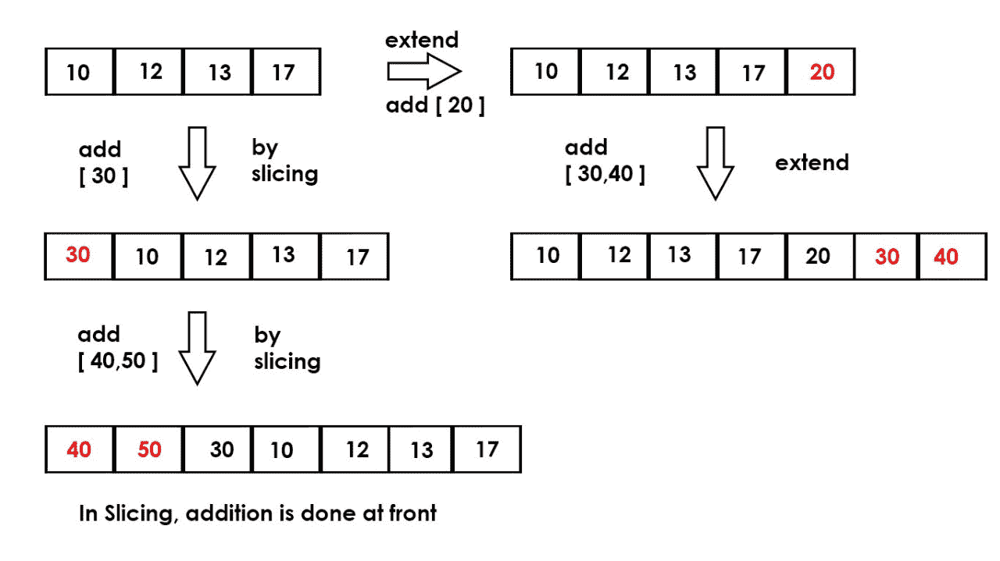

# 用 Python 扩展列表(5 种不同方式)

> 原文:[https://www . geesforgeks . org/extending-list-python-5-differential-way/](https://www.geeksforgeeks.org/extending-list-python-5-different-ways/)

在 python 中扩展一个列表可以通过以下方式完成:
**1。使用[追加()函数](https://www.geeksforgeeks.org/list-methods-python/)** :我们可以使用追加()函数追加到列表的末尾。对于将任何单个值附加到列表或将列表附加到列表，语法保持不变。但是我们一次只能使用 append()函数追加一个值

```
# Python program to extend a list using append()

a = [10, 12, 13, 17] 

# appending multiple values
a.append(20)
a.append(22)
print(a)
```

**输出:**

```
[10, 12, 13, 17, 20, 22]

```

**2。使用“+”运算符:**我们可以使用“+”运算符来添加值。我们可以使用[]向列表中添加任意数量的值。添加多个值可以通过使用'，'值来完成。

```
# Python program to extend a list using '+' 

a = [10, 12, 13, 17] 

# Appending single value
a = a + [20]

# append more then one values
a = a + [30, 40]
print(a)
```

输出:

```
[10, 12, 13, 17, 20, 30, 40]

```

**3。使用切片:**使用 python 中的切片，可以将单个或多个值添加到列表中。

> **a[:0] = [x，y，z…]**

这里 a 是值(x，y，z..)将被添加。在这种方法中，值被附加到列表的前面。



```
# Python program to extend a list using 'slicing' 

# appending multiple value 
a =[10, 12, 13, 17] 

# add 1 number
a[:0] = [30]

# add two numbers
a[:0] = [40, 50]
print(a)
```

输出:

```
[40, 50, 30, 10, 12, 13, 17]

```

**4。使用 chain():** 使用 [chain()迭代器函数](https://www.geeksforgeeks.org/iterator-functions-in-python-set-1/)，我们可以通过以下语法扩展列表:

> 列表(链(a，[x，y，z..]))

这里 a 是值(x，y，z..)将被添加。在这种方法中，值被附加到列表的末尾。

```
# python program to extend a list using 
# "chain" iterator functions
from itertools import *

a = [10, 20, 30]

# extend a list
print(list(chain(a, [40, 50, 60])))
```

**输出:**

```
[10, 20, 30, 40, 50, 60]

```

**5。使用[扩展](https://www.geeksforgeeks.org/list-methods-python/)T3**

```
# Python program to extend a list using extend() 
a = [10, 12, 13, 17] 

b = [30, 40]

a.extend(b)

print(a)
```

输出:

```
[10, 12, 13, 17, 30, 40]

```