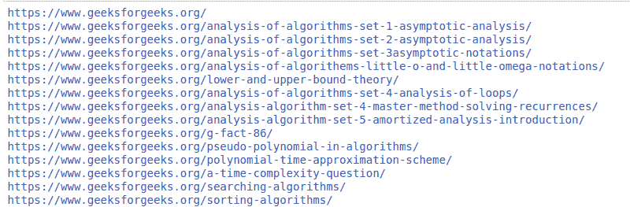
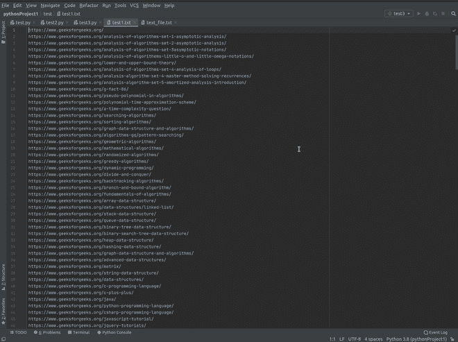

# 使用 Python 提取网页中的所有网址

> 原文:[https://www . geesforgeks . org/extract-从网页中提取所有 urls 使用-python/](https://www.geeksforgeeks.org/extract-all-the-urls-from-the-webpage-using-python/)

[刮痧](https://www.geeksforgeeks.org/introduction-to-web-scraping/) 是每个人从任何网站获取数据都非常必不可少的技能。在本文中，我们将编写 Python 脚本来提取网站中的所有 URL，或者您可以将其保存为 CSV 文件。

**所需模块:**

*   [**bs4**](https://www.geeksforgeeks.org/implementing-web-scraping-python-beautiful-soup/)【T4:美人汤(bs4)是一个从 HTML 和 XML 文件中拉出数据的 Python 库。这个模块没有内置 Python。要安装此软件，请在终端中键入以下命令。

```py
pip install bs4
```

*   [**请求**](https://www.geeksforgeeks.org/python-requests-tutorial/) **:** 请求让你发送 HTTP/1.1 请求极其轻松。该模块也没有内置 Python。要安装此软件，请在终端中键入以下命令。

```py
pip install requests
```

**进场:**

*   导入模块
*   创建请求实例并传入网址
*   将请求传递到一个美丽的输出()函数中
*   使用“a”标签查找所有标签(“a href”)

**例 1:**

## 蟒蛇 3

```py
import requests
from bs4 import BeautifulSoup

url = 'https://www.geeksforgeeks.org/'
reqs = requests.get(url)
soup = BeautifulSoup(reqs.text, 'html.parser')

urls = []
for link in soup.find_all('a'):
    print(link.get('href'))
```

**输出:**



**例 2:**

提取网址并保存为 CSV 文件。

## 蟒蛇 3

```py
import requests
from bs4 import BeautifulSoup

urls = 'https://www.geeksforgeeks.org/'
grab = requests.get(urls)
soup = BeautifulSoup(grab.text, 'html.parser')

# opening a file in write mode
f = open("test1.txt", "w")
# traverse paragraphs from soup
for link in soup.find_all("a"):
   data = link.get('href')
   f.write(data)
   f.write("\n")

f.close()
```

**输出:**

