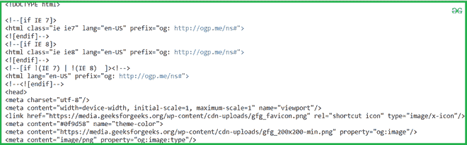

# 使用 Python 从 Geeksforgeeks 文章中提取作者信息

> 原文:[https://www . geesforgeeks . org/extract-authors-information-from-geesforgeeks-article-use-python/](https://www.geeksforgeeks.org/extract-authors-information-from-geeksforgeeks-article-using-python/)

在本文中，我们将编写一个 python 脚本，从 GeeksforGeeks 文章中提取作者信息。

### **需要的模块**

*   [**bs4:**](https://www.geeksforgeeks.org/implementing-web-scraping-python-beautiful-soup/) 美人汤(bs4)是一个从 HTML 和 XML 文件中拉出数据的 Python 库。这个模块没有内置 Python。要安装此软件，请在终端中键入以下命令。

```py
pip install bs4
```

*   [**请求**](https://www.geeksforgeeks.org/python-requests-tutorial/) **:** 请求让你发送 HTTP/1.1 请求极其轻松。该模块也没有内置 Python。要安装此软件，请在终端中键入以下命令。

```py
pip install requests
```

**进场:**

*   导入模块
*   创建请求实例并传入网址
*   初始化文章标题
*   将网址传递到 getdata()
*   借助请求和靓汤刮数据
*   找到所需的详细信息并进行筛选。

**逐步执行脚本:**

**第一步:**导入所有依赖

## 计算机编程语言

```py
# import module
import requests
from bs4 import BeautifulSoup
```

**第二步:**创建一个 URL 获取功能

## 蟒蛇 3

```py
# link for extract html data
# Making a GET request

def getdata(url):
    r=requests.get(url)
    return r.text
```

**步骤 3:** 现在将文章名称合并到 URL 中，并将 URL 传递给 getdata()函数，并将该数据转换为 HTML 代码

## 蟒蛇 3

```py
# input article by geek
article = "optparse-module-in-python"

# url
url = "https://www.geeksforgeeks.org/"+article

# pass the url
# into getdata function
htmldata=getdata(url)
soup = BeautifulSoup(htmldata, 'html.parser')

# display html code
print(soup)
```

**输出:**



**第 4 步:**从 HTML 文档中遍历作者姓名。

## 计算机编程语言

```py
# traverse author name
for i in soup.find('div', class_="author_handle"):
    Author = i.get_text()
print(Author)
```

**输出:**

```py
kumar_satyam
```

**第 5 步:**现在创建一个带有作者姓名的 URL，并获取 HTML 代码。

## 蟒蛇 3

```py
# now get author information
# with author name
profile ='https://auth.geeksforgeeks.org/user/'+Author+'/profile'

# pass the url
# into getdata function
htmldata=getdata(profile)
soup = BeautifulSoup(htmldata, 'html.parser')
```

**第六步:**遍历作者信息。

## 蟒蛇 3

```py
# traverse information of author
name = soup.find(
    'div', class_='mdl-cell mdl-cell--9-col mdl-cell--12-col-phone textBold medText').get_text()

author_info = []
for item in soup.find_all('div', class_='mdl-cell mdl-cell--9-col mdl-cell--12-col-phone textBold'):
    author_info.append(item.get_text())

print("Author name :")
print(name)
print("Author information  :")
print(author_info)
```

**输出:**

> 作者姓名:Satyam Kumar
> 作者信息:
> ['LNMI patna '，' \ nhttps://www . LinkedIn . com/in/Satyam-Kumar-174273101/']

**完整代码:**

## 蟒蛇 3

```py
# import module
import requests
from bs4 import BeautifulSoup

# link for extract html data
# Making a GET request

def getdata(url):
    r = requests.get(url)
    return r.text

# input article by geek
article = "optparse-module-in-python"

# url
url = "https://www.geeksforgeeks.org/"+article

# pass the url
# into getdata function
htmldata = getdata(url)
soup = BeautifulSoup(htmldata, 'html.parser')

# traverse author name
for i in soup.find('div', class_="author_handle"):
    Author = i.get_text()

# now get author information
# with author name
profile = 'https://auth.geeksforgeeks.org/user/'+Author+'/profile'

# pass the url
# into getdata function
htmldata = getdata(profile)
soup = BeautifulSoup(htmldata, 'html.parser')

# traverse information of author
name = soup.find(
    'div', class_='mdl-cell mdl-cell--9-col mdl-cell--12-col-phone textBold medText').get_text()

author_info = []
for item in soup.find_all('div', class_='mdl-cell mdl-cell--9-col mdl-cell--12-col-phone textBold'):
    author_info.append(item.get_text())

print("Author name :", name)
print("Author information  :")
print(author_info)
```

**输出:**

> 作者姓名:Satyam Kumar
> 作者信息:
> ['LNMI patna '，' \ nhttps://www . LinkedIn . com/in/Satyam-Kumar-174273101/']