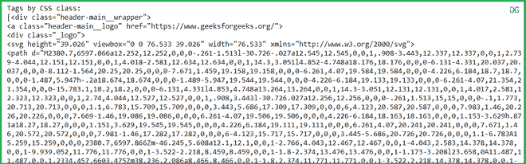

# 使用 Python 从给定的 HTML 中提取 CSS 标签

> 原文:[https://www . geesforgeks . org/extract-CSS-tag-from-给定-html-use-python/](https://www.geeksforgeeks.org/extract-css-tag-from-a-given-html-using-python/)

**先决条件:** [**使用**](https://www.geeksforgeeks.org/implementing-web-scraping-python-beautiful-soup/) 在 Python 中实现网页抓取

在本文中，我们将看到如何使用 python 从 HTML 文档或 URL 中提取 CSS。

**所需模块:**

*   **bs4:** 美人汤(bs4)是一个从 HTML 和 XML 文件中拉出数据的 Python 库。这个模块没有内置 Python。要安装此软件，请在终端中键入以下命令。

```
pip install bs4

```

*   **请求:** Requests 可以让你极其轻松地发送 HTTP/1.1 请求。该模块也没有内置 Python。要安装此软件，请在终端中键入以下命令。

```
pip install requests

```

**进场:**

*   导入模块
*   创建一个 HTML 文档，并在代码中指定 CSS 标签
*   将 HTML 文档传递到美化程序()函数中
*   现在用 select()方法遍历标签。

**实施:**

## 蟒蛇 3

```
# import module
from bs4 import BeautifulSoup

# Html doc
html_doc = """
<html>
<head>
<title>Geeks</title>
</head>
<body>
<h2>paragraphs</h2>

<p>Welcome geeks.</p>

<p>Hello geeks.</p>

<a class="example" href="www.geeksforgeeks.com" id="dsx_23">java</a>
<a class="example" href="www.geeksforgeeks.com/python"  id="sdcsdsdf">python</a>
</body>
</html>
"""
soup = BeautifulSoup(html_doc, "lxml")

# traverse CSS from soup
print("display by CSS class:")
print(soup.select(".example"))
```

**输出:**

```
display by CSS class:
[<a class="example" href="www.geeksforgeeks.com" id="dsx_23">java</a>, 
<a class="example" href="www.geeksforgeeks.com/python" id="sdcsdsdf">python</a>]

```

**现在让我们获取带有 URL 的 CSS 标签:**

## 蟒蛇 3

```
# import module
from bs4 import BeautifulSoup
import requests

# link for extract html data
# Making a GET request 

def getdata(url):
    r=requests.get(url)
    return r.text
html_doc = getdata('https://www.geeksforgeeks.org/')
soup = BeautifulSoup(html_doc,"lxml")

# traverse CSS from soup

print("\nTags by CSS class:")
print(soup.select(".header-main__wrapper"))
```

**输出:**

