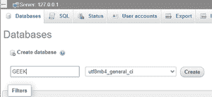
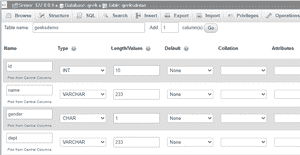
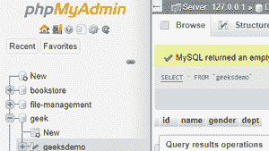
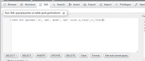
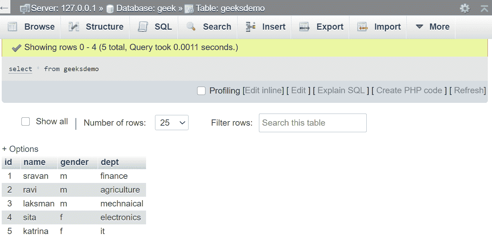
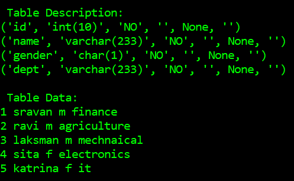

# 使用 Python 中的 MySQL-Connector 和 XAMPP 从数据库中提取数据

> 原文:[https://www . geesforgeks . org/extract-data-from-database-use-MySQL-connector-and-xampp-in-python/](https://www.geeksforgeeks.org/extract-data-from-database-using-mysql-connector-and-xampp-in-python/)

**先决条件:**[MySQL-Connector](https://www.geeksforgeeks.org/connect-mysql-database-using-mysql-connector-python/)[XAMPP 安装](https://www.geeksforgeeks.org/how-to-install-xampp-on-windows/)

当我们不得不使用 MySQL 和其他编程语言时，就要用到连接器。mysql 连接器的工作是提供对所需语言的 MySQL 驱动程序的访问。因此，它在编程语言和 MySQL 服务器之间生成了一个连接。

### **要求**

*   **XAMPP:** 存储和显示数据的数据库/服务器。
*   **MySQL-连接器模块:**用于连接数据库和 python 文件。使用以下命令安装此模块。

```py
pip install mysql-connector

```

*   **车轮模块:**一个处理车轮文件的命令行工具。使用以下命令安装此模块。

```py
pip install wheel

```

### 逐步方法:

**在数据库中创建表的过程:**

*   启动你的 *XAMPP* 网络服务器。
*   在浏览器中键入[http://localhost/phpmyadmin/](http://localhost/phpmyadmin/)。
*   转到数据库使用名称创建数据库，然后单击创建。



*   在 *GEEK* 数据库中创建一个表格，点击开始。


*   定义列名并点击保存。



*   您的表已创建。



*   通过点击 *SQL* 选项卡，然后选择*插入*将数据插入数据库。



*   您表中的数据是:



*   现在，您可以使用 python 在您的网页中执行 IE 显示数据操作

**编写 Python 程序的程序:**

*   在 Python 代码中导入 *mysql* 连接器模块。

```py
import mysql.connector

```

*   创建连接对象。

> conn _ object = MySQL . connector . connect(主机名、用户名、密码、数据库名)

在这里，您需要传递服务器名、用户名、密码和数据库名)

*   创建光标对象。

```py
cur_object=conn_object,cursor()

```

*   对数据库执行查询。

```py
query=DDL/DML etc
cur_obj=execute(query)

```

*   关闭光标对象。

```py
cur_obj.close()

```

*   关闭连接对象。

```py
conn_obj.close()

```

**以下是基于上述方法的完整 Python 程序:**

## 蟒蛇 3

```py
# import required modules
import mysql.connector

# create connection object
con = mysql.connector.connect(
  host="localhost", user="root",
  password="", database="GEEK")

# create cursor object
cursor = con.cursor()

# assign data query
query1 = "desc geeksdemo"

# executing cursor
cursor.execute(query1)

# display all records
table = cursor.fetchall()

# describe table
print('\n Table Description:')
for attr in table:
    print(attr)

# assign data query
query2 = "select * from geeksdemo"

# executing cursor
cursor.execute(query2)

# display all records
table = cursor.fetchall()

# fetch all columns
print('\n Table Data:')
for row in table:
    print(row[0], end=" ")
    print(row[1], end=" ")
    print(row[2], end=" ")
    print(row[3], end="\n")

# closing cursor connection
cursor.close()

# closing connection object
con.close()
```

**输出:**



**注意:** XAMPP *阿帕奇*和 *MySQL* 全程保持开机。