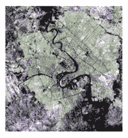
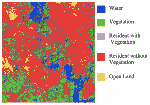
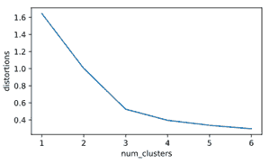
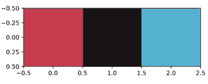

# 使用 Python 提取图像的主色

> 原文:[https://www . geeksforgeeks . org/extract-使用 python 提取图像主色/](https://www.geeksforgeeks.org/extract-dominant-colors-of-an-image-using-python/)

让我们看看如何使用 Python 提取图像的主色。**聚类**在许多现实世界的应用中使用，一个这样的现实世界的聚类例子是从图像中提取主色。

任何图像都由像素组成，每个像素代表图像中的一个点。一个像素包含三个值，每个值的范围在 **0 到 255** 之间，代表**红色**、**绿色**和**蓝色**成分的数量。这些的组合形成了像素的实际颜色。为了找到主色，使用了 k-均值聚类的概念。k-means 聚类的一个重要用途是分割卫星图像以识别表面特征。

下图显示的卫星图像包含了河谷的地形。



河谷的地形

各种颜色通常属于不同的特征，k-means 聚类可用于将它们聚类成组，然后这些组可被识别为各种表面，如水、植被等，如下所示。



聚集的群体(水，开阔的土地，…)

## **寻找主色的工具**

*   **matplotlib . image . imread–**它将 JPEG 图像转换为包含每个像素的 RGB 值的矩阵。
*   **matplotlib . pyplot . imshow–**该方法将在对 RGB 值执行 k 均值聚类后显示聚类中心的颜色。

现在让我们进入一个示例，对以下图像执行 k 均值聚类:


示例图像

可以看出，这张图中有三种主色，**一种蓝色**、**一种红色**、**黑色**。

**第一步:**该过程的第一步是使用图像类的 imread 方法将图像转换为像素。

## 蟒蛇 3

```
# Import image class of matplotlib
import matplotlib.image as img

# Read batman image and print dimensions
batman_image = img.imread('batman.png')
print(batman_image.shape)
```

**输出:**

```
(187, 295, 4)
```

输出是 M*N*3 矩阵，其中 M 和 N 是图像的维数。

**第二步:**在这个分析中，我们将集体查看所有像素，而不考虑它们的位置。所以在这一步中，所有的 RGB 值都被提取并存储在它们相应的列表中。一旦创建了列表，它们就被存储到熊猫数据框中，然后缩放数据框以获得标准化值。

## 蟒蛇 3

```
# Importing the modules
import pandas as pd
from scipy.cluster.vq import whiten

# Store RGB values of all pixels in lists r, g and b
r = []
g = []
b = []
for row in batman_image:
    for temp_r, temp_g, temp_b, temp in row:
        r.append(temp_r)
        g.append(temp_g)
        b.append(temp_b)

# only printing the size of these lists
# as the content is too big
print(len(r))
print(len(g))
print(len(b))

# Saving as DataFrame
batman_df = pd.DataFrame({'red' : r,
                          'green' : g,
                          'blue' : b})

# Scaling the values
batman_df['scaled_color_red'] = whiten(batman_df['red'])
batman_df['scaled_color_blue'] = whiten(batman_df['blue'])
batman_df['scaled_color_green'] = whiten(batman_df['green'])
```

**输出:**

```
55165
55165
55165
```

**第三步:**现在，使用**肘形图**方法找到 k 均值中的聚类数。这不是一个绝对的方法来找到集群的数量，但有助于给出关于集群的指示。

**肘形图:**聚类中心和畸变(观测值和相应质心的平方差之和)之间的线图。

下面是生成弯管图的代码:

## 蟒蛇 3

```
# Preparing data to construct elbow plot.
distortions = []
num_clusters = range(1, 7)  #range of cluster sizes

# Create a list of distortions from the kmeans function
for i in num_clusters:
    cluster_centers, distortion = kmeans(batman_df[['scaled_color_red',
                                                    'scaled_color_blue',
                                                    'scaled_color_green']], i)
    distortions.append(distortion)

# Create a data frame with two lists, num_clusters and distortions
elbow_plot = pd.DataFrame({'num_clusters' : num_clusters,
                           'distortions' : distortions})

# Create a line plot of num_clusters and distortions
sns.lineplot(x = 'num_clusters', y = 'distortions', data = elbow_plot)
plt.xticks(num_clusters)
plt.show()
```

弯管图绘制如下:

**输出:**



肘形图

可以看出，在 x 轴上的 3 处形成了一个合适的弯头，这意味着簇的数量等于 3(在给定的图像中有三种主色)。

**步骤 4 :** 得到的聚类中心为**标准化 RGB 值**。

```
Standardized value = Actual value / Standard Deviation
```

使用 imshow()方法显示主色，该方法将 RGB 值缩放到 0 到 1 的范围。为此，您需要将聚类中心的标准化值乘以相应的标准偏差。由于实际的 RGB 值取 255 的最大范围，相乘的结果除以 255 得到范围 0-1 的缩放值。

## 蟒蛇 3

```
cluster_centers, _ = kmeans(batman_df[['scaled_color_red',
                                       'scaled_color_blue',
                                       'scaled_color_green']], 3)

dominant_colors = []

# Get standard deviations of each color
red_std, green_std, blue_std = batman_df[['red',
                                          'green',
                                          'blue']].std()

for cluster_center in cluster_centers:
    red_scaled, green_scaled, blue_scaled = cluster_center

    # Convert each standardized value to scaled value
    dominant_colors.append((
        red_scaled * red_std / 255,
        green_scaled * green_std / 255,
        blue_scaled * blue_std / 255
    ))

# Display colors of cluster centers
plt.imshow([dominant_colors])
plt.show()
```

这是显示给定图像的三种主色的合成图。

**输出:**



显示主色的图

请注意，这三种颜色类似于图像视觉检查中的三种指示颜色。

以下是不带注释的完整代码:

## 蟒蛇 3

```
import matplotlib.image as img
import matplotlib.pyplot as plt
from scipy.cluster.vq import whiten
from scipy.cluster.vq import kmeans
import pandas as pd

batman_image = img.imread('batman.jpg')

r = []
g = []
b = []
for row in batman_image:
    for temp_r, temp_g, temp_b, temp in row:
        r.append(temp_r)
        g.append(temp_g)
        b.append(temp_b)

batman_df = pd.DataFrame({'red' : r,
                          'green' : g,
                          'blue' : b})

batman_df['scaled_color_red'] = whiten(batman_df['red'])
batman_df['scaled_color_blue'] = whiten(batman_df['blue'])
batman_df['scaled_color_green'] = whiten(batman_df['green'])

cluster_centers, _ = kmeans(batman_df[['scaled_color_red',
                                    'scaled_color_blue',
                                    'scaled_color_green']], 3)

dominant_colors = []

red_std, green_std, blue_std = batman_df[['red',
                                          'green',
                                          'blue']].std()

for cluster_center in cluster_centers:
    red_scaled, green_scaled, blue_scaled = cluster_center
    dominant_colors.append((
        red_scaled * red_std / 255,
        green_scaled * green_std / 255,
        blue_scaled * blue_std / 255
    ))

plt.imshow([dominant_colors])
plt.show()
```