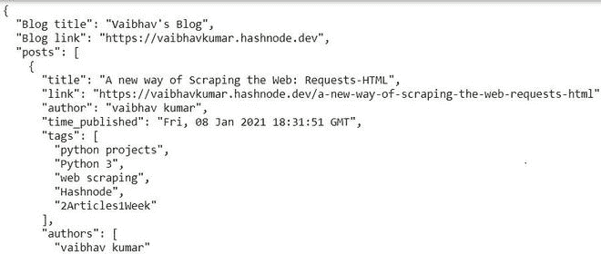

# 从 Python 中的 RSS 提取提要细节

> 原文:[https://www . geesforgeks . org/extract-feed-details-from-RSS-in-python/](https://www.geeksforgeeks.org/extract-feed-details-from-rss-in-python/)

在这篇文章中，我们将看到如何为一个 Hashnode 博客提取提要并使用 RSS 提要发布细节。虽然我们将在 Hashnode 上将其用于博客，但它也可以用于其他提要。

RSS 意味着丰富的网站摘要，并使用标准的网络格式来发布经常变化的信息，如博客文章、新闻、音频、视频等。RSS 文档通常被称为提要，由文本和元数据组成，如时间和作者姓名。

**安装提要解析器:**

我们将使用 Feedparser python 库来解析博客的 RSS 提要。这是一个非常受欢迎的解析博客提要的库。

```
pip install feedparser
```

**让我们逐步了解一下:**

**第一步:**获取 RSS 源

使用 feedparser.parse()函数创建一个包含已解析博客的 feed 对象。它采用博客提要的网址。

## 蟒蛇 3

```
# url of blog feed
feed_url = "https://vaibhavkumar.hashnode.dev/rss.xml"

blog_feed = feedparser.parse(feed_url)
```

**第二步:**从博客获取详情。

## 蟒蛇 3

```
# returns title of the blog site
blog_feed.feed.title 

# returns the link of the blog
# and number of entries(blogs) in the site.
blog_feed.feed.link
len(blog_feed.entries)

# Details of individual blog can
# be accessed by using attribute name
print(blog_feed.entries[0].title)
print(blog_feed.entries[0].link)
print(blog_feed.entries[0].author)
print(blog_feed.entries[0].published)

# Getting lists of tags and authors.
tags = [tag.term for tag in blog_feed.entries[0].tags]
authors= [author.name for author in blog_feed.entries[0].authors]
```

**下面是完整的实现:**现在用上面的代码写一个函数，取 RSS feed 的链接，返回细节。

## 蟒蛇 3

```
def get_posts_details(rss=None):

    """
    Take link of rss feed as argument
    """
    if rss is not None:

          # import the library only when url for feed is passed
        import feedparser

        # parsing blog feed
        blog_feed = blog_feed = feedparser.parse(rss)

        # getting lists of blog entries via .entries
        posts = blog_feed.entries

        # dictionary for holding posts details
        posts_details = {"Blog title" : blog_feed.feed.title,
                        "Blog link" : blog_feed.feed.link}

        post_list = []

        # iterating over individual posts
        for post in posts:
            temp = dict()

            # if any post doesn't have information then throw error.
            try:
                temp["title"] = post.title
                temp["link"] = post.link
                temp["author"] = post.author
                temp["time_published"] = post.published
                temp["tags"] = [tag.term for tag in post.tags]
                temp["authors"] = [author.name for author in post.authors]
                temp["summary"] = post.summary
            except:
                pass

            post_list.append(temp)

        # storing lists of posts in the dictionary
        posts_details["posts"] = post_list 

        return posts_details # returning the details which is dictionary
    else:
        return None

if __name__ == "__main__":
  import json

  feed_url = "https://vaibhavkumar.hashnode.dev/rss.xml"

  data = get_posts_details(rss = feed_url) # return blogs data as a dictionary

  if data:
    # printing as a json string with indentation level = 2
    print(json.dumps(data, indent=2)) 
  else:
    print("None")
```

**输出:**

