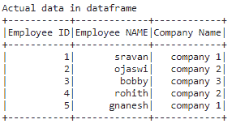

# 从 PySpark 数据帧中提取第一行和最后 N 行

> 原文:[https://www . geesforgeks . org/extract-first-and-last-n-row-from-py spark-data frame/](https://www.geeksforgeeks.org/extract-first-and-last-n-rows-from-pyspark-dataframe/)

在本文中，我们将使用 Python 中的 PySpark 从数据帧中提取前 N 行和后 N 行。首先，我们将创建一个示例数据帧。

我们必须在 spark 会话的帮助下创建一个 spark 对象，并使用 getorcreate()方法给应用命名。

```
spark = SparkSession.builder.appName('sparkdf').getOrCreate()
```

最后，用列表和列列表来创建数据后，方法:

```
dataframe = spark.createDataFrame(data, columns)
```

## 蟒蛇 3

```
# importing module
import pyspark

# importing sparksession from pyspark.sql module
from pyspark.sql import SparkSession

# creating sparksession and giving an app name
spark = SparkSession.builder.appName('sparkdf').getOrCreate()

# list  of employee data with 5 row values
data = [["1", "sravan", "company 1"],
        ["2", "ojaswi", "company 2"],
        ["3", "bobby", "company 3"],
        ["4", "rohith", "company 2"],
        ["5", "gnanesh", "company 1"]]

# specify column names
columns = ['Employee ID', 'Employee NAME', 'Company Name']

# creating a dataframe from the lists of data
dataframe = spark.createDataFrame(data, columns)

print('Actual data in dataframe')
dataframe.show()
```

**输出:**



### **提取前 N 行**

我们可以通过使用几种方法提取前 N 行，这些方法将在下面通过一些示例进行讨论:

**方法 1:使用头()**

该函数用于提取给定数据帧中的前 N 行

> **语法:** dataframe.head(n)
> 
> 哪里，
> 
> *   n 指定首先要提取的行数
> *   dataframe 是使用 pyspark 从嵌套列表中创建的 dataframe 名称。

## 蟒蛇 3

```
print("Top 2 rows ")

# extract top 2 rows
a = dataframe.head(2)
print(a)

print("Top 1 row ")

# extract top 1 row
a = dataframe.head(1)
print(a)
```

**输出:**

> 前 2 行
> 
> [行(员工标识='1 '，员工姓名='sravan '，公司名称= '公司 1 ')，
> 
> 行(员工标识='2 '，员工姓名='ojaswi '，公司名称= '公司 2 ')]
> 
> 前 1 行
> 
> [行(员工标识='1 '，员工姓名='sravan '，公司名称= '公司 1 ')]

**方法 2:使用 first()**

该函数仅用于提取数据框中的一行。

> **语法** : dataframe.first()
> 
> *   它不接受任何参数
> *   dataframe 是使用 pyspark 从嵌套列表中创建的 dataframe 名称

## 蟒蛇 3

```
print("Top row ")

# extract top  row
a = dataframe.first()
print(a)
```

**输出:**

> 顶行
> 
> 行(员工标识='1 '，员工姓名='sravan '，公司名称= '公司 1 ')

**方法三:使用 show()**

默认情况下，用于从上到下显示数据框。

> **语法:** dataframe.show(n)
> 
> 哪里，
> 
> *   数据帧是输入数据帧
> *   n 是要从顶部显示的行数，如果未指定 n，它将打印数据框中的整行

## 蟒蛇 3

```
# show() function to get 
# 2 rows
dataframe.show(2)
```

**输出:**


### **提取最后 N 行**

提取最后一行意味着从给定的数据帧中获取最后 N 行。为此，我们使用 tail()函数，可以得到最后 N 行

> **语法:** dataframe.tail(n)
> 
> 哪里，
> 
> *   n 是获得最后 n 行的数字
> *   数据帧是输入数据帧

**示例:**

## 蟒蛇 3

```
print("Last 2 rows ")

# extract last 2 rows
a = dataframe.tail(2)
print(a)

print("Last 1 row ")

# extract last 1 row
a = dataframe.tail(1)
print(a)
```

**输出:**

> 最后 2 行
> 
> [行(员工标识='4 '，员工姓名='rohith '，公司名称= '公司 2 ')，
> 
> 行(员工标识='5 '，员工姓名='gnanesh '，公司名称= '公司 1 ')]
> 
> 最后 1 行
> 
> [行(员工标识='5 '，员工姓名='gnanesh '，公司名称= '公司 1 ')]