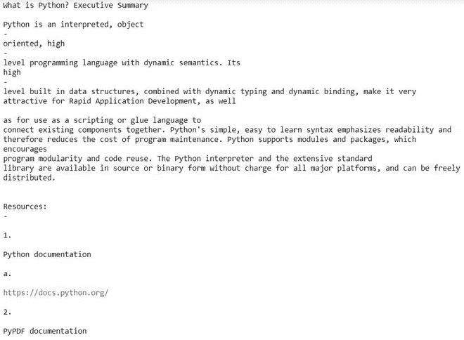

# 从 Python 中的 PDF 中提取超链接

> 原文:[https://www . geesforgeks . org/extract-hyperlinks-from-pdf-in-python/](https://www.geeksforgeeks.org/extract-hyperlinks-from-pdf-in-python/)

先决条件: [PyPDF2](https://www.geeksforgeeks.org/working-with-pdf-files-in-python/) 、[雷杰克斯](https://www.geeksforgeeks.org/python-check-url-string/)

在本文中，我们将使用 Python 从 PDF 中提取超链接。它可以通过不同的方式完成:

*   使用 PyPDF2
*   使用 pdfx

**方法 1:使用 PyPDF2。**

PyPDF2 是一个作为 PDF 工具包构建的 python 库。它能够提取文档信息等等。

**进场:**

*   阅读 PDF 文件并将其转换为文本
*   使用正则表达式从文本中获取网址

**让我们逐步实现这个模块:**

**第一步:**打开并读取 PDF 文件。

## 蟒蛇 3

```
import PyPDF2

file = "Enter PDF File Name"

pdfFileObject = open(file, 'rb')

pdfReader = PyPDF2.PdfFileReader(pdfFileObject)

for page_number in range(pdfReader.numPages):

    pageObject = pdfReader.getPage(page_number)
    pdf_text = pageObject.extractText()
    print(pdf_text)

pdfFileObject.close()
```

**输出:**



**步骤 2:** 使用正则表达式从字符串中查找 URL

## 蟒蛇 3

```
# Import Module
import PyPDF2
import re

# Enter File Name
file = "Enter PDF File Name"

# Open File file
pdfFileObject = open(file, 'rb')

pdfReader = PyPDF2.PdfFileReader(pdfFileObject)

# Regular Expression (Get URL from String)
def Find(string):

    # findall() has been used
    # with valid conditions for urls in string
    regex = r"(https?://\S+)"
    url = re.findall(regex,string)
    return [x for x in url]

# Iterate through all pages
for page_number in range(pdfReader.numPages):

    pageObject = pdfReader.getPage(page_number)

    # Extract text from page
    pdf_text = pageObject.extractText()

    # Print all URL
    print(Find(pdf_text))

# CLose the PDF
pdfFileObject.close()
```

**输出:**

```
['https://docs.python.org/', 'https://pythonhosted.org/PyPDF2/', 'https://www.geeksforgeeks.org/']
```

**方法二:使用 pdfx。**

在这个方法中，我们将使用 pdfx 模块。pdfx 模块用于从给定的 PDF 或 PDF URL 中提取 URL、元数据和纯文本。功能:从给定的 PDF 中提取引用和元数据。

```
pip install pdfx
```

**下面是实现:**

## 蟒蛇 3

```
# Import Module
import pdfx

# Read PDF File
pdf = pdfx.PDFx("File Name")

# Get list of URL
print(pdf.get_references_as_dict())
```

**输出:-**

```
{'url': ['https://www.geeksforgeeks.org/',
  'https://docs.python.org/',
  'https://pythonhosted.org/PyPDF2/',
  'GeeksforGeeks.org']}
```