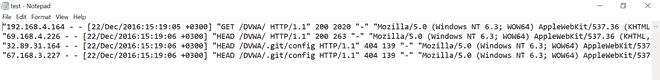
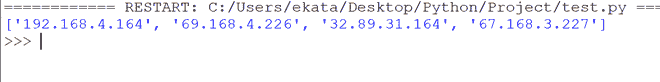
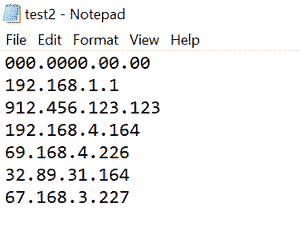
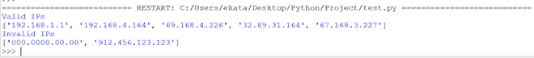

# 使用 Python 从文件中提取 IP 地址

> 原文:[https://www . geesforgeks . org/extract-IP-address-from-file-using-python/](https://www.geeksforgeeks.org/extract-ip-address-from-file-using-python/)

让我们看看如何使用 Python 从文件中提取 IP 地址。

**算法:**

*   导入[正则表达式](https://www.geeksforgeeks.org/regular-expression-python-examples-set-1/)的 re 模块。
*   使用 Open()函数打开文件。
*   阅读文件中的所有行，并将它们存储在列表中。
*   声明 IP 地址的模式。正则表达式模式是:

```
r'(\d{1,3}\.\d{1,3}\.\d{1,3}\.\d{1,3})'
```

*   对于列表中的每个元素，使用 search()函数搜索模式，将 IP 地址存储在列表中。
*   显示包含 IP 地址的列表。

需要处理的文件是 test.txt :



test.txt

## 蟒蛇 3

```
# importing the module
import re

# opening and reading the file
with open('C:/Users/user/Desktop/New Text Document.txt') as fh:
   fstring = fh.readlines()

# declaring the regex pattern for IP addresses
pattern = re.compile(r'(\d{1,3}\.\d{1,3}\.\d{1,3}\.\d{1,3})')

# initializing the list object
lst=[]

# extracting the IP addresses
for line in fstring:
   lst.append(pattern.search(line)[0])

# displaying the extracted IP addresses
print(lst)
```

**输出:**



上面的 Python 程序显示了文件中存在的任何类型的 IP 地址。我们还可以显示**有效的** IP 地址。

有效 IP 地址的规则:

*   数字应该在 0-255 的范围内
*   它应该由 4 个用“.”分隔的单元格组成

有效 IP 地址的正则表达式为:

> ((25[0-5]|2[0-4][0-9]|[01]? [0-9][0-9]? )\.){3}(25[0-5]|2[0-4][0-9]|[01]? [0-9][0-9]? )

对用于有效 IP 的正则表达式的解释:

因为我们不能在正则表达式中使用 0-255 范围，所以我们将其分为 3 组:

*   25[0-5]–表示从 250 到 255 的数字
*   2[0-4][0-9]–表示从 200 到 249 的数字
*   [01]?[0-9][0-9]?-表示从 0 到 199 的数字

需要处理的文件是 test2.txt :



test2.txt

## 蟒蛇 3

```
# importing the module
import re

# opening and reading the file
with open('test2.txt') as fh:
  string = fh.readlines()

# declaring the regex pattern for IP addresses
pattern =re.compile('''((25[0-5]|2[0-4][0-9]|[01]?[0-9][0-9]?)\.)
{3}(25[0-5]|2[0-4][0-9]|[01]?[0-9][0-9]?)''')

# initializing the list objects
valid =[]
invalid=[]

# extracting the IP addresses
for line in string:
    line = line.rstrip()
    result = pattern.search(line)

    # valid IP addresses
    if result:
      valid.append(line)

    # invalid IP addresses 
    else:
      invalid.append(line)

# displaying the IP addresses
print("Valid IPs")
print(valid)
print("Invalid IPs")
print(invalid)
```

**输出:**

