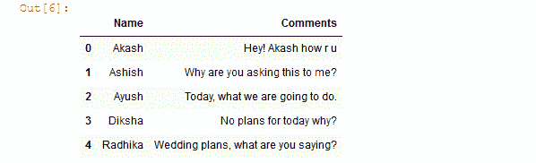
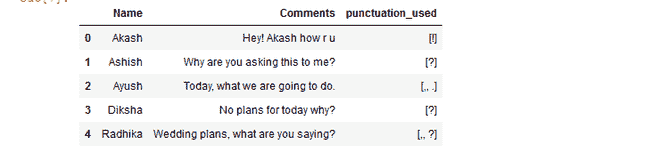

# 使用正则表达式

从数据帧的指定列中提取标点符号

> 原文:[https://www . geeksforgeeks . org/extract-标点符号-从指定的数据框列中-使用-regex/](https://www.geeksforgeeks.org/extract-punctuation-from-the-specified-column-of-dataframe-using-regex/)

**先决条件:**[Python 中的正则表达式](https://www.geeksforgeeks.org/regular-expression-python-examples-set-1/)

在本文中，我们将看到如何使用 Regex 提取数据框的指定列中使用的标点符号。

首先，我们制作包含所有标点符号的正则表达式:[！"\$%&\'()*+,\-.\/:;=#@?\[\\\]^_`{|}~]*:然后我们将特定列的每一行传递给 **re.findall()** 函数，用于提取标点符号，然后将提取的标点符号分配给数据框中的新列。

**re.findall()** 函数用于提取字符串中模式的所有非重叠匹配，作为字符串列表。从左到右扫描字符串，并按照找到的顺序返回匹配项。

> **语法:** re.findall(正则表达式，字符串)
> 
> **返回:**字符串中模式的所有非重叠匹配，作为字符串列表。

现在，让我们创建一个数据框架:

## 蟒蛇 3

```py
# import required libraries
import pandas as pd
import re

# creating Dataframe with
# name and their comments
df = pd.DataFrame({
    'Name' : ['Akash', 'Ashish', 'Ayush',
              'Diksha' , 'Radhika'],

    'Comments': ['Hey! Akash how r u' , 
                 'Why are you asking this to me?' ,
                 'Today, what we are going to do.' ,
                 'No plans for today why?' ,
                 'Wedding plans, what are you saying?']},

    columns = ['Name', 'Comments']
    )

# show the Dataframe
df
```

**输出:**



现在，从列注释中提取标点符号:

## 蟒蛇 3

```py
# define a function for extracting
# the punctuations
def check_find_punctuations(text):

    # regular expression containing
    # all punctuation
    result = re.findall(r'[!"\$%&\'()*+,\-.\/:;=#@?\[\\\]^_`{|}~]*', 
                        text)

    # form a string
    string = "".join(result)

    # list of strings return
    return list(string)

# creating new column name
# as a punctuation_used and 
# applying user defined function
# on each rows of Comments column
df['punctuation_used'] = df['Comments'].apply(
                         lambda x : check_find_punctuations(x)
                         )

# show the Dataframe
df
```

**输出:**

